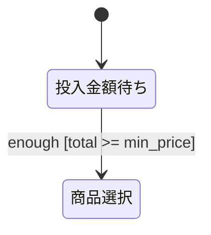
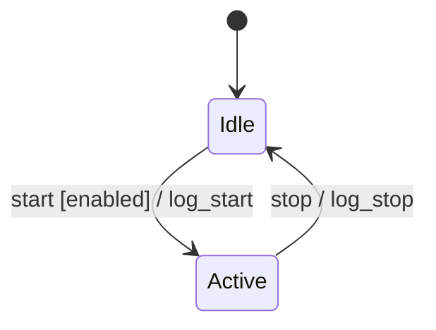
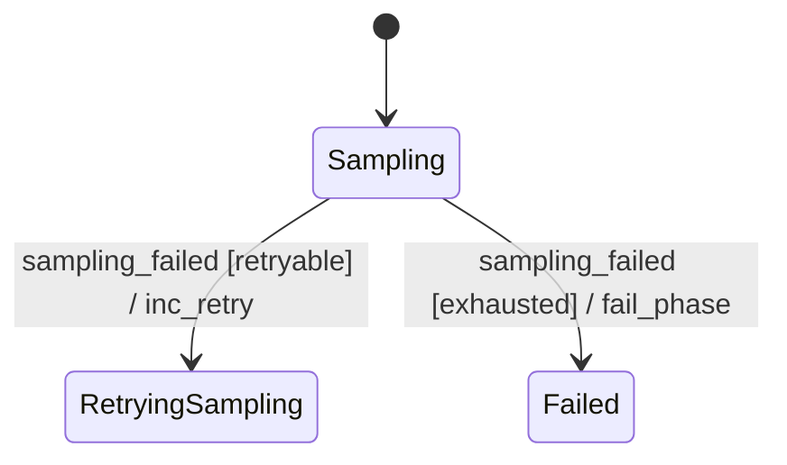
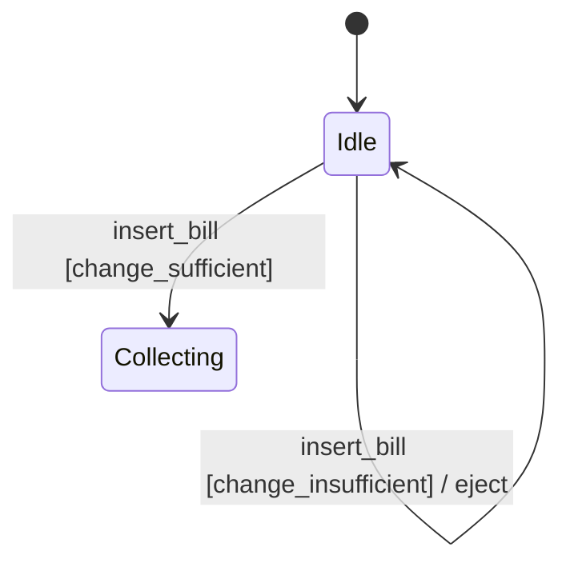
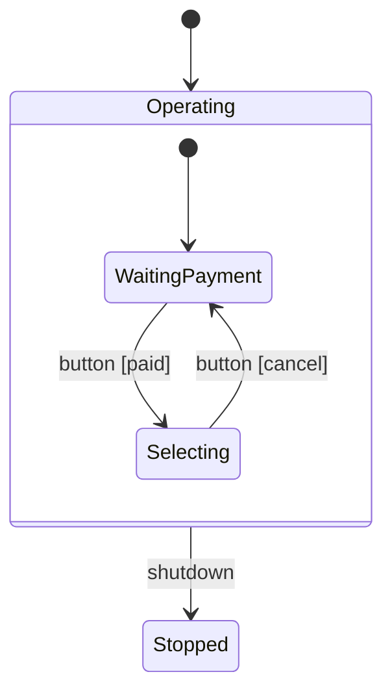
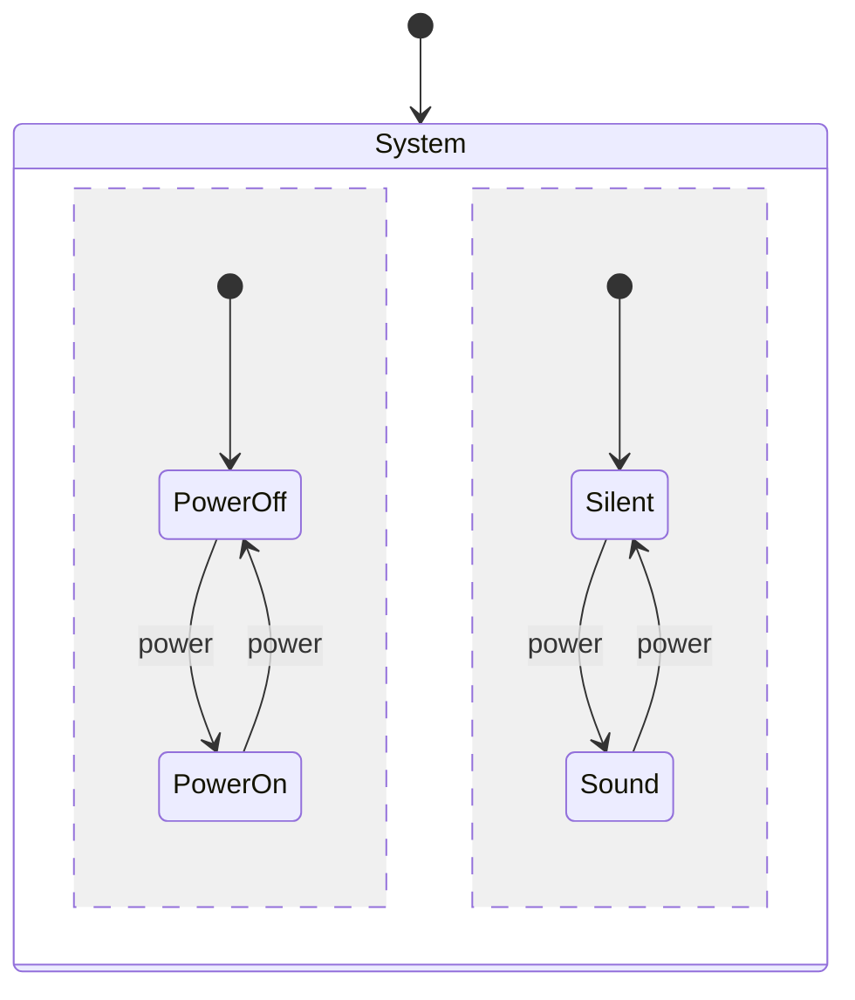

# Behavior Spec Guide

振る舞い仕様を書くときとレビューするときに使う詳細規約。

## Conversion and Reactive Behavior

| 種類           | 判定基準                                 | 記述方法                                 |
| -------------- | ---------------------------------------- | ---------------------------------------- |
| 変換系         | 出力が入力だけで決まり、履歴に依存しない | 決定表                                   |
| リアクティブ系 | 履歴、モード、状態、並列性に依存する     | Mermaid `stateDiagram-v2`                |
| 混合系         | 変換とリアクションの両方を含む           | 表と状態機械を分け、境界を設計メモに書く |

状態を持たない判定を状態機械にすると、存在しない履歴を読者に推測させる。
一方、状態を持つ振る舞いを表だけで書くと、イベントの順序と遷移可能性が失われる。

## State Machine Subset

次の Harel state machine の要素を使う。

| 機能      | Mermaid 表記                 | 用途                               |
| --------- | ---------------------------- | ---------------------------------- |
| 階層      | `state Composite { ... }`    | 複数状態に共通する遷移をまとめる   |
| 直交領域  | composite 内の `--`          | 独立して進む状態を並べる           |
| broadcast | 直交領域に同名イベントを書く | 一つのイベントを複数領域へ通知する |

### State Naming

機械可読な state ID には ASCII の英字、数字、`_` を使う。 日本語名や長い表示名には alias を使う。



本文では人間向け名を使い、Mermaid と表の参照キーには ID を使う。

### Transition Labels

遷移ラベルは UML の次の順序で書く。

```text
event [guard] / action
```

- `event`：受信するイベント。通常の遷移では必須
- `[guard]`：遷移を許可する事前条件。省略可能
- `/ action`：遷移時の作用。省略可能

payload や引数は `pick(item)` や `publish_failed(current_phase)` の関数形式で書く。



完了遷移ではイベントを省略し、`Composite --> Next : / notify_complete` のように書ける。
外部イベントを必要としない内部発火には `internal_` 接頭辞を付ける。

### Guards and Actions

Mermaid 内では短い動詞または述語の ID を使い、詳細は定義表に置く。

- 推奨：`submit [email_valid] / increment_fail_count`
- 非推奨：`submit [email.valid == true] / fail_count' = fail_count + 1`

ガードが参照できるのは、事前状態、宣言済み状態変数、イベント引数、定数である。
アクションは事前状態、事後状態、イベント引数、定数を参照できる。
ガードから未来の値や未宣言変数を読まない。

ラベルが約 40 文字を超える場合や、同じ遷移元と遷移先の組が複数ある場合は ID と定義表に分ける。



| Action ID    | Meaning                       |
| ------------ | ----------------------------- |
| `inc_retry`  | retry count を一つ増やす      |
| `fail_phase` | 現在の phase の失敗を通知する |

| Guard ID    | Condition                    |
| ----------- | ---------------------------- |
| `retryable` | `retry_count < max_retries`  |
| `exhausted` | `retry_count >= max_retries` |

同じ state と event から出るガードは、互いに排他的かを確認する。
重なる場合、同じ入力から複数の遷移が可能になり、意図しない非決定性が生じる。

## Product Breakdown

複数の状態軸をすべて掛け合わせた state を列挙しない。 次の三つのパターンで分解する。

| Pattern    | 適用条件                                | 表現                                                      |
| ---------- | --------------------------------------- | --------------------------------------------------------- |
| 禁止状態   | ある組合せが存在できない                | state を作らず、不変条件を設計メモに書く                  |
| 遷移制限   | ある遷移が不可能または拒否される        | 到達不能な遷移を省き、必要なら reject または no-op を書く |
| モード依存 | 同じ event の意味が mode によって変わる | hierarchy または orthogonal region へ分ける               |

遷移制限の例を示す。



モード依存の例を示す。



hierarchy 内の同名 event は、現在の mode による排他的な選択を表す。 orthogonal region 内の同名 event
は broadcast を表す。

## Abnormal Paths

正常系と同じ抽象度で次の異常系を確認する。

- 入力検証の失敗
- reject
- cancel
- timeout
- 外部処理の失敗
- retry と recovery

未定義の state と event の組について、次のいずれかを設計メモに書く。

- self-loop または no-op として無視する
- error として扱う
- invariant によって到達不能とする

## Initialization and Completion

- 各 state machine に `[*] --> initial_state` を置く。
- 初期化作用は `[*] --> initial_state : / init_action` と書ける。
- 終了する機械は `State --> [*]` を置く。
- 常駐サービスのように終了しない機械へ、形式だけの終端を追加しない。

## Action Idempotency

retry される可能性がある作用は、繰り返し実行の意味を確定する。

| 種類   | 例                                                    | 記述上の注意                   |
| ------ | ----------------------------------------------------- | ------------------------------ |
| 累積系 | `increment_X`, `add_to_total`, `append_log`           | 二回実行された場合の結果を書く |
| 冪等系 | `set_status_to_locked`, `mark_visible`, `reset_count` | retry 可能な遷移で優先する     |

累積系 action が複数回実行され得る場合は、それを許容する根拠か重複防止の契約を設計メモに書く。

## Orthogonal Regions and Broadcast

独立した二つの側面が同時に進む場合だけ直交領域を使う。



この例では `power` が両方の領域に broadcast される。
二つの領域が実際には常に同じ順序で進むなら、直交領域ではなく一つの線形な状態機械にする。

## Spec Sections

リアクティブ仕様では、必要な範囲で次の表を Mermaid block の後に置く。

- 状態一覧
- イベント契約またはイベント一覧
- アクション定義
- ガード定義
- 共有状態
- Liveness
- 設計メモ

複数 entity を含む仕様では、イベント契約と通信 map を必須とする。

## Design Notes

設計メモには次の項目を必ず含める。

- **直積崩れの扱い**：禁止状態、遷移制限、モード依存をどこで使ったか
- **broadcast の対応**：どのイベントをどの領域へ通知するか。該当しない場合は「なし」
- **ガードの根拠**：条件が必要な理由と参照変数の scope
- **アクションの冪等性**：累積系と冪等系の区別、retry 時の結果
- **未定義イベントの扱い**：無視、error、到達不能のどれか
- **異常系の coverage**：cancel、fail、reject、timeout、recovery の扱い
- **既知の未対応ケース**：意図的に省いた状態と遷移

該当する場合は次の項目も含める。

- **イベント契約**：producer、consumer、同期性、配送保証、payload
- **共有状態の排他制御**：書き手と競合防止方法
- **refinement**：親 spec と子 spec の相互 link
- **実装詳細**：behavior spec と implementation doc の相互 link

## Write Self-Check

- 変換系、リアクティブ系、混合系の分類が明示されている。
- リアクティブ仕様に `stateDiagram-v2` block がある。
- transition label が `event [guard] / action` の順である。
- state ID と event ID が一貫している。
- 各 state machine と composite region に初期遷移がある。
- ガードが未来値または未宣言変数を読んでいない。
- 同じ state と event のガードが排他的である。
- 異常系が正常系と同じ抽象度で記述されている。
- 未定義 event の既定規則がある。
- broadcast が直交領域の同名 event で表現されている。
- 共有状態に ownership または排他方針がある。
- 設計メモの必須項目が揃っている。

## Review Checklist

### Mechanical Checks

| ID  | Severity | Check                                                      |
| --- | -------- | ---------------------------------------------------------- |
| E02 | error    | Mermaid syntax または `stateDiagram-v2` block が壊れている |
| E03 | error    | 遷移ラベルが `event [guard] / action` の順序に従っていない |
| I02 | info     | state または event の命名が一貫していない                  |
| I03 | info     | 初期遷移 `[*] -->` がない                                  |

### Semantic Checks

| ID  | Severity | Check                                                            |
| --- | -------- | ---------------------------------------------------------------- |
| E01 | error    | 未定義の state と event の組が既定規則でも扱われていない         |
| E04 | error    | 変換系を状態機械で表すか、リアクティブ系を表だけで平坦化している |
| E05 | error    | ガードが未来状態または未宣言変数を読む                           |
| W01 | warning  | 直積崩れの方針が不明である                                       |
| W02 | warning  | broadcast の event 名または領域が一致しない                      |
| W03 | warning  | 同じ state と event のガードが重なる                             |
| W04 | warning  | hierarchy にまとめられる遷移が繰り返されている                   |
| W05 | warning  | 異常系がないか、正常系より粗い                                   |
| W06 | warning  | 非冪等 action の retry 時の結果が不明である                      |
| W07 | warning  | multi-entity event の同期性または配送保証がない                  |
| W08 | warning  | 共有状態に競合可能性があり、ownership または排他方針がない       |
| W09 | warning  | behavior spec に middleware または deployment detail が混ざる    |
| I01 | info     | action のない遷移に意図の説明がない                              |
| I04 | info     | guard または action が長い式のままである                         |
| I05 | info     | multi-entity spec に communication map がない                    |
| I06 | info     | Mermaid label が長く、図上で重なる可能性がある                   |

E04 と W04 を混同しない。 E04 は表現形式の選択が誤っている場合であり、W04 は状態機械としては正しいが
hierarchy で読みやすくできる場合である。

## Review Report

元ファイルの行番号を使い、次の形式で報告する。

```markdown
## レビュー結果

- error: N件
- warning: N件
- info: N件

### error

**E01** L12：未定義イベント

現状：`Idle` で `cancel` の扱いが定義されていない。

影響：実装ごとに無視、拒否、失敗のいずれかへ分かれる。

提案：遷移を追加するか、設計メモに既定規則を書く。
```
