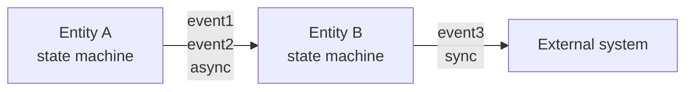

# Multi-Entity Composition, Refinement, and Implementation Separation

複数 subsystem の連携、抽象状態の詳細化、behavior と implementation の分離を扱うための規約。

## When to Use

| Case                                            | Required artifact                                        |
| ----------------------------------------------- | -------------------------------------------------------- |
| 二つ以上の subsystem が登場する                 | entity ごとの状態機械、event contract、communication map |
| 一つの抽象状態が大きすぎる                      | parent と child の refinement spec                       |
| middleware や deployment 名が behavior に混ざる | behavior spec と implementation doc の分離               |

## Multi-Entity Specs

entity ごとに状態機械を分け、event contract table で接続する形を基本とする。

| Approach                        | 適用条件                      | Strength                       | Risk                         |
| ------------------------------- | ----------------------------- | ------------------------------ | ---------------------------- |
| 個別の状態機械と event contract | subsystem 間の event 連携     | 内部状態と通信契約を分離できる | 同期 semantics の記述が必要  |
| sequence diagram を併記         | protocol の代表的な順序を示す | 時系列を追いやすい             | 全状態と異常系は表せない     |
| 一つの状態機械                  | subsystem が強く結合している  | 一つの図で確認できる           | state の直積で読みにくくなる |

### Event Contract

```markdown
| Event     | Producer    | Consumer    | Sync                                   | Payload        | Notes |
| --------- | ----------- | ----------- | -------------------------------------- | -------------- | ----- |
| `event_a` | Subsystem A | Subsystem B | async / at-least-once / point-to-point | `{key: type}`  |       |
| `event_b` | Operator    | Subsystem A | manual trigger                         | `{id: string}` |       |
```

共有 event は全図で同じ名前を使う。 event contract には次のうち該当する通信特性を書く。

- `sync`：producer が consumer の完了を待つ
- `async`：producer が送信後に処理を続ける
- `at-most-once`、`at-least-once`、`exactly-once`：配送保証
- `broadcast`、`point-to-point`、`pub-sub`：通信形状

payload には field 名と型を書く。 共有状態は event contract と分け、ownership または排他方針を書く。

### Communication Map

communication map は、どの entity がどの event で接続されるかを示す。



各 artifact の役割を分ける。

- `flowchart`：entity 間の静的な接続
- `sequenceDiagram`：一つの scenario の代表的な順序
- `stateDiagram-v2`：各 entity の内部状態と全遷移
- event contract table：同期性、配送保証、payload の契約

sequence diagram は state machine の代替ではない。 一つの sequence diagram
に全異常系を押し込まず、状態機械と別 scenario で扱う。

## Shared State

複数 entity が同じ値を読む場合は、次を表にする。

| State          | Owner    | Readers   | Writers  | Exclusion     |
| -------------- | -------- | --------- | -------- | ------------- |
| `catalog_size` | Sampling | Filtering | Sampling | single writer |

writer が複数いる場合は、lock、compare-and-swap、version check、single-writer queue など、競合を防ぐ
mechanism を明記する。 排他方法が implementation detail に依存する場合でも、behavior spec
には保証する性質を書く。

## Refinement

一つの state の内部が大きい場合は parent と child に分ける。

- parent spec は抽象 state と外部から見える遷移を保持する。
- child spec は抽象 state の内部だけを記述する。
- parent の設計メモから child へ link する。
- child の冒頭で、どの parent state を refinement するかを書く。
- child から parent へも link する。

使い分けの目安を示す。

| Use                  | Condition                                          |
| -------------------- | -------------------------------------------------- |
| 一つの図の hierarchy | 内部状態が約五個以下で、読者と抽象度が同じ         |
| child spec           | 内部状態が大きいか、parent と child の読者が異なる |

parent の記述例を示す。

```markdown
`ParallelSetup` の内部動作は [parallel-setup-spec.md](./parallel-setup-spec.md) を参照する。
```

child の記述例を示す。

```markdown
# ParallelSetup 詳細仕様

この仕様は [system-spec.md](./system-spec.md) の `ParallelSetup` state を refinement する。
```

## Behavior and Implementation

behavior spec は要求される振る舞いを記述し、implementation doc はその実現方法を記述する。

| Behavior spec         | Implementation doc             |
| --------------------- | ------------------------------ |
| sync または async     | queue や broker の製品名       |
| 配送保証              | retry count や DLQ 設定        |
| ordering guarantee    | topic、queue、resource 名      |
| communication shape   | framework、library、runtime    |
| persistence semantics | deployment、scaling、cost      |
| state と transition   | class、function、module の構成 |

書き換え例を示す。

| Avoid                       | Prefer                               |
| --------------------------- | ------------------------------------ |
| `async (SNS pub)`           | `async / at-least-once / broadcast`  |
| `publish_to_prelabel_topic` | `emit_prelabel_completed`            |
| `start_sampling_lambda`     | `enter_sampling`                     |
| `SQS DLQ retry count`       | `失敗 event は最大 N 回再試行される` |

文書名は `xxx-spec.md` と `xxx-impl.md` のように分け、設計メモから相互に link する。
