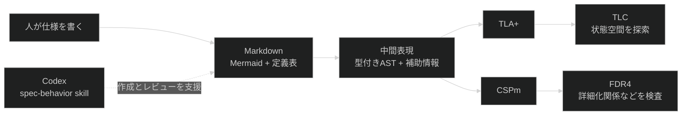
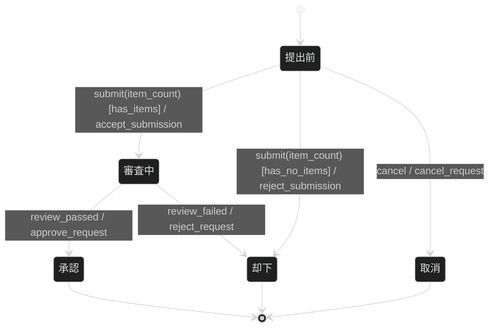
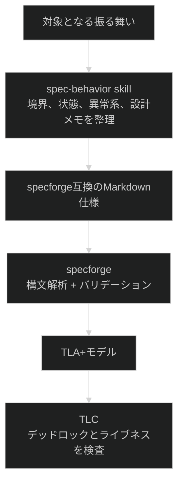

# specforge

specforgeは、Mermaid
`stateDiagram-v2`で書いた振る舞い仕様を、形式検証に使えるTLA+とCSPmへ変換するコマンドラインツールです。
TLA+を生成するだけでなく、`specforge verify`からTLCを起動し、状態空間の探索まで一続きに実行できます。

個人の仕様作成を支えるために開発していますが、リポジトリをクローンしてDenoでビルドすれば、単体の実行ファイルとして利用できます。
現在はパッケージレジストリやリリースバイナリでは配布していません。

## 振る舞い仕様が必要になる場面

APIの型やデータ構造は、システムが何を受け渡すかを定義します。
しかし、現在の状態やそれまでに受け取ったイベントによって応答が変わる**リアクティブな振る舞い**は、入出力の型だけでは定義できません。

注文の取消、失敗後の再試行、タイムアウトからの回復、複数の処理が並行して進むワークフローでは、同じイベントでも現在の状態によって許可する遷移が変わります。
正常系の処理手順だけを文章で並べると、拒否や取消をどの状態で受け付けるのか、失敗後にどこへ戻るのか、終了できない経路がないかを追いにくくなります。

振る舞い仕様は、状態、イベント、ガード、アクションを一つの状態機械として定義します。
Mermaidで記述すると、文章中に分散しやすい「どの状態で何を受け取り、次にどこへ移るか」を、ノードと矢印として同じ画面で追えます。
階層化された状態と直交領域を使えば、モードの切替えと並行して進む状態も、状態の組合せをすべて列挙せずに表現できます。

振る舞い仕様の対象、リアクティブ系と変換系の分け方、仕様の完全性は[振る舞い仕様とは何か](./docs/behavior-specs.md)で説明しています。
有限状態機械、拡張状態機械、TLA+、CSP、安全性、ライブネスの理論的な背景は[基本概念](./docs/concepts.md)を参照してください。

## Mermaidから検証モデルまで

specforgeの入力は、有限状態機械に状態変数、ガード、アクションを加えた**拡張状態機械**です。
制御上の状態が同じでも、再試行回数や残高などの状態変数によって遷移の可否と遷移先を変えられます。
人が読み書きするMarkdown仕様を中間表現へ変換し、モデルチェッカーが読める形式へ落とします。



遷移ラベルはUMLの`event [guard] / action`という順序で書きます。
次の例では、`submit(item_count)`を受け取り、`has_items`が成立した場合に`accept_submission`を行って審査中へ移ります。



### ガード定義

| Guard ID       | 条件              |
| -------------- | ----------------- |
| `has_items`    | `item_count > 0`  |
| `has_no_items` | `item_count == 0` |

### 共有状態

| 変数         | 型           | 初期値 |
| ------------ | ------------ | ------ |
| `item_count` | int（0以上） | 0      |

### イベント一覧

| イベント        | ペイロード     |
| --------------- | -------------- |
| `submit`        | `{item_count}` |
| `cancel`        | なし           |
| `review_passed` | なし           |
| `review_failed` | なし           |

### 進行性

| 性質          | TLA+式         |
| ------------- | -------------- |
| `Termination` | `<>Terminated` |

Mermaidブロックの後ろには、ガード定義、共有状態、イベントペイロード、ライブネス性質などの表を置けます。
specforgeは図と表を合わせて読み込み、構文検査、静的バリデーション、TLA+またはCSPmへの変換を行います。

TLA+とTLCが現在の主バックエンドです。 CSPmとFDR4は副バックエンドとして扱っています。

### 定まった記法をASTへ変換する

Mermaidを図として表示するだけなら、記述方法を一つに限定する必要はありません。
一方、状態機械を別の検査器やコード生成器へ渡すには、同じ意味を同じ構文で記述し、機械が曖昧さなく読み取れる必要があります。

specforgeはMermaidの全機能を受理せず、`event [guard] / action`形式の遷移ラベル、階層状態、直交領域などのサブセットに入力を限定します。
構文解析器は、この規則で書かれた図を状態、遷移、イベント、ガード、アクションに分解した型付きASTへ変換し、Markdownの表から状態変数、イベントペイロード、ライブネス性質を抽出します。

`--json`を使うと、状態機械のAST、ガード辞書、状態変数、イベントペイロードをJSONとして取得できます。
同じ中間表現からTLA+とCSPmを生成しているため、独自の静的検査、可視化、別形式への変換も追加しやすい構造です。

## specforgeで検査できること

specforgeは、構文解析後の静的バリデーションと、TLCによる状態空間の探索を分けて実行します。
静的バリデーションは図と補助表の明らかな不整合を調べ、TLCは初期状態から到達可能な状態を探索して反例を探します。

| 確認する性質       | 検査方法                 | 検査内容                                                                                         |
| ------------------ | ------------------------ | ------------------------------------------------------------------------------------------------ |
| 構文と参照の整合性 | 構文解析器、V001からV003 | Mermaidサブセット、ガード定義、状態変数、イベントペイロード、複合状態の初期遷移を確認する        |
| 明らかな未到達状態 | V004                     | 宣言した状態が、どの遷移の到達先にも現れない場合に警告する                                       |
| 出口のない状態     | V005                     | 到達先として使われる状態に、次の遷移または終端への遷移がない場合に警告する                       |
| デッドロック       | TLC                      | 初期状態から到達可能な状態空間を探索し、次へ進めない状態への反例を探す                           |
| 終端状態への到達   | TLCと`<>Terminated`      | `--bound`で指定した値域と`WF_vars(Next)`の弱公平性の下で、終端へ到達しない実行がないかを検査する |
| ライブネス性質     | `### 進行性`表とTLC      | Markdownで宣言したTLA+の時間的性質に違反する実行を探索する                                       |

V004は、宣言だけされて遷移先に使われていない状態を見つける静的検査です。
すべての状態に対する完全な到達可能性証明ではないため、状態空間上の性質はTLCの結果と合わせて判断します。

終端への到達は自動的に仮定されません。
仕様に終端遷移と`<>Terminated`を宣言した場合に、specforgeがTLA+の性質と公平性仮定を生成し、TLCが反例の有無を検査します。
`verified ok`は、`--bound`で指定した有限の値域と公平性仮定の下で、生成したモデルに宣言済みの性質の反例が見つからなかったことを表します。

## ビルドして使う

### 必要なもの

TLA+やCSPmへの変換だけを行う場合は、Deno 2.xが必要です。
`specforge verify`でTLCを実行する場合は、Javaと`tla2tools.jar`も必要です。

### リポジトリから実行ファイルを作る

リポジトリをクローンし、`deno task compile`を実行します。

```bash
git clone https://github.com/daikichiba9511/specforge.git
cd specforge
deno task compile
```

ビルドが成功すると、実行した環境向けの実行ファイルが`bin/specforge`に生成されます。
Denoランタイムは実行ファイルに組み込まれるため、ビルド後の通常利用では`deno task cli`を経由する必要はありません。

```bash
./bin/specforge --json --strict examples/vending-machine.md
./bin/specforge --tla --bound=3 examples/vending-machine.md
```

継続して使う場合は、`bin/specforge`を任意の`PATH`配下へコピーするか、`bin`ディレクトリを`PATH`へ追加してください。
以降の例では、`specforge`として実行できる状態を前提にします。

### TLCを使えるようにする

Javaをインストールし、TLA+ Toolsの`tla2tools.jar`を配置します。
macOSでHomebrewを使う場合は、次のように準備できます。

```bash
brew install openjdk
mkdir -p ~/.local/share/specforge
curl -L -o ~/.local/share/specforge/tla2tools.jar \
  https://github.com/tlaplus/tlaplus/releases/download/v1.7.4/tla2tools.jar
```

別の場所にjarを置く場合は、`SPECFORGE_TLA_JAR`でパスを指定できます。

```bash
export SPECFORGE_TLA_JAR=/path/to/tla2tools.jar
```

Nixを使う場合は、`nix develop`でDeno、OpenJDK、`tla2tools.jar`、必要な環境変数が揃ったシェルへ入れます。

## 振る舞い仕様を変換して検証する

### 構文と中間表現を確認する

`--json`は、構文解析した状態機械とMarkdownから抽出した補助情報をJSONで出力します。
`--strict`を付けると、V001からV007までのバリデーションの指摘を警告で終わらせず、終了コード1の失敗として扱います。

```bash
specforge --json --strict path/to/spec.md
```

仕様を作成した直後は、まずこのコマンドで構文と静的な不整合を確認してください。

### TLA+を生成する

`--tla`を付けると、TLA+モジュールを標準出力へ生成します。

```bash
specforge --tla --bound=3 path/to/spec.md > Spec.tla
```

`--bound=N`は、状態変数を有限化する`Domain == 0..N`の上限です。
ガードの境界値へ到達できる最小値から始め、検証したい範囲に合わせて広げます。

### TLCまで実行する

`verify`は、Markdown仕様の読み込み、TLA+生成、TLCによるモデル検査を一続きに実行します。

```bash
specforge verify --strict --bound=3 path/to/spec.md
```

成功時は`verified ok`とTLCの探索結果を表示します。
ライブネス性質を宣言した仕様では、デッドロック検査と合わせて時間的性質も検査します。

```text
verified ok

Model checking completed. No error has been found.
```

### CSPmを生成する

出力形式を指定しない場合はCSPmを標準出力へ生成します。

```bash
specforge path/to/spec.md > Spec.csp
```

FDR4による検証は現在のCLIから自動実行しません。

## Codexのspec-behavior skillと使う

このリポジトリには、振る舞い仕様の作成とレビューを支援するリポジトリ内skillを同梱しています。
Codexでこのリポジトリを開くと、[`.agents/skills/spec-behavior`](./.agents/skills/spec-behavior)が検出されます。

skillには二つの利用モードがあります。

- **writeモード**：対象の境界を決め、正常系と異常系を含む新しい振る舞い仕様を作る。
- **reviewモード**：既存仕様の構文、状態遷移、未定義イベント、ガード、設計メモを検査する。

新しい仕様を作る場合は、保存先と検証まで行うことをプロンプトに含めます。

```text
$spec-behavior writeモードで注文ワークフローの振る舞い仕様を
specs/order-workflow.mdに作成し、specforgeのstrictバリデーションとTLC検証まで実行して
```

既存仕様を確認する場合は、reviewモードを明示します。

```text
$spec-behavior reviewモードでexamples/order-workflow.mdをレビューし、
specforge --json --strictとTLC検証の結果を報告して
```

skillは仕様を作成する規律を提供し、specforgeはその仕様を機械的に変換して検査します。
両者の役割は次のように分かれます。



skillが参照する詳しい執筆規則は[振る舞い仕様の書き方](./docs/writing-specs.md)にあります。
構文解析器とコード生成器が受理する厳密な入力契約は[specforge入力仕様](./docs/spec.md)が正準です。

## specforge自体を開発する

ここまでの節は、ビルド済みのspecforgeを利用する人を対象としています。
この節は、構文解析、バリデーション、コード生成、CLIを変更する開発者向けです。

### 開発環境

再現性のある開発環境にはNix flakeを使えます。

```bash
nix develop
```

Deno 2、OpenJDK 21、`tla2tools.jar`が揃い、`SPECFORGE_TLA_JAR`と`JAVA_HOME`も設定されます。

miseを使う場合は、Deno 2とOpenJDK 21を`mise.toml`の定義に従って導入します。
TLCを使う場合は、前述の手順で`tla2tools.jar`を別途配置してください。

```bash
mise install
```

手動で構築する場合は、Deno 2とOpenJDK 21をインストールしてください。

### 開発用コマンド

```bash
deno task test       # テスト
deno task fmt        # フォーマット
deno task lint       # lint
deno task check      # 型検査

deno task cli --json --strict examples/vending-machine.md
deno task cli --tla --bound=3 examples/vending-machine.md
deno task verify --strict --bound=3 examples/vending-machine.md

deno task compile    # bin/specforgeを生成
deno task bench      # ベンチマーク
```

複数モジュールにまたがる変更へ着手する前に、[AGENTS.md](./AGENTS.md)で現在の設計文脈、正準ドキュメント、残タスクを確認してください。
具体的な残タスクは[tasks/todo.md](./tasks/todo.md)で管理しています。

## 現在の対応範囲

構文解析器は、spec-behavior skillが生成するMermaidサブセットだけを受理します。
サブセット外のMermaid記法は曖昧に解釈せず、構文解析時に拒絶します。

現在は次の要素に対応しています。

- 複合状態と完了遷移
- 直交領域
- `event [guard] / action`形式の遷移ラベル
- イベントペイロードと状態変数の束縛
- ガード定義の置換
- V001からV007までのバリデーション
- `### Liveness`表からTLA+の性質への変換
- `WF_vars(Next)`による弱公平性
- `specforge verify`からのTLC実行

specforgeが検査する対象は、Mermaidと補助表で定義した拡張状態機械モデルです。
モデルに含めていない性質は検査対象になりません。
現在の変換セマンティクスと既知の境界は[specforge入力仕様](./docs/spec.md)を参照してください。

## ドキュメント

- [振る舞い仕様とは何か](./docs/behavior-specs.md)：振る舞い仕様の対象、境界、完全性、形式検証との関係
- [振る舞い仕様の書き方](./docs/writing-specs.md)：状態、イベント、ガード、アクション、補助表、設計メモの書き方
- [基本概念](./docs/concepts.md)：拡張状態機械、CSP、TLA+、安全性、ライブネス、公平性の解説
- [specforge入力仕様](./docs/spec.md)：Mermaidサブセット、文法、補助情報、変換セマンティクス
- [遷移ラベルの読み方](./docs/label-reading.md)：`event [guard] / action`の解釈
- [specforge自身の振る舞い仕様](./docs/behavior.md)：自己適用としてTLC検証している仕様
- [サンプル集](./examples/README.md)：正常例と反例を含む実行可能な例
- [性能計測](./docs/perf.md)：ベンチマークとCPUプロファイルの取得方法
- [設計判断](./docs/decisions.md)：採用済みの判断と未決事項
- [残タスク](./tasks/todo.md)：優先度と規模を付けたバックログ

## 技術構成

- Deno 2.x
- TypeScript
- TLA+とTLCを主バックエンドとして使用
- CSPmとFDR4を副バックエンドとして使用
- 構文解析器とコード生成器の中核は外部依存なし
- テストは`deno test`と`jsr:@std/assert`を使用
