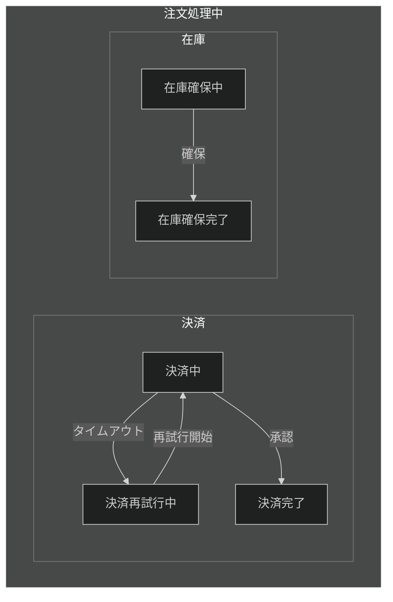
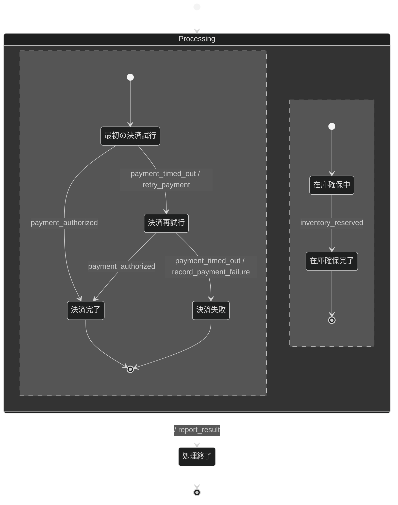
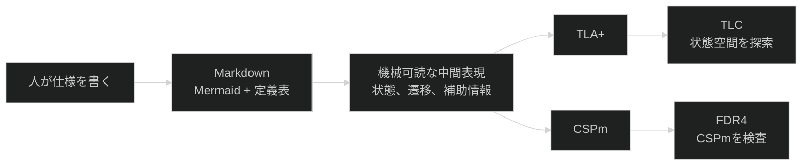
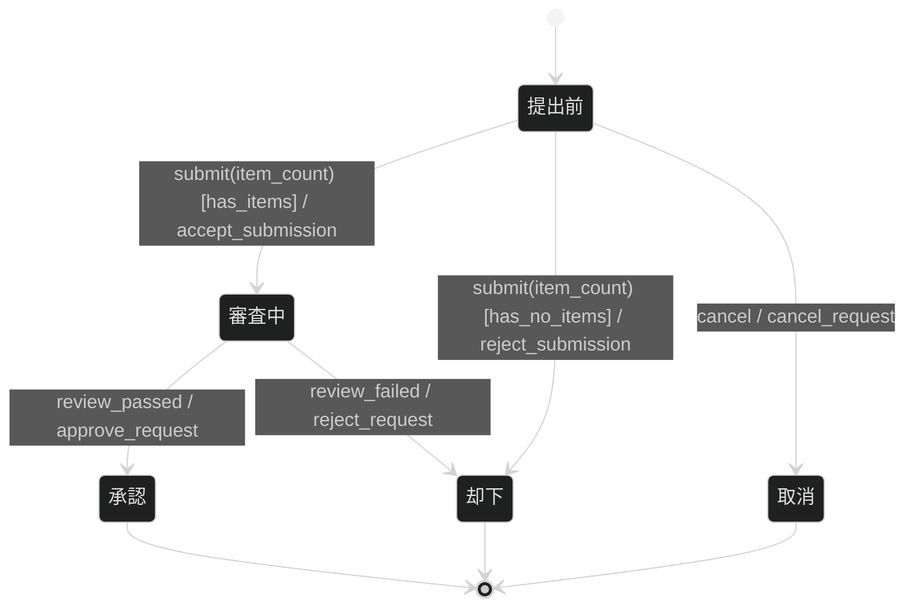
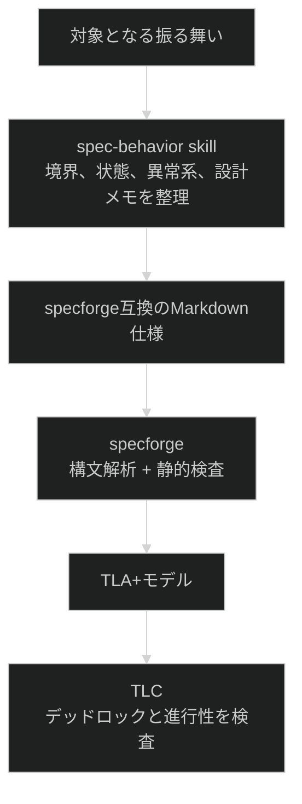

# specforge

**振る舞い仕様**は、システムがどの状態で、どの出来事を受けると、何をして次の状態へ進むかを定義した文書です。
specforgeは、Mermaid
`stateDiagram-v2`で書いた振る舞い仕様を、機械が解析できる形式仕様へ変換するコマンドラインツールです。

**モデル検査**は、仕様で定義した状態を機械的に探索し、満たすべき性質に違反する状態遷移を探す手法です。
specforgeは通常、システムの状態変化を論理式で記述する言語であるTLA+を生成し、そのモデル検査器であるTLCへ渡します。
プロセス間のイベント列を記述するCSPm形式への変換にも対応しており、生成結果はCSPmのモデル検査器であるFDR4へ渡せます。

個人の仕様作成を支えるために開発していますが、リポジトリをクローンしてTypeScriptの実行環境であるDenoでビルドすれば、単体の実行ファイルとして利用できます。
現在はパッケージレジストリやリリースバイナリでは配布していません。

## 振る舞い仕様が必要になる場面

APIの型やデータ構造は、システムが何を受け渡すかを定義します。
しかし、現在の状態やそれまでに受け取ったイベントに反応して応答が変わる**リアクティブな振る舞い**は、入出力の型だけでは定義できません。

注文の取消、失敗後の再試行、タイムアウトからの回復、複数の処理が並行して進むワークフローでは、同じイベントでも現在の状態によって許可する遷移が変わります。
正常系の処理手順だけを文章で並べると、拒否や取消をどの状態で受け付けるのか、失敗後にどこへ戻るのか、終了できない経路がないかを追いにくくなります。

振る舞い仕様は、状態、イベント（起きた出来事）、ガード（遷移を許可する条件）、アクション（遷移時の作用）を一つの状態機械として定義します。
Mermaidで記述すると、文章中に分散しやすい「どの状態で何を受け取り、次にどこへ移るか」を、ノードと矢印として同じ画面で追えます。
状態を入れ子にして共通の振る舞いをまとめる階層化と、独立して並行に進む状態を分ける直交領域を使えば、動作モードの切替えと並行する振る舞いを、状態の組合せをすべて列挙せずに表現できます。

状態や履歴に依存するリアクティブ系と、現在の入力だけで出力が決まる変換系の分け方は[振る舞い仕様とは何か](./docs/behavior-specs.md)で説明しています。
同じ文書では、仕様が選んだ範囲内で状態とイベントの組合せに解釈の空白を残さない、という完全性の考え方も説明しています。
有限状態機械と拡張状態機械、TLA+とTLC、CSPmとFDR4の理論的な背景は[基本概念](./docs/concepts.md)を参照してください。
同じ文書では、処理の途中で遷移を選べず停止するデッドロックと、処理の完了を表す状態へいずれ進む終端到達も説明しています。

## 並行する注文処理で見落としを発見する

注文の確定前に、決済と在庫確保を並行して進める処理を考えます。
要求を文章にすると、「両方が成功したら注文を確定し、失敗したら失敗結果を返し、決済がタイムアウトしたら再試行する」と簡潔に書けます。
しかし、この文章だけでは再試行を何回で打ち切るのか、失敗として終了する経路が必要なのかは決まりません。

次の図では、在庫を確保できても、決済中と決済再試行中を何度でも往復できます。
二つの処理は独立して進むため、開発者が正常系を一つずつ追うだけでは、特定の順序でだけ現れる問題を見落としやすくなります。



[問題を残した振る舞い仕様](./examples/parallel-order-retry.md)は、構文にも状態間の行き止まりにも問題がないため、specforgeの静的検査を通過します。
ところが、「注文処理はいずれ終了する」と宣言してTLCで検査すると、進行性の違反が見つかります。

```console
$ specforge verify --strict examples/parallel-order-retry.md
verification failed (code 13)

Error: Temporal properties were violated.
Error: The following behavior constitutes a counter-example:
```

この違反を発生させる実行を、仕様上の状態とイベントで追うと次のようになります。

```text
注文処理を開始する
→ 在庫の確保が完了する
→ 決済がタイムアウトする
→ 決済を再試行する
→ 再び決済がタイムアウトする
→ 同じ遷移を繰り返し、注文処理が終了しない
```

この実行は、次に進めなくなるデッドロックではありません。
決済の再試行によって状態は変わり続けますが、注文処理の終了には到達しません。
形式検証によって、再試行回数に上限を設ける、利用者が中止できるようにする、外部サービスがいつか応答するという前提を置く、といった設計判断が未確定であることが分かります。

通常のテストでは、開発者が「一回タイムアウトした後に成功する」といった具体的な順序を選びます。
TLCは有限化した状態遷移のグラフを探索するため、決済中と再試行中を往復し続ける循環も検査対象になります。
これは実装を使ったテストの代わりではなく、テストケースを作る前の仕様に終了しない経路が残っていないかを調べる検査です。

次の修正版は、決済を一回だけ再試行し、二回目のタイムアウト後は決済失敗として決済領域を終了します。
在庫領域も完了すると、注文処理全体が`Finished`へ進みます。
この例の`Finished`は注文の成立ではなく、成功または失敗の結果が確定して処理を終了できる状態を表します。



### 進行性

| 性質の名前    | TLA+式         |
| ------------- | -------------- |
| `Termination` | `<>Terminated` |

この[終了経路を追加した仕様](./examples/parallel-order-retry-fixed.md)を再検査すると、宣言した有限のモデルでは、終了しない実行が見つからなくなります。

```console
$ specforge verify --strict examples/parallel-order-retry-fixed.md
verified ok

31 states generated, 16 distinct states found, 0 states left on queue.
```

ここで確認したのは、仕様に書いた状態遷移が成功または失敗として終了することです。
実際の決済APIが正しく呼ばれることや、`record_payment_failure`が期待どおりの副作用を起こすことは、このモデルの検査対象ではありません。

この例では、それぞれの要素が異なる役割を持ちます。

| 要素         | この例で得られるもの                                                         |
| ------------ | ---------------------------------------------------------------------------- |
| 振る舞い仕様 | 決済と在庫確保の状態、受け付けるイベント、終了条件を実装前に明示する         |
| Mermaid      | 並行する二つの処理と、正常終了、再試行、失敗の経路を同じ図で確認する         |
| specforge    | 定まった記法で書かれた図を解析し、TLA+とTLCの入力へ変換する                  |
| TLC          | 有限化したモデルで可能な状態遷移を探索し、宣言した進行性を破る実行を探す     |
| 検査結果     | 終了しない実行が存在するかを示し、未確定だった設計判断を検討できるようにする |

振る舞い仕様を書くことで、実装の各所に分散する前の状態遷移を一つの図として検討できます。
specforgeとTLCをつなぐことで、人が読み合わせで選ばなかったイベント順序も検査対象になります。
問題が見つかった場合は、実装後の障害としてではなく、要求や設計の未決定事項として扱えます。
現在の`specforge verify`はTLCの結果を要約して表示するため、詳細な状態列ではなく、違反した性質と探索した状態数を報告します。

## Mermaidから検証モデルまで

**有限状態機械**は、有限個の状態と、その間を移動する遷移で振る舞いを表すモデルです。
specforgeの入力は、有限状態機械に状態変数、ガード、アクションを加えた**拡張状態機械**です。
制御上の状態が同じでも、再試行回数や残高などの状態変数によって遷移の可否と遷移先を変えられます。
人が読み書きするMarkdown仕様を中間表現へ変換し、モデルチェッカーが読める形式へ落とします。



遷移ラベルは`event [guard] / action`という順序で書きます。
次の例では、`submit(item_count)`を受け取り、`has_items`が成立した場合に`accept_submission`を行って審査中へ移ります。



### ガード定義

| ガード名       | 条件              |
| -------------- | ----------------- |
| `has_items`    | `item_count > 0`  |
| `has_no_items` | `item_count == 0` |

### 共有状態

| 変数         | 型           | 初期値 |
| ------------ | ------------ | ------ |
| `item_count` | int（0以上） | 0      |

ペイロードは、イベントと一緒に状態機械へ渡す値です。
この例では、`submit`イベントが申請項目数を`item_count`として渡します。

### イベント一覧

| イベント        | ペイロード     |
| --------------- | -------------- |
| `submit`        | `{item_count}` |
| `cancel`        | なし           |
| `review_passed` | なし           |
| `review_failed` | なし           |

**進行性**は、処理が止まらず、期待する状態へいずれ進むという性質です。

### 進行性

| 性質の名前    | TLA+式         |
| ------------- | -------------- |
| `Termination` | `<>Terminated` |

`<>Terminated`は「いつか処理の完了を表す終端状態へ到達する」というTLA+の式です。

Mermaidブロックの後ろには、ガード定義、共有状態、イベントペイロード、進行性などの表を置けます。
specforgeは図と表を合わせて読み込み、構文検査、静的検査、TLA+またはCSPmへの変換を行います。

specforgeは通常の検証にTLA+とTLCを使います。
CSPmを検査する場合は、別途FDR4というモデル検査器を使います。

### 定まった記法を抽象構文木へ変換する

Mermaidを図として表示するだけなら、記述方法を一つに限定する必要はありません。
一方、状態機械を別の検査器やコード生成器へ渡すには、同じ意味を同じ構文で記述し、機械が曖昧さなく読み取れる必要があります。

specforgeはMermaidの全機能を受理せず、`event [guard] / action`形式の遷移ラベル、階層状態、直交領域などのサブセットに入力を限定します。
構文解析器は、この規則で書かれた図を状態、遷移、イベント、ガード、アクションへ分解した**抽象構文木（Abstract
Syntax Tree、AST）**へ変換します。
抽象構文木は、入力文を文字列のまま扱わず、各要素の種類と関係をたどれるデータ構造です。
構文解析器は、Markdownの表から状態変数、イベントペイロード、進行性も抽出します。

`--json`を使うと、状態機械のAST、ガード名と条件の対応、状態変数、イベントペイロードをJSONとして取得できます。
同じ中間表現からTLA+とCSPmを生成しているため、独自の静的検査、可視化、別形式への変換も追加しやすい構造です。

## specforgeで検査できること

specforgeは、構文解析後の静的検査と、TLCによる状態空間の探索を分けて実行します。
**静的検査**は、状態空間を探索せず、図と補助表の構文や参照関係を調べる検査です。
TLCは初期状態から到達可能な状態を探索し、宣言した性質に違反する実行が存在するかを調べます。
現在の`specforge verify`は、TLCの出力から違反した性質と探索結果を抜き出して表示します。

| 確認すること       | 検査内容                                                                                  |
| ------------------ | ----------------------------------------------------------------------------------------- |
| 入力の構文         | 対応していないMermaid記法、壊れた遷移ラベル、複合状態の初期遷移の不足を検出する           |
| 名前と参照の整合性 | 未定義のガード、宣言されていない状態変数、似ているが一致しないペイロード名を検出する      |
| 明らかな未到達状態 | 宣言した状態が、どの遷移の到達先にも現れない場合に警告する                                |
| 出口のない状態     | 到達先として使われる状態に、次の遷移または終端への遷移がない場合に警告する                |
| デッドロック       | 終端状態ではないのに、どの遷移も選べず停止する到達可能な状態をTLCで探索する               |
| 終端状態への到達   | 処理が完了したことを表す終端状態へ、いずれ到達するという性質に違反する実行をTLCで探索する |
| そのほかの進行性   | `### 進行性`表で宣言した「いずれ起きるべきこと」に違反する実行をTLCで探索する             |

未到達状態の静的検査は、宣言だけされて遷移先に使われていない状態を見つけます。
すべての状態に対する完全な到達可能性証明ではないため、状態空間上の性質はTLCの結果と合わせて判断します。

終端への到達は自動的に仮定されません。
仕様に終端遷移と「いつか終端へ到達する」という進行性を宣言した場合に、specforgeがTLA+の式を生成し、TLCが反例の有無を検査します。
**反例**は、宣言した性質が成立しないことを示す具体的な状態遷移です。
進行性を検査するときは、実行できる遷移がいつまでも無視され続ける動作を除くため、実行可能な状態が続けばいつか実行されるという弱公平性を仮定します。
`verified ok`は、指定した有限の値域と弱公平性の下で、生成したモデルに宣言済みの性質の反例が見つからなかったことを表します。

## ビルドして使う

### 必要なもの

TLA+やCSPmへの変換だけを行う場合は、Deno 2.xが必要です。
`specforge verify`でTLCを実行する場合は、Javaと`tla2tools.jar`も必要です。

### リポジトリから実行ファイルを作る

リポジトリをクローンし、`deno task compile`を実行します。

```bash
git clone https://github.com/daikichiba9511/specforge.git
cd specforge
deno task compile
```

ビルドが成功すると、実行した環境向けの実行ファイルが`bin/specforge`に生成されます。
Denoランタイムは実行ファイルに組み込まれるため、ビルド後の通常利用では`deno task cli`を経由する必要はありません。

```bash
./bin/specforge examples/vending-machine.md
```

継続して使う場合は、`bin/specforge`を任意の`PATH`配下へコピーするか、`bin`ディレクトリを`PATH`へ追加してください。
以降の例では、`specforge`として実行できる状態を前提にします。

### TLCを使えるようにする

Javaをインストールし、TLA+ Toolsの`tla2tools.jar`を配置します。
macOSでHomebrewを使う場合は、次のように準備できます。

```bash
brew install openjdk
mkdir -p ~/.local/share/specforge
curl -L -o ~/.local/share/specforge/tla2tools.jar \
  https://github.com/tlaplus/tlaplus/releases/download/v1.7.4/tla2tools.jar
```

別の場所にjarを置く場合は、`SPECFORGE_TLA_JAR`でパスを指定できます。

```bash
export SPECFORGE_TLA_JAR=/path/to/tla2tools.jar
```

Nixを使う場合は、`nix develop`でDeno、OpenJDK、`tla2tools.jar`、必要な環境変数が揃ったシェルへ入れます。

## 振る舞い仕様を変換して検証する

### 構文と中間表現を確認する

`--json`は、構文解析した状態機械とMarkdownから抽出した補助情報をJSONで出力します。
`--strict`を付けると、未定義のガード、未到達状態、出口のない状態などの静的検査の指摘を警告で終わらせず、終了コード1の失敗として扱います。

```bash
specforge --json --strict path/to/spec.md
```

仕様を作成した直後は、まずこのコマンドで構文と静的な不整合を確認してください。

### TLA+を生成する

`--tla`を付けると、TLA+モジュールを標準出力へ生成します。

```bash
specforge --tla --bound=3 path/to/spec.md > Spec.tla
```

`--bound=N`は、状態変数を有限化する`Domain == 0..N`の上限です。
ガードの境界値へ到達できる最小値から始め、検証したい範囲に合わせて広げます。

### TLCまで実行する

`verify`は、Markdown仕様の読み込み、TLA+生成、TLCによるモデル検査を一続きに実行します。

```bash
specforge verify --strict --bound=3 path/to/spec.md
```

成功時は`verified ok`とTLCの探索結果を表示します。
進行性を宣言した仕様では、デッドロック検査と合わせて、期待する状態へいずれ進むかも検査します。

```text
verified ok

Model checking completed. No error has been found.
```

### CSPmを生成する

出力形式を指定しない場合はCSPmを標準出力へ生成します。

```bash
specforge path/to/spec.md > Spec.csp
```

FDR4による検証は現在のCLIから自動実行しません。

## Codexのspec-behavior skillと使う

このリポジトリには、振る舞い仕様の作成とレビューを支援するリポジトリ内skillを同梱しています。
Codexでこのリポジトリを開くと、[`.agents/skills/spec-behavior`](./.agents/skills/spec-behavior)が検出されます。

skillには二つの利用モードがあります。

- **作成（write）モード**：対象の境界を決め、正常系と異常系を含む新しい振る舞い仕様を作る。
- **レビュー（review）モード**：既存仕様の構文、状態遷移、未定義イベント、ガード、設計メモを検査する。

新しい仕様を作る場合は、保存先と検証まで行うことをプロンプトに含めます。

```text
$spec-behavior 作成モードで注文ワークフローの振る舞い仕様を
specs/order-workflow.mdに作成し、specforgeの--strictを使った静的検査とTLC検証まで実行して
```

既存仕様を確認する場合は、レビューモードを明示します。

```text
$spec-behavior レビューモードでexamples/order-workflow.mdをレビューし、
specforge --json --strictとTLC検証の結果を報告して
```

skillは仕様を作成する規律を提供し、specforgeはその仕様を機械的に変換して検査します。
両者の役割は次のように分かれます。



skillが参照する詳しい執筆規則は[振る舞い仕様の書き方](./docs/writing-specs.md)にあります。
構文解析器とコード生成器が受理する厳密な入力契約は[specforge入力仕様](./docs/spec.md)が正準です。

## specforge自体を開発する

ここまでの節は、ビルド済みのspecforgeを利用する人を対象としています。
この節は、構文解析、静的検査、コード生成、CLIを変更する開発者向けです。

### 開発環境

再現性のある開発環境にはNix flakeを使えます。

```bash
nix develop
```

Deno 2、OpenJDK 21、`tla2tools.jar`が揃い、`SPECFORGE_TLA_JAR`と`JAVA_HOME`も設定されます。

開発ツールのバージョンを管理するmiseを使う場合は、Deno 2とOpenJDK
21を`mise.toml`の定義に従って導入します。
TLCを使う場合は、前述の手順で`tla2tools.jar`を別途配置してください。

```bash
mise install
```

手動で構築する場合は、Deno 2とOpenJDK 21をインストールしてください。

### 開発用コマンド

```bash
deno task test       # テスト
deno task fmt        # フォーマット
deno task lint       # lint
deno task check      # 型検査

deno task cli --json --strict examples/vending-machine.md
deno task cli --tla --bound=3 examples/vending-machine.md
deno task verify --strict --bound=3 examples/vending-machine.md

deno task compile    # bin/specforgeを生成
deno task bench      # ベンチマーク
```

複数モジュールにまたがる変更へ着手する前に、[AGENTS.md](./AGENTS.md)で現在の設計文脈、正準ドキュメント、残タスクを確認してください。
具体的な残タスクは[tasks/todo.md](./tasks/todo.md)で管理しています。

## 現在の対応範囲

構文解析器は、spec-behavior skillが生成するMermaidサブセットだけを受理します。
サブセット外のMermaid記法は曖昧に解釈せず、構文解析時に拒絶します。

現在は次の要素に対応しています。

- 状態を入れ子にする複合状態と、内部の処理が終わるとイベントなしで進む完了遷移
- 直交領域
- `event [guard] / action`形式の遷移ラベル
- イベントが渡した値を同名の状態変数へ引き継ぐ変換
- ガード名を定義表の条件式へ置き換える変換
- 構文、名前の参照、未到達状態、出口のない状態などの静的検査
- `### 進行性`表からTLA+の時間的な性質への変換
- 進行性の検査に必要な弱公平性の付加
- `specforge verify`からのTLC実行

specforgeが検査する対象は、Mermaidと補助表で定義した拡張状態機械モデルです。
モデルに含めていない性質は検査対象になりません。
現在の変換セマンティクスと既知の境界は[specforge入力仕様](./docs/spec.md)を参照してください。

## ドキュメント

- [振る舞い仕様とは何か](./docs/behavior-specs.md)：振る舞い仕様の対象、境界、完全性、形式検証との関係
- [振る舞い仕様の書き方](./docs/writing-specs.md)：状態、イベント、ガード、アクション、補助表、設計メモの書き方
- [基本概念](./docs/concepts.md)：拡張状態機械、TLA+、CSPm、デッドロック、進行性、公平性の解説
- [specforge入力仕様](./docs/spec.md)：Mermaidサブセット、文法、補助情報、変換セマンティクス
- [遷移ラベルの読み方](./docs/label-reading.md)：`event [guard] / action`の解釈
- [specforge自身の振る舞い仕様](./docs/behavior.md)：自己適用としてTLC検証している仕様
- [サンプル集](./examples/README.md)：正常例と反例を含む実行可能な例
- [性能計測](./docs/perf.md)：ベンチマークとCPUプロファイルの取得方法
- [設計判断](./docs/decisions.md)：採用済みの判断と未決事項
- [残タスク](./tasks/todo.md)：優先度と規模を付けたバックログ

## 技術構成

- Deno 2.x
- TypeScript
- 通常の形式検証にはTLA+とTLCを使用
- CSPm形式の生成にも対応し、検査にはFDR4を使用
- 構文解析器とコード生成器の中核は外部依存なし
- テストは`deno test`と`jsr:@std/assert`を使用
