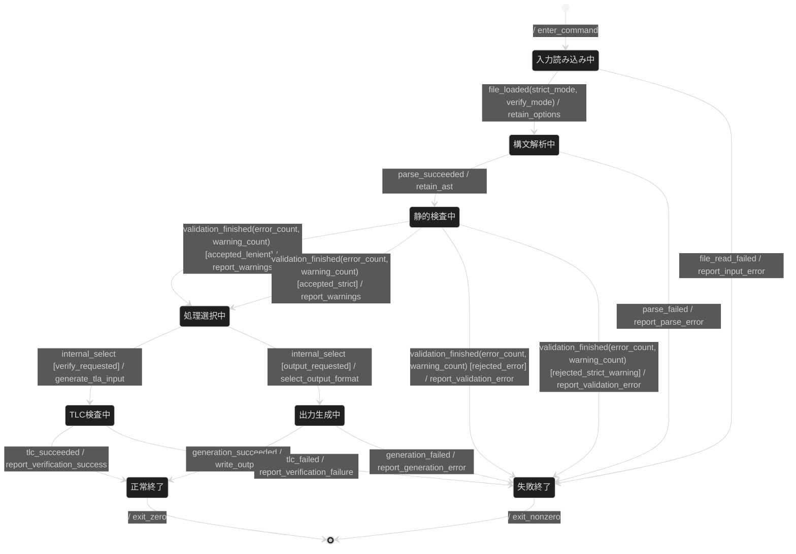

# specforge自身の振る舞い仕様

この文書は、specforgeのコマンドを一回実行したときの振る舞いを定義する。
入力ファイルの読み込みから、構文解析、静的検査、出力またはTLCによるモデル検査、終了までを対象とする。

この仕様には二つの用途がある。

1. 開発者がCLI全体の状態と分岐を確認する。
2. この文書自体をspecforgeへ入力し、TLA+へ変換してTLCで検査する。

入力として受理するMermaid記法の契約は[入力仕様](./spec.md)に定める。
ここでは入力言語ではなく、specforge自身の実行時の振る舞いだけを扱う。

## 対象と対象外

対象は、単一の入力ファイルを処理する一回のCLI実行である。
複数ファイルの一括処理、標準入力、割り込みシグナルの処理、FDR4の起動は対象外とする。

## 状態機械



## 状態一覧

| 状態          | 意味                                                      |
| ------------- | --------------------------------------------------------- |
| `Reading`     | 指定された入力ファイルを読み込む                          |
| `Parsing`     | Mermaid図とMarkdown表を、機械が扱える抽象構文木へ変換する |
| `Validating`  | 構文解析後の名前、参照、到達可能性などを静的に調べる      |
| `Dispatching` | 通常の変換と、TLCまで実行する検証のどちらへ進むかを選ぶ   |
| `Generating`  | 選択されたJSON、TLA+、CSPmのいずれかを生成する            |
| `Verifying`   | TLA+と設定ファイルを生成し、TLCを実行する                 |
| `Done`        | 終了コード0で正常終了する                                 |
| `Failed`      | エラーを報告し、0以外の終了コードで終了する               |

## イベント一覧

イベントは、同一プロセス内の処理結果を表す。 外部メッセージの配送保証を表すものではない。

| イベント               | ペイロード                     | 意味                                                  |
| ---------------------- | ------------------------------ | ----------------------------------------------------- |
| `file_loaded`          | `{strict_mode, verify_mode}`   | 入力の読み込みとコマンド引数の解釈に成功した          |
| `file_read_failed`     | `{}`                           | 入力ファイルを読み込めなかった                        |
| `parse_succeeded`      | `{}`                           | 構文解析に成功した                                    |
| `parse_failed`         | `{}`                           | 入力に受理できない構文があった                        |
| `validation_finished`  | `{error_count, warning_count}` | 静的検査が終わった                                    |
| `internal_select`      | `{}`                           | コマンド引数に従って次の処理を選ぶ                    |
| `generation_succeeded` | `{}`                           | 選択した形式の生成に成功した                          |
| `generation_failed`    | `{}`                           | 生成中に失敗した                                      |
| `tlc_succeeded`        | `{}`                           | TLCが宣言済みの性質への違反を発見しなかった           |
| `tlc_failed`           | `{}`                           | TLCの起動失敗、デッドロック、進行性違反などが発生した |

## ガード定義

`strict_mode`と`verify_mode`は、0を無効、0より大きい値を有効として扱う。

| ガードID                  | 条件                                                        | 意味                                       |
| ------------------------- | ----------------------------------------------------------- | ------------------------------------------ |
| `accepted_lenient`        | `error_count == 0 && strict_mode == 0`                      | 通常モードでエラーがない                   |
| `accepted_strict`         | `error_count == 0 && strict_mode > 0 && warning_count == 0` | 厳格モードでエラーも警告もない             |
| `rejected_error`          | `error_count > 0`                                           | 一件以上のエラーがある                     |
| `rejected_strict_warning` | `error_count == 0 && strict_mode > 0 && warning_count > 0`  | 厳格モードで一件以上の警告がある           |
| `verify_requested`        | `verify_mode > 0`                                           | `verify`サブコマンドが指定された           |
| `output_requested`        | `verify_mode == 0`                                          | JSON、TLA+、CSPmのいずれかを標準出力へ書く |

## 共有状態

| 変数            | 型           | 初期値 | 用途                                       |
| --------------- | ------------ | ------ | ------------------------------------------ |
| `strict_mode`   | int（0以上） | 0      | 警告を失敗として扱うかを決める             |
| `verify_mode`   | int（0以上） | 0      | TLCを実行するかを決める                    |
| `error_count`   | int（0以上） | 0      | 静的検査を通過できるかを決める             |
| `warning_count` | int（0以上） | 0      | 厳格モードで静的検査を通過できるかを決める |

## アクション定義

アクションは遷移時に行う処理の名前である。
CSPm出力では名前をイベントとして残すが、TLA+出力では現在アクションの内部処理を表現しない。
どちらの場合も、ファイル書き込みなどの実際の副作用は検査しない。

| アクション                    | 意味                                       |
| ----------------------------- | ------------------------------------------ |
| `enter_command`               | コマンドの処理を開始する                   |
| `retain_options`              | 読み込んだコマンド引数を後続処理へ渡す     |
| `retain_ast`                  | 構文解析した抽象構文木を後続処理へ渡す     |
| `report_warnings`             | 静的検査の警告があれば標準エラー出力へ書く |
| `report_input_error`          | 入力ファイルの読み込みエラーを報告する     |
| `report_parse_error`          | 構文エラーを報告する                       |
| `report_validation_error`     | 静的検査を通過できなかった理由を報告する   |
| `select_output_format`        | JSON、TLA+、CSPmの出力形式を選ぶ           |
| `generate_tla_input`          | TLCへ渡すTLA+と設定を生成する              |
| `write_output`                | 生成結果を標準出力へ書く                   |
| `report_generation_error`     | 生成時のエラーを報告する                   |
| `report_verification_success` | TLCの探索状態数を含む成功結果を要約する    |
| `report_verification_failure` | TLCが報告した違反または起動失敗を要約する  |
| `exit_zero`                   | 終了コード0で終了する                      |
| `exit_nonzero`                | 0以外の終了コードで終了する                |

## 進行性

進行性は、処理がいつか望ましい状態へ進むという性質である。
ここでは、一回のCLI実行が正常終了または失敗終了のどちらかへ必ず到達することを検査する。

| 性質の名前    | TLA+式         |
| ------------- | -------------- |
| `Termination` | `<>Terminated` |

## 設計メモ

- 未定義イベントは無視する。
- `strict_mode`が0の場合、警告を表示して処理を続ける。
- `strict_mode`が0より大きい場合、警告が一件以上あれば失敗する。
- `verify_mode`が0の場合、`--json`と`--tla`の指定に応じた形式を生成する。
  どちらもなければCSPmを生成する。
- `verify_mode`が0より大きい場合、TLA+を生成してTLCを実行する。 FDR4は起動しない。
- TLCの失敗結果は要約して表示する。 現在のCLIは反例の状態列をそのまま表示しない。
- 構文解析に失敗した場合は途中までの抽象構文木を返さない。
- ファイルへの書き込みが一回だけ行われることや、報告処理の副作用そのものは、この状態機械の検査対象外である。
- 標準入力、複数ファイルの同時処理、FDR4の起動は未対応である。

## この仕様を検査する

```bash
deno task cli --json --strict docs/behavior.md
deno task verify --strict --bound=3 docs/behavior.md
```

最初のコマンドは構文と静的な不整合を調べる。
二つ目のコマンドはTLA+を生成してTLCを実行し、デッドロックと宣言した進行性を調べる。
`verified ok`は、指定した有限の値域と生成されたモデルの範囲で、反例が見つからなかったことを意味する。

## 参照

- [入力仕様](./spec.md)：Mermaidサブセット、Markdown表、変換規則
- [振る舞い仕様の書き方](./writing-specs.md)：仕様作成から検査までの手順
- [spec-behavior skill](../.agents/skills/spec-behavior/SKILL.md)：この仕様の作成とレビューに使うskill
