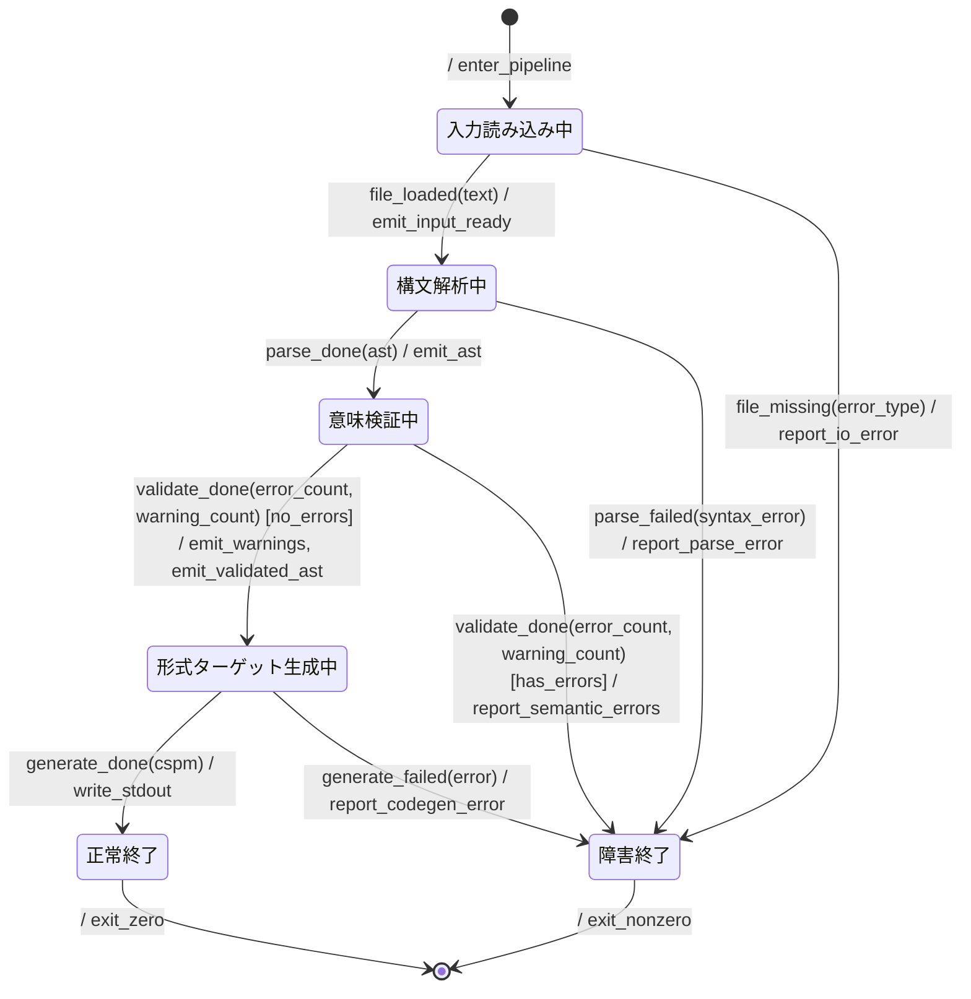

# specforge 振る舞い仕様

specforge **自身**の実行時パイプライン振る舞い (= ファイル受信 → parse → validate → 形式ターゲット
(TLA+ / CSPm) 生成 → 出力) を spec-behavior skill の規律で記述する。

本 doc は 2 つの役割を持つ:

1. specforge の実装者が pipeline 全体像を把握するための contract
2. **dogfood ケース (達成済)**: 本 doc を specforge 自身に食わせて TLA+ に変換し、TLC で
   deadlock-free / 終端到達を検証する (turtles all the way down)。
   `deno task verify
   docs/behavior.md` で再現可能。 CSPm 側は FDR4 環境がある場合の追加検証用

> 入力言語の契約 (Mermaid サブセット / BNF / TLA+ + CSPm 変換セマンティクス) は
> [`./spec.md`](./spec.md) を参照。本 doc は specforge **runtime の挙動** だけを扱う。

---

## リアクティブ仕様 (Mermaid 拡張状態機械)

### 状態一覧

| 状態 ID      | 人間向け名           | 説明                                                                       |
| ------------ | -------------------- | -------------------------------------------------------------------------- |
| `Reading`    | 入力読み込み中       | CLI 引数で指定された path のファイル内容を読み出す                         |
| `Parsing`    | 構文解析中           | Mermaid stateDiagram-v2 として字句解析 + 構文解析、AST 化                  |
| `Validating` | 意味検証中           | AST に対し ID 整合 / 状態変数参照 / イベント契約整合 などの semantic check |
| `Generating` | 形式ターゲット生成中 | AST から TLA+ または CSPm 文字列を組み立てる                               |
| `Done`       | 正常終了             | exit code 0、stdout に形式ターゲット (TLA+ / CSPm) が出力済み              |
| `Failed`     | 障害終了             | exit code non-zero、stderr に詳細エラー出力済み                            |

### イベント一覧

| イベント                                    | 発生元                         | 通信特性  | payload (ガード/分岐に使うフィールド)                                     |
| ------------------------------------------- | ------------------------------ | --------- | ------------------------------------------------------------------------- |
| `file_loaded(text)`                         | `fs.readFileSync` 成功         | sync 内部 | `text`: 読み込んだ全文 (ガード未使用)                                     |
| `file_missing(error_type)`                  | `fs.readFileSync` 失敗         | sync 内部 | `error_type`: `ENOENT` / `EACCES` / 他 (ガード未使用)                     |
| `parse_done(ast)`                           | `Parser.parse`                 | sync 内部 | `ast`: `Diagram` (ガード未使用)                                           |
| `parse_failed(syntax_error)`                | `Parser.parse`                 | sync 内部 | `syntax_error`: `ParseError` (ガード未使用)                               |
| `validate_done(error_count, warning_count)` | `Validator`                    | sync 内部 | `error_count`、`warning_count`: `no_errors` / `has_errors` で使用         |
| `generate_done(cspm)`                       | `generateCspm` / `generateTla` | sync 内部 | `cspm`: 生成された形式ターゲット (TLA+ または CSPm) 文字列 (ガード未使用) |
| `generate_failed(error)`                    | `generateCspm` / `generateTla` | sync 内部 | `error`: 生成失敗の原因 (ガード未使用)                                    |

**通信特性の前提**: すべてのイベントは sync 内部 (同一プロセス内の関数呼び出し境界)
で発火するため、配信保証や順序保証の概念は単一インスタンス内では自明
(exactly-once、in-order)。multi-entity 拡張は本仕様の対象外。

### アクション定義

| アクション ID            | 意味                                                           | 冪等性                                    |
| ------------------------ | -------------------------------------------------------------- | ----------------------------------------- |
| `enter_pipeline`         | パイプライン起動 (CLI 引数解釈、`input_path` 確定)             | 冪等                                      |
| `emit_input_ready`       | 内部チャネルで input text を Parsing 段に渡す                  | 冪等                                      |
| `emit_ast`               | 内部チャネルで AST を Validating 段に渡す                      | 冪等                                      |
| `emit_warnings`          | 蓄積した警告を stderr に書き出す (空なら no-op)                | 累積系 (重複出力は許容、stdout 不変)      |
| `emit_validated_ast`     | 検証済み AST を Generating 段に渡す                            | 冪等                                      |
| `write_stdout`           | 生成された CSPm を stdout に書き出す                           | 冪等 (1 回限りの書き込み、二重実行はバグ) |
| `report_io_error`        | stderr に IO エラー詳細を出力 (path、`error_type`)             | 冪等                                      |
| `report_parse_error`     | stderr に行番号付き parse error 詳細を出力                     | 冪等                                      |
| `report_semantic_errors` | stderr に validator が見つけた semantic errors を一覧出力      | 冪等                                      |
| `report_codegen_error`   | stderr に codegen 失敗の原因を出力                             | 冪等                                      |
| `exit_zero`              | プロセス終了 (exit code 0)                                     | 自明な 1 回限り                           |
| `exit_nonzero`           | プロセス終了 (exit code non-zero、内部分類は exit code で表現) | 自明な 1 回限り                           |

### ガード定義

| ガード ID    | 条件 (参照範囲は事前状態 + イベント引数のみ) | 根拠                                                |
| ------------ | -------------------------------------------- | --------------------------------------------------- |
| `no_errors`  | `error_count == 0`                           | validator が semantic error を出していない          |
| `has_errors` | `error_count > 0`                            | validator が 1 件以上の semantic error を出している |

`warning_count` はガードでは使わない (現状は warning ありでも続行)。`--strict` モード対応時に
`has_errors` を `error_count > 0 || (strict_mode && warning_count > 0)` に拡張する想定。

### 共有状態

`validate_done` イベントの payload で送られてきた値をガードで参照するため、 specforge の TLA+
backend が `\E new_<var>` で非決定 bind するための state var として宣言する。

| 変数            | 型        | 書き手    | 読み手                                          |
| --------------- | --------- | --------- | ----------------------------------------------- |
| `error_count`   | int (>=0) | Validator | `Validating` 遷移時の `no_errors`/`has_errors`  |
| `warning_count` | int (>=0) | Validator | (現状ガード未使用、`--strict` モードで使用予定) |

### Liveness

specforge pipeline は CLI 1 実行が必ず `Done` か `Failed` のいずれかに到達することを進行性
プロパティとして宣言する。 specforge は本表を読み取り TLA+ 出力に `WF_vars(Next)` 公平性を
付加した上で TLC に `<>Terminated` を検証させる (`PROPERTY Termination` in `.cfg`)。

| プロパティ名  | 式             | 意味                                        |
| ------------- | -------------- | ------------------------------------------- |
| `Termination` | `<>Terminated` | 全 behavior が最終的に `Done`/`Failed` 到達 |

---

## 設計メモ

**必須**:

- **直積崩れの扱い**:
  - **遷移制限**: 各 stage は前段成功イベントを受けて初めて起動するため、`Validating` 中に
    `file_loaded` 等の前段イベントは到達しない (実装層で前段 filter を保証)。
  - **禁止状態**: pipeline は線形で、`Parsing` と `Generating` 等の並列状態は存在しない。
  - **モード依存**: 現状なし。将来 `--strict` / `--lenient` モードを追加する際に階層 (mode
    dependence) で表現する余地あり。
- **broadcast の対応**: なし。直交領域を使わない (本 pipeline は単一の sequential フロー)。
- **ガードの根拠**: `validate_done` が運ぶ `error_count` で「次段へ進む / Failed
  に集約」を分岐。`no_errors` / `has_errors` は `error_count` の単純 0 比較で完結。
- **アクションの冪等性**: ほぼすべて冪等 (`enter_*`、`emit_*`、`report_*`、`write_stdout`)。`exit_*`
  は OS の制約上 1 回限り。`emit_warnings` は累積系だが stdout 出力には影響しない。リトライ機構は本
  spec のスコープ外 (CLI 1 実行 = 1 試行)。
- **未定義イベントの扱い**: **無視 (self-loop / no-op)**。例: `Reading` 中に `validate_done`
  が来てもアクションを起動しない
  (実装層が前段から後段への発火を保証するため、原理的に未定義組合せは発生しない)。
- **異常系のカバレッジ**:
  | 異常ケース                                                                                                                                          | カバー方法                                                             |
  | --------------------------------------------------------------------------------------------------------------------------------------------------- | ---------------------------------------------------------------------- |
  | ファイル不在 / 権限不足                                                                                                                             | `file_missing` → `Failed`、`report_io_error`                           |
  | 構文エラー                                                                                                                                          | `parse_failed` → `Failed`、`report_parse_error` (行番号付き)           |
  | 意味エラー                                                                                                                                          | `validate_done` with `has_errors` → `Failed`、`report_semantic_errors` |
  | コード生成失敗                                                                                                                                      | `generate_failed` → `Failed`、`report_codegen_error`                   |
  | すべての `*_failed` 系イベントは `Failed` 状態に集約され、`operator_acknowledged` 相当の操作なしに即 `exit_nonzero` で終端する (CLI ツールの慣習)。 |                                                                        |
- **既知の未対応ケース**: 下記「既知の未対応ケース (詳細)」を参照。

**該当時**:

- **イベント契約 (multi-entity)**: 該当なし — specforge は single-instance / single-process。
- **共有状態の排他制御 (multi-entity)**: 該当なし — pipeline 内のデータは sequential
  に受け渡され、共有書き込み元はなし。
- **refinement 子 spec のリンク**: 該当なし。
- **実装詳細 doc のリンク**: 振る舞いと実装は同一 repo 内なので別 doc
  分離不要。実装側のミドルウェア固有名詞は混入しない (純粋なローカル CLI / 標準ライブラリのみ)。

### 既知の未対応ケース (詳細)

- **Streaming 入力 (stdin) は対象外**: CLI は file path 引数前提。`-` argument で stdin
  読みは将来追加候補。
- **部分成功時の出力ポリシー**: 現状は warnings ありでも CSPm を stdout に出力 + warnings を stderr
  に出力。`--strict` モードを追加する際は「warnings あれば exit_nonzero」に挙動を切り替える
  (上述、ガードに条件を足す)。
- **複数 spec の同時処理**: CLI 1 実行 = 1 spec。一括処理が必要なら shell 側で
  `for f in *.mmd; do specforge "$f"; done`。
- **Parser エラー時の部分復元**: parse 失敗時に途中まで AST を返して続行する機能はなし。即停止
  (`parse_failed` → `Failed`)。
- **Pipeline 中断 (SIGINT)**: 現状は OS 側のデフォルト動作 (即終了) に任せる。`Failed`
  状態への正規遷移として扱わない。将来 signal handler を入れる場合は本仕様を改訂。
- **FDR4 invocation**: roadmap 上の将来課題。本 spec は CSPm 出力までで、検証実行は対象外 (別
  sub-command として `specforge verify` を追加する想定)。

### 形式ターゲット変換時の想定

本 doc を specforge 自身に食わせて TLA+ または CSPm に変換したときの期待形 (informative、
`docs/spec.md` §7 のセマンティクスに従う):

- **各状態 → プロセス / phase 値**: `Reading`、`Parsing`、`Validating`、`Generating`、`Done`、
  `Failed`。 CSPm では各状態が独立プロセス、TLA+ では `phase \in {"Reading", ...}` の単一変数。
- **各イベント → channel / action**:
  `file_loaded`、`parse_done`、`validate_done`、`generate_done`、および対応する `*_failed` /
  `*_missing` 系
- **状態変数**: `validate_done(error_count, warning_count)` の payload を guard で参照するため
  `error_count` / `warning_count` を state var として宣言 (詳細は「共有状態」表)。 TLA+ では
  `\E new_error_count \in Domain:` で非決定的に bind されて `no_errors` / `has_errors` を判定。
- **`Failed` の集約**: 単一の終端集約プロセス / phase にすべての `*_failed` 経路を絞り込む
- **検証目標**:
  - **Deadlock-freeness**: `Done` / `Failed` 以外で進めない状態が生まれないこと
  - **Termination**: 任意の入力経路で必ず `Done` または `Failed` のいずれかの終端に到達すること
  - **Failure isolation**: `Failed` 状態に入った後、`exit_nonzero` 以外の経路で抜けないこと
  - **Mutual exclusivity of guards**: 同 event `validate_done` に対し `no_errors` ∧ `has_errors`
    が同時成立しないこと (自明だが TLC / FDR4 で確認)

実検証結果: `deno task verify docs/behavior.md` → `verified ok` (10 states / 6 distinct、
deadlock-free)。 self-dogfood として spec-behavior → specforge → TLA+ → TLC のチェーンが end-to-end
で動くことを実証する。

---

## 参照

- [`./spec.md`](./spec.md) — specforge 入力言語契約 (Mermaid サブセット / BNF / CSPm
  変換セマンティクス)
- [spec-behavior skill](../.agents/skills/spec-behavior/SKILL.md) — 本 doc
  の記述に用いた振る舞い仕様の規律
- [multi-entity composition guide](../.agents/skills/spec-behavior/references/multi-entity-composition.md)
  — multi-entity / refinement / impl 分離パターン (現状の本 spec では未使用)

## 変更履歴

- v0.1 (本ドキュメント初版): pipeline 振る舞いを stateDiagram-v2 で記述、状態 / イベント /
  アクション / ガードを 4 表で定義、設計メモは spec-behavior の `必須` / `該当時`
  テンプレートに従う。
