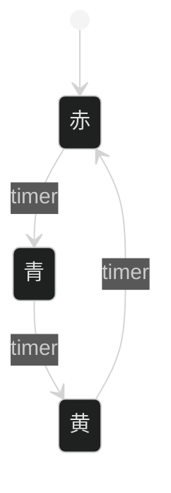
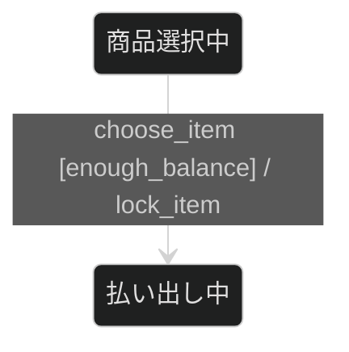
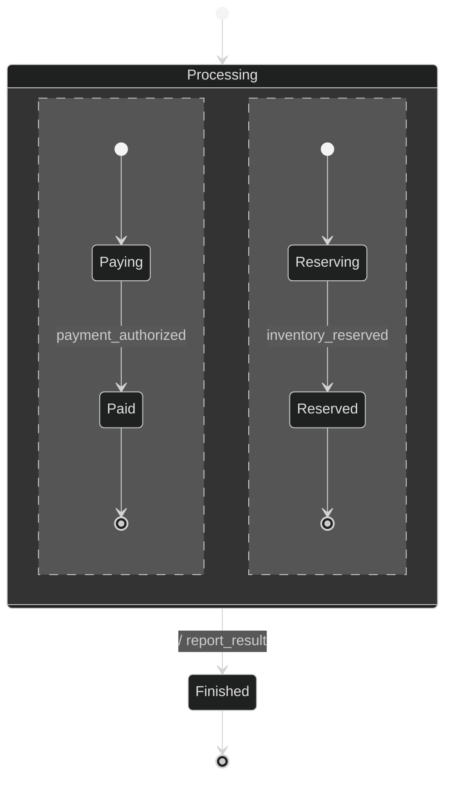
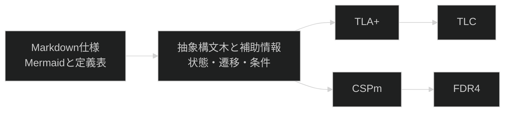

# specforgeを理解するための基本概念

この文書は、振る舞い仕様や形式検証に初めて触れる人を対象に、specforgeが扱う理論と検査結果の読み方を説明する。
コマンドの使い方は[README](../README.md)、仕様の作成手順は[振る舞い仕様の書き方](./writing-specs.md)を参照する。

## 状態機械

**状態機械**は、システムの振る舞いを状態と遷移で表すモデルである。
状態は「現在どの段階にいるか」を表し、遷移は「どの出来事によって次の状態へ移るか」を表す。

例えば、信号機を赤、青、黄の三状態として表し、タイマーによって次の色へ進むように定義できる。
現在が赤なら次は青、現在が青なら次は黄というように、現在の状態から可能な反応が決まる。



状態数と遷移数が有限のものを**有限状態機械**という。
有限であれば、原理上はすべての到達可能な状態を列挙できる。

## 拡張状態機械

残高や再試行回数のような値を、状態名だけで表すと状態数が増えすぎる。
そこで、状態機械に状態変数、ガード、アクションを加えた**拡張状態機械**を使う。

- 状態変数は、遷移後も保持する値である。
- ガードは、遷移を選べる条件である。
- アクションは、遷移に伴う作用を表す名前である。

自動販売機が`Selecting`状態にいるとき、残高`balance`が1以上なら購入へ進み、0なら進めない、という条件をガードで表現できる。



specforgeでは、遷移ラベルを`event [guard] / action`の順で記述する。
この順序を固定することで、図を表示するだけでなく、イベント、ガード、アクションを機械的に分解できる。

## 階層状態と直交領域

**階層状態**は、複数の状態を一つの親状態へまとめる表現である。
親状態から外へ出る遷移は、内部のどの状態にいても共通する退出規則として使える。

**直交領域**は、複数の状態機械が同時に有効であることを表す。
決済と在庫確保を別々の直交領域に置けば、どちらが先に完了するかを固定せずに並行性を表現できる。



この図では、両方の領域が終端へ到達すると`Processing`が完了し、`Finished`へ進める。
各領域のイベント順序を一つに固定しないため、決済が先の場合と在庫確保が先の場合の両方がモデルに含まれる。

## 抽象構文木と中間表現

Mermaidは人にとって読みやすいが、表現の自由度が高い。
別のツールへ渡すには、同じ意味を同じ書き方で表す規則が必要になる。

specforgeは受理するMermaid記法を限定し、入力を**抽象構文木**へ変換する。
抽象構文木は、入力を単なる文字列ではなく、状態、遷移、イベントなどの種類と関係として保持するデータ構造である。



中間表現を一度作ることで、同じ入力からTLA+とCSPmを生成できる。
`--json`を使えば、この中間表現をJSONとして取り出し、独自の検査や変換へ接続できる。

## 形式仕様とモデル検査

**形式仕様**は、曖昧さを避けるために、状態や性質を数学的な規則で表した仕様である。
**モデル検査**は、形式仕様から到達可能な状態を探索し、満たすべき性質に違反する実行を探す方法である。

通常のテストでは、開発者が具体的な入力と順序を選ぶ。
モデル検査では、モデルに含まれる選択肢から生じる状態と順序を機械が探索する。
そのため、二つの処理が特定の順序で進んだときだけ起きる行き止まりや、状態が変化し続けるのに完了しない循環を見つけやすい。

ただし、無限に多い値をそのまま全探索することはできない。
specforgeは状態変数の値域を`0..N`へ有限化し、`--bound=N`で上限を指定する。
検査結果は、この値域の範囲に限定される。

## TLA+とTLC

**TLA+**は、状態、状態変化、時間に関する性質を記述する形式仕様言語である。
**TLC**は、TLA+で書かれた有限のモデルを探索するモデル検査器である。

specforgeは通常の検証先としてTLA+とTLCを使う。
Mermaidの状態をTLA+の変数の値へ、遷移を次状態を定める論理式へ変換する。

TLCは、デッドロックと、仕様で宣言した時間に関する性質を検査する。
現在の`specforge verify`は、TLCの結果を要約し、成功時には探索した状態数を表示する。
失敗時には違反の種類を表示するが、TLCが内部で生成した詳細な状態列はそのまま表示しない。

## CSPmとFDR4

**CSP**は、並行して動く処理を、観測できるイベント列と処理同士の組合せで表す理論である。
**CSPm**は、そのモデルを記述するための言語である。 **FDR4**は、CSPmのモデルを検査するツールである。

specforgeはCSPmも生成できるが、FDR4を自動では起動しない。
現在はTLA+とTLCを主な検証経路とし、CSPmはFDR4を利用できる環境で追加検査するために残している。
生成されたCSPmの読み方は[CSPm出力の読み方](./csp-reading.md)で説明する。

## 安全性と進行性

形式検証で調べる性質は、大きく**安全性**と**進行性**に分けられる。

安全性は、「悪いことが起きない」という性質である。
例えば、残高が負にならない、成功と失敗が同時に成立しない、といった規則が該当する。

進行性は、「望ましいことがいつか起きる」という性質である。
例えば、受理した注文処理がいつか成功または失敗として終了する、という規則が該当する。

specforgeは、終端状態へいつか到達する性質を次のように宣言できる。

```markdown
### 進行性

| 性質の名前    | TLA+式         |
| ------------- | -------------- |
| `Termination` | `<>Terminated` |
```

`<>P`は、将来のどこかで`P`が成立することを表す。
したがって`<>Terminated`は、いつか終端状態へ到達するという意味になる。

現在のspecforgeは任意の不変条件をMarkdown表から生成する機能を持たない。
独自の安全性を検査するには、生成したTLA+を編集して不変条件を追加する必要がある。

## デッドロックと終了しない循環

**デッドロック**は、終端状態ではないのに、選べる遷移が一つもない状態である。
例えば、エラー状態から回復も終了もできない場合が該当する。

終了しない循環は、デッドロックとは異なる。
再試行中と処理中を繰り返すモデルは、毎回遷移できるため停止していないが、終端状態へ到達しない。
この問題は、終端到達を進行性として宣言して検査する。

specforgeの静的検査は、明らかな出口のない状態を入力の形から指摘する。
TLCは、実際に到達可能な状態の組合せを探索してデッドロックや進行性違反を調べる。
両者は同じ検査ではなく、互いを補う。

## 公平性

**反例**は、宣言した性質が成立しないことを示す具体的な状態遷移である。
進行性を検査するとき、実行可能な遷移を永久に選ばない実行まで許すと、多くのモデルが不自然な反例を持つ。
そこで、実行可能な状態が続く遷移はいずれ選ばれる、という**弱公平性**を仮定する。

specforgeは進行性が一件以上宣言された場合、次状態を選ぶ処理全体へ弱公平性を加える。
これは、外部サービスが必ず成功するという保証ではない。
モデルの中で実行可能な遷移を、選択器が永遠に無視し続けないという仮定である。

現在は、遷移ごとに異なる公平性を指定できない。
したがって、検査結果を読むときは、有限の値域だけでなく、この一律の弱公平性も前提に含める。

## 検査できることとできないこと

| 対象                               | 現在のspecforgeでの扱い           |
| ---------------------------------- | --------------------------------- |
| 受理するMermaid構文                | 構文解析時に検査する              |
| 未定義ガードや名前の不一致         | 静的検査で指摘する                |
| 明らかな未到達状態や出口のない状態 | 静的検査で指摘する                |
| 到達可能なデッドロック             | TLCで探索する                     |
| 宣言した終端到達などの進行性       | TLCで探索する                     |
| 任意の不変条件                     | 自動生成しない                    |
| 実装が仕様に一致すること           | 検査しない                        |
| アクション内部の副作用や冪等性     | 検査しない                        |
| 無限の値域すべて                   | 検査しない。`--bound`で有限化する |
| 複数仕様ファイルの合成             | 現在は生成しない                  |
| 直交領域の同名イベント同期         | 現在は生成しない                  |

`verified ok`を「システム全体が正しい」と読み替えてはいけない。
正確には、指定した値域と公平性の下で、入力から生成したモデルに、宣言した性質への反例が見つからなかったことを意味する。

## 状態数と値域

状態変数を増やすほど、値の組合せによって探索状態数が増える。
`--bound`を大きくすると境界値を含めやすくなる一方、検査時間とメモリ使用量も増える。

最初は、ガードに現れる境界へ到達できる最小値を選ぶ。
例えば`retry_count >= 3`を検査するなら、少なくとも`--bound=3`が必要である。
その後、必要な境界を追加しながら探索状態数の増加を確認する。

## 文書の読み分け

- [振る舞い仕様とは何か](./behavior-specs.md)：対象、完全性、実装との境界
- [振る舞い仕様の書き方](./writing-specs.md)：要求から図と表を作る手順
- [入力仕様](./spec.md)：構文と変換規則の正準契約
- [遷移ラベルの読み方](./label-reading.md)：ラベルの各要素と変換後の対応
- [CSPm出力の読み方](./csp-reading.md)：生成されたCSPmの基礎
- [サンプル集](../examples/README.md)：正常例と問題を含む例の比較
