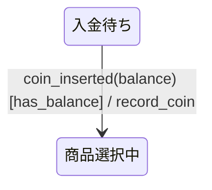
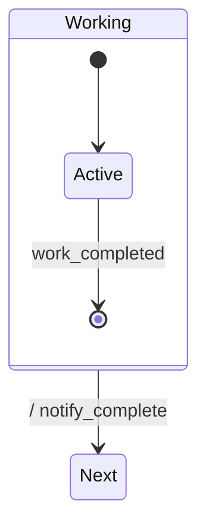

# 遷移ラベル`event [guard] / action`の読み方

Mermaid状態図の矢印には、遷移を起こす出来事、遷移を許可する条件、遷移に伴う作用を書ける。
specforgeは、この三要素を次の順序で受理する。

```text
event [guard] / action
```

この文書では、各要素の意味、省略規則、値の受け渡し、TLA+とCSPmへの変換範囲を説明する。
文字単位の構文は[入力仕様](./spec.md)を正準とする。

## 三つの要素

次の遷移を例にする。



### イベント

イベントは、状態機械が反応する出来事である。
例の`coin_inserted(balance)`は、硬貨が投入され、`balance`という値を一緒に受け取ったことを表す。

イベント名には、`payment_authorized`や`timeout`のように、起きた事実が分かる名前を使う。
外部イベントを必要としない内部判定には、`internal_`接頭辞を使う。

```text
internal_check_lockout
```

`internal_`は読み手のための命名規則である。 現在のspecforgeは、通常のイベントと同じように変換する。

### ガード

ガードは、イベントを受けたときに、その遷移を選べるかを決める条件である。
角括弧の中へ短いガードIDを書き、条件式は`### ガード定義`表へ分ける。

```markdown
### ガード定義

| ガードID      | 条件          | 根拠                   |
| ------------- | ------------- | ---------------------- |
| `has_balance` | `balance > 0` | 正の残高だけを受理する |
```

ガードは、遷移前の状態変数と、イベントが渡した値を参照する。
ガードが偽なら、その遷移は選べず、アクションも行われない。
同じ状態とイベントから出る別のガードが成立すれば、そちらの遷移を選べる。

現在のspecforgeは、複数のガードが同時に成立するか、どのガードも成立しない値があるかを自動判定しない。
同じ状態とイベントから分岐するガードの重なりと漏れは、仕様レビューで確認する。

### アクション

アクションは、遷移に伴って行う作用の名前である。
例の`record_coin`は、投入された硬貨を記録するという仕様上の意図を表す。

複数のアクションは`,`で区切る。

```text
timer / record_timeout, notify_operator
```

CSPmでは、複数のアクションを記載順のイベント列へ変換する。
TLA+では、現在アクションを状態更新へ変換しない。
したがって、TLCは実際の副作用、アクションの実行順、冪等性を検査しない。

## 省略できる要素

| 書き方               | 例                              | 意味                                       |
| -------------------- | ------------------------------- | ------------------------------------------ |
| イベントのみ         | `A --> B : timer`               | `timer`を契機に遷移する                    |
| イベントとガード     | `A --> B : timer [ready]`       | `ready`が成立するときだけ遷移する          |
| イベントとアクション | `A --> B : timer / log`         | `timer`を契機に`log`を伴って遷移する       |
| 三要素すべて         | `A --> B : timer [ready] / log` | 条件を満たすと作用を伴って遷移する         |
| アクションのみ       | `A --> B : / notify`            | 外部イベントを待たずに作用を伴って遷移する |
| ラベルなし           | `[*] --> A`                     | 作用なしで直ちに遷移する                   |

### 完了遷移

階層状態から外へ出る遷移でイベントを省略すると、内部の全領域が完了した後に自動で進む**完了遷移**になる。



この例では、`Active`が終端へ到達した後、`notify_complete`を伴って`Next`へ進む。

初期遷移の`[*] --> Idle`には、通常ラベルを書かない。
親の状態機械へ入ったときに、最初の状態を決めるための遷移である。

## 引数とペイロード

イベントと一緒に渡す値を**ペイロード**という。
イベントが値を持つ場合は、関数のように`name(arg1, arg2)`と書く。

```text
coin_inserted(balance)
filter_completed(batch_id, item_count)
```

イベント契約表にも同じ項目名を書く。

```markdown
### イベント契約

| イベント        | ペイロード  |
| --------------- | ----------- |
| `coin_inserted` | `{balance}` |
```

ペイロード項目と状態変数の名前が一致すると、specforgeは受信値を新しい状態変数の値として次の状態へ渡す。
TLA+では、指定した有限値域から受信値を選ぶ形へ変換する。
CSPmでは、`coin_inserted?balance`という受信に変換する。

引数のないイベントでは、`timer`と`timer()`のどちらも受理する。

## 読む順序

`coin_inserted(balance) [has_balance] / record_coin`は、次の順序で読む。

1. `coin_inserted`イベントと`balance`を受け取る。
2. 受け取った値を使って`has_balance`を評価する。
3. 条件が成立すれば遷移を選ぶ。
4. `record_coin`という作用を伴って遷移先へ進む。

これは仕様上の読み方である。
現在のTLA+出力は、一番目から三番目までの状態変化を表現するが、四番目の副作用を表現しない。

## TLA+への変換

次の遷移を考える。

```text
Idle --> Selecting : coin_inserted(balance) [has_balance] / record_coin
```

`has_balance`を`balance > 0`と定義すると、要点は次のようなTLA+になる。

```tla
Idle_coin_inserted_Selecting ==
    /\ phase = "Idle"
    /\ \E new_balance \in Domain:
         /\ new_balance > 0
         /\ phase' = "Selecting"
         /\ balance' = new_balance
```

`new_balance`は、イベントで受け取る可能性のある値を表す。
`record_coin`の副作用は、このTLA+には含まれない。

## CSPmへの変換

同じ遷移は、要点として次のようなCSPmになる。

```cspm
Idle(balance) =
    coin_inserted?balance ->
        (balance > 0) & record_coin -> Selecting(balance)
```

`?balance`で値を受け取り、ガードが成立すれば`record_coin`を経て次のプロセスへ進む。
詳しくは[CSPmの読み方](./csp-reading.md)を参照する。

## よくある誤解

### ガードがイベントを発生させる

ガードはイベントを発生させない。 イベントを受けたときに、どの遷移を選べるかを決める。

### アクションを書けば副作用も検査される

検査されない。 CSPmにはアクション名が残るが、実際の処理内容は展開しない。
TLA+には現在アクションによる状態更新を生成しない。

### `/ action`は状態へ入ったときの処理である

specforgeでは、イベントを省略した遷移として扱う。 UMLの`entry / action`記法には対応していない。

### ガードが偽ならイベントは必ず破棄される

検査モデルはイベントキューや再送方式を表現しない。
破棄、待機、再送のどれにするかは、設計メモと別の通信契約で定める。

## 関連文書

- [振る舞い仕様とは何か](./behavior-specs.md)
- [振る舞い仕様の書き方](./writing-specs.md)
- [入力仕様](./spec.md)
- [CSPmの読み方](./csp-reading.md)
