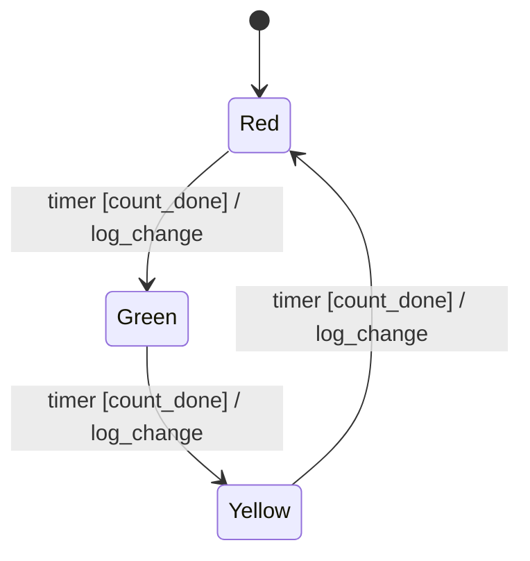
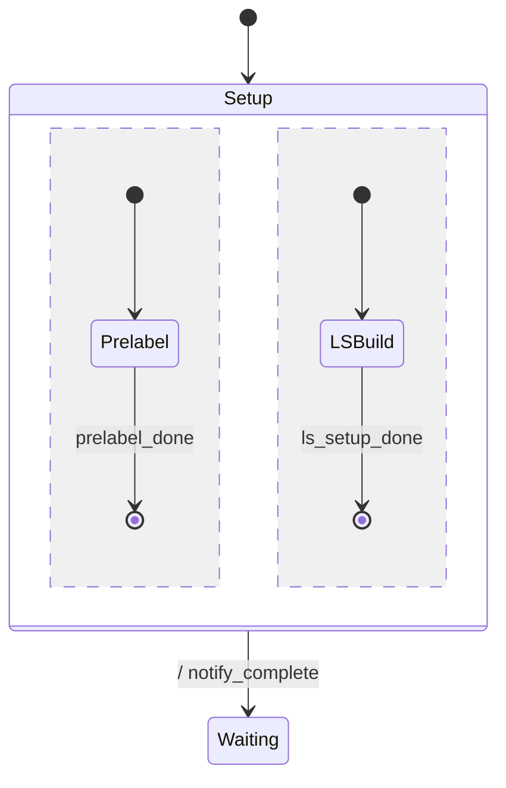
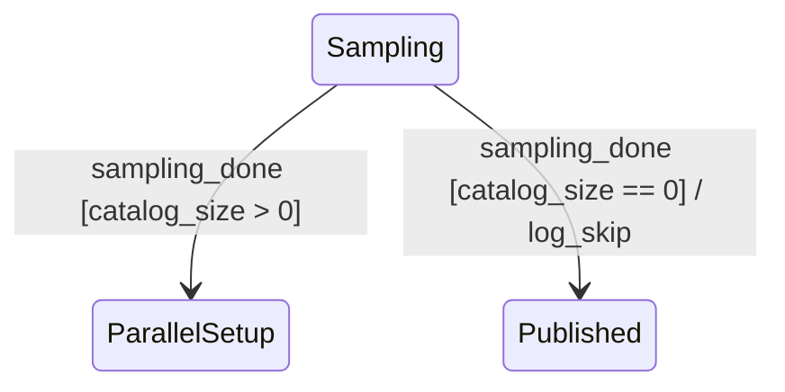

# specforge 入力仕様

specforge が受理する Mermaid `stateDiagram-v2` サブセットと、それを取り巻く補助情報 (イベント契約表
/ 設計メモ等) の契約を定める。dotfiles 管理下の `spec-behavior` skill
が出力するスペックを正準入力として想定し、そこからの**機械的な TLA+ / CSPm
変換**を成立させるための制約を明示する (TLA+ + TLC を primary、CSPm + FDR4 を secondary backend)。

---

## 1. 目的と非目的

### 1.1 目的

- `spec-behavior` skill が write モードで出力する Mermaid spec を、人手介在なしで TLA+ (TLC 入力)
  または CSPm (FDR4 入力) に変換できるようにする
- 受理可能な構文を**狭く厳密に**定義し、サブセット外のものを parse
  時に拒絶することで、変換の曖昧性を消す
- skill 著者・spec 著者・ツール実装者の三者間で「何が動く保証があるか」の合意基準にする

### 1.2 非目的

- Mermaid 全機能のサポート (notes / styles / click event 等は対象外)
- 振る舞い仕様の編集環境提供 (spec-behavior skill の役割)
- TLA+ / CSPm への変換セマンティクスは §7 で informative にまとめる (両 backend サポート済)。
  厳密な意味的等価性証明や時相論理プロパティの完全カタログ化は本仕様の対象外
- spec の妥当性 (= 設計として正しいか) の検査 (これは spec-behavior の review モードの責務)

### 1.3 成否判定

- `spec-behavior` SKILL.md 内の全 Mermaid サンプルが無修正で parse できる
- `~/job/docs/tasks/active/hitl-evaluation-system-phase-flow-spec.md` 相当の現実スペックが parse
  できる
- 変換結果が **TLC** (TLA+) で構文受理され、deadlock-free check が走る (`specforge verify` で
  end-to-end 実行可能)。 FDR4 (CSPm) も同様、環境があれば

---

## 2. リファレンス: Mermaid stateDiagram-v2

公式機能のうち specforge がどう扱うかの一覧。詳細は
[Mermaid 公式ドキュメント](https://mermaid.js.org/syntax/stateDiagram.html) を参照。

| Mermaid 機能                                     | specforge での扱い | 備考                                        |
| ------------------------------------------------ | ------------------ | ------------------------------------------- |
| `stateDiagram-v2` ヘッダ                         | **必須**           | `stateDiagram` (v1) は非対応                |
| `state ID` (bare 宣言)                           | **受理**           | description 空のエイリアス扱い              |
| `state "desc" as ID`                             | **受理**           | 表示名 / 日本語名のエイリアス               |
| `[*] --> X` 初期遷移                             | **受理**           | composite 内でも可                          |
| `X --> [*]` 終了遷移                             | **受理**           | ラベル可                                    |
| `A --> B` 単純遷移                               | **受理**           | ラベル省略可                                |
| `A --> B : label` ラベル付き遷移                 | **受理**           | ラベルは `event [guard] / action` 形式 (§4) |
| `state X { ... }` 階層 composite                 | **受理**           | 1+ の region を持つ                         |
| `--` 直交領域区切り                              | **受理**           | composite 内でのみ有効                      |
| `%% ...` 行コメント                              | **受理**           | 行末まで除去                                |
| `state X <<choice>>` choice 擬似状態             | **拒絶**           | ガード + 複数遷移で表現 (§6)                |
| `state X <<fork>>`, `<<join>>`                   | **拒絶**           | 直交領域で表現                              |
| `note right of X : ...` 等 notes                 | **拒絶**           | 視覚要素、振る舞い意味なし                  |
| `direction LR` / `TB`                            | **無視**           | parse はするが意味は持たない (検討中、§7)   |
| `classDef`, `class X foo`                        | **拒絶**           | スタイル要素                                |
| `click X "url"`                                  | **拒絶**           | navigation 要素                             |
| `state X : multi\nline\ndesc` 複数行 description | **拒絶**           | エイリアス形式 `as` を使う                  |

「拒絶」項目は parser が `ParseError` を投げて即停止する。

---

## 3. 受理サブセット (文法)

### 3.1 EBNF

```
diagram       ::= header NEWLINE region
header        ::= 'stateDiagram-v2'

region        ::= stmt*                       ; トップレベル region は orthogonal 不可
composite_body::= stmt* ('--' NEWLINE stmt*)* ; 0+ の orthogonal 領域

stmt          ::= alias_stmt
                | bare_state_stmt
                | composite_stmt
                | transition_stmt
                | comment
                | empty_line

alias_stmt    ::= 'state' SP STRING SP 'as' SP ID NEWLINE
bare_state_stmt ::= 'state' SP ID NEWLINE
composite_stmt::= 'state' SP ID SP? '{' NEWLINE composite_body '}' NEWLINE
transition_stmt::= state_ref SP? '-->' SP? state_ref (SP? ':' SP? label)? NEWLINE

state_ref     ::= '[*]' | ID
label         ::= event_part? guard_part? action_part?
event_part    ::= ID arglist?
guard_part    ::= '[' guard_expr ']'
action_part   ::= '/' SP? ID arglist?
arglist       ::= '(' arg (',' SP? arg)* ')'
arg           ::= ID                          ; payload field 参照のみ (リテラルは未対応、§7)
guard_expr    ::= [^\]]+                      ; 平文として保持し別途検証 (§4.3)

ID            ::= [A-Za-z_][A-Za-z0-9_]*
STRING        ::= '"' [^"]* '"'               ; ダブルクオート、内部エスケープなし
comment       ::= '%%' [^\n]*
SP            ::= [ \t]+
NEWLINE       ::= '\n' | '\r\n'
empty_line    ::= SP? NEWLINE
```

### 3.2 字句規則

- **ID**: ASCII の英数 + `_`、先頭は英字または `_`。Mermaid は CJK もある程度許容するが specforge は
  ASCII 限定 (Japanese 状態名は `state "投入金額待ち" as WaitingPayment` で alias 表現する)
- **STRING**: 表示用 alias の description。中身は parser からは不透明
  (具体内容に依存する処理はしない)
- **コメント**: `%%` 以降行末まで除去、ただし行番号は保持してエラー報告に使う

### 3.3 意味規則 (parse 後の検証 — Validation pass、§5.4)

- ID は **同一スコープ内で一意**。composite の親と子で同名 ID は許容 (将来 namespace で区別)
  だが、現状は **warning**
- `[*]` は遷移の `from` または `to` のみに現れる。`state [*]` のような宣言は不可
- `--` は composite_body 内でのみ出現可能。トップレベル region に書かれていたら `ParseError`
- composite は **0 個以上**の region を持つ (中身空も許容、refinement の親 spec
  で内部詳細省略時に使う)
- 同じ `(from, to, event, guard)` の組合せが複数回現れたら **warning** (ガード競合の可能性、W03)

---

## 4. 遷移ラベルの構文

UML 慣習に従う。`event [guard] / action` の **3 つの省略可能な要素**から成る。3 つすべて省略可 (=
完了遷移 / 自動遷移)。

### 4.1 形式

| 形                       | 意味                                                        | 例                                          |
| ------------------------ | ----------------------------------------------------------- | ------------------------------------------- |
| `event`                  | イベント受信時、副作用なし                                  | `A --> B : timer`                           |
| `event [guard]`          | 受信 + ガード成立で発火、副作用なし                         | `A --> B : timer [count_done]`              |
| `event / action`         | 受信時、アクション実行                                      | `A --> B : timer / log`                     |
| `event [guard] / action` | フルパターン                                                | `A --> B : timer [count_done] / log_change` |
| `[guard] / action`       | event 省略 = 内部発火 (現状非推奨、§7)                      | —                                           |
| `/ action`               | event ・ guard 省略 = 完了遷移 (composite 全 region 終了時) | `Parallel --> Next : / notify`              |
| (ラベルなし)             | 副作用なしの即遷移 (主に `[*] -->` の初期遷移で使用)        | `[*] --> Idle`                              |

### 4.2 引数表記 (specforge の追加制約)

イベント・アクションが引数を取る場合、関数形式 `name(arg1, arg2)` で書く。spec-behavior の R-D
で追加された規律と一致。

- イベント引数: `pick(item)`、`insert_bill(amount)` — payload field を参照
- アクション引数: `publish_failed(current_phase)`、`log(level, msg)` — 実行時引数
- ガード内で引数参照: `pick(item) [item in displayed_items]`

parser は event 部分の `name` と `args` を分割して AST の `Label.event` (bare 名)、
`Label.eventArgs` (引数列) に格納する。 event 契約表との lookup は bare 名で行うので、 Mermaid 側が
`event(arg)` 形式でも `event` 形式でも payload binding は同じく動く。

引数の**型・形式の宣言は別途**:

- multi-entity の場合: イベント契約表の `payload` 列 (§5.1)
- 単一エンティティの場合: 設計メモの「状態変数 / イベント引数」セクション

引数なしの場合は `()` を省略可 (`timer` で OK、`timer()` も等価で受理)。

### 4.3 ガード式の制約

specforge
はガード式を**正規表現で構造的に抜き出すのみ**で、内部の意味解析は別パスに分離する。受理する形は
spec-behavior の規律に従う:

- **参照可能な値**: 事前状態の state variable + イベント引数 + 定数
- **演算子**: 比較 (`==`, `!=`, `<`, `<=`, `>`, `>=`)、論理 (`&&`, `||`, `!`)、集合 (`in`, `not in`)
- **数式記法は非推奨**: `count' = count + 1` のような prime 記法は guard には書かない (action 側で
  `increment_count` 等の ID 化を使う)

Validation pass (§5.4) で式を tokenize し、`(`/`)` の対応や未知 ID 検出を行う。FDR4
が受理できる構文への変換は CSPm 側の責務。

### 4.4 内部遷移 (tau)

外部イベント不要で発火する遷移は `internal_xxx` の命名規約で書く (spec-behavior 規律)。

例: `Authenticating --> Locked : internal_check [fail_count >= 5] / lock_account`

**現状**: specforge は `internal_` プレフィックスを **特別扱いしない** (通常の event と同様 channel
として宣言、TLA+ では action 名として emit する)。 命名規約として「読み手にとって外部
イベントか内部発火か区別がつく」点だけ確保する。 将来 CSPm 側で `\ {internal_*}` 形式の hiding
を入れる案あり (CLAUDE.md Pending 参照)。 TLA+ には hiding に直接対応する機構が無いため、 TLA+
側は何もしない予定。

---

## 5. 補助情報 (Side artifacts)

Mermaid 図だけでは形式変換に必要な情報が足りない。spec ファイル内 / 別ファイルで以下を提供する。

### 5.1 イベント契約表 (multi-entity の場合に必須)

複数のサブシステム / state machine が連携する spec
では、共有イベントの通信契約を表で明示する。spec-behavior の
`references/multi-entity-composition.md` 規律と一致。

形式 (Markdown table):

```markdown
| event                 | producer      | consumer                                      | sync性                         | payload                    | 備考                          |
| --------------------- | ------------- | --------------------------------------------- | ------------------------------ | -------------------------- | ----------------------------- |
| `sampling_done`       | Sampling step | Sampling step (自己ループ後 ParallelSetup へ) | async / at-least-once / 点対点 | `{batch_id, catalog_size}` | `catalog_size` をガードで使用 |
| `annotation_complete` | 運用者 (手動) | spec 全体                                     | async / 手動キック             | `{batch_id}`               | ガード未使用                  |
```

specforge は `.md` 入力時、`### イベント契約` / `### イベント一覧` / `### イベント定義` (もしくは
英語版 `Event contract(s)` / `Event list(s)` / `Event definition(s)`) を含む見出しの直後の表を
拾う。表のヘッダ行で「payload」(もしくは「ペイロード」) を含むセルがある列を payload 列として
特定し、各データ行の 1 列目を event 名、payload セルの `{f1, f2, ...}` 部分を payload field 列
として取り込む。`{}` の周囲にある補足コメント (例:
`` `{batch_id, catalog_size}` (`catalog_size` を `catalog_ok` で使用) ``) は無視される。

CSPm 出力では payload を持つ event は `channel ev : VAL.VAL` の型付き channel として宣言され、
遷移箇所では `ev?f1.f2 -> (guard) & action -> Next` の受信パターンに展開される。これにより guard
内の変数参照が **channel 受信で bind された値** を見るようになり、event ごとに異なる値で
ガード判定が行われる (Phase 3 の主目的)。

VAL の bound はデフォルト `{0..1}` で生成される (検証時の状態空間を最小に保つため)。広い範囲で
検証したい場合は CLI flag `--bound=N` で `{0..N}` に上書き可能 (TLA+ の `Domain == 0..N` も同時に
切り替わる)。例: hitl spec で `--bound=5` を指定すると、 TLC が探索する distinct states は 27 → 3943
まで増える。

### 5.2 状態変数の列挙 (specforge が取り込む)

ガード / アクションで参照される状態変数を、型と所有者 (どの step が書くか) を含めて列挙する。CSP
プロセスパラメータへのマップに使う。

specforge は `### 共有(状態|変数)` / `### State variable(s)` / `### Shared state` を含む見出しの
直後の markdown 表から **1 列目を変数名**として取り出し、CSPm 冒頭に `<name> = 0` の定数定義を emit
する。それ以外の列 (型 / 書き手 / 初期値 等) は現状 specforge は読まない (Phase 3 で型情報を
取り込んでプロセスパラメータ化する予定)。

形式 (推奨):

```markdown
### 共有状態と排他制御

| 変数               | 型        | 書き手           | 読み手                     | 初期値 |
| ------------------ | --------- | ---------------- | -------------------------- | ------ |
| `catalog_size`     | int (>=0) | Sampling step    | Sampling 遷移時のガード    | 0      |
| `prelabeled_count` | int (>=0) | Prelabeling step | Prelabeling 遷移時のガード | 0      |
```

specforge が出す CSPm の例:

```cspm
-- specforge: entry point with default initial values (edit to verify scenarios)
Spec = enter_sampling -> Sampling(0, 0)
-- assert Spec :[deadlock free]

Sampling(catalog_size, prelabeled_count) =
  sampling_done?batch_id.catalog_size -> (catalog_size > 0)
    & emit_sampling_done -> ParallelSetup(catalog_size, prelabeled_count)
  [] ...
```

Phase 4 で **プロセスパラメータ threading** に切り替わった: 全プロセスが state var 列を引数として
受け取り、target invocation で同じ引数を伝播する。event payload field の名前が state var 名と
一致すると、CSPm の `?` 受信が自動でスコープシャドウィングを起こし、続く invocation には 新値が
thread される (上の例だと `sampling_done?_.catalog_size` で受け取った値がそのまま
`ParallelSetup(catalog_size, ...)` に渡る)。

シナリオごとに違う初期値で検証したい場合は、生成された `Spec = Initial(0, 0, ...)` の数値を
書き換えるか、`|~| c : VAL @ Sampling(c, 0, ...)` 形式の非決定的選択で全初期値を網羅する。

### 5.3 ガード定義表 (specforge が取り込む)

`[catalog_ok]` のような **ガードタグ**と、対応する **CSP/CSPm 式**を表で対応付ける。specforge は
`.md` 入力時にこの表を抽出し、CSPm 生成時に guard タグを式に置換する。

入力形式:

- `### ガード定義` または `### Guard(s)` を含む見出し (`#` 1〜6 個、case insensitive)
- 直後の最初の markdown 表を取り込む
- 1 列目 = ガードタグ、2 列目 = 条件式
- backtick (`` `catalog_ok` ``) で囲んでも囲まなくても可

形式:

```markdown
### ガード定義

| ガード ID       | 条件                | 根拠                     |
| --------------- | ------------------- | ------------------------ |
| `catalog_ok`    | `catalog_size > 0`  | サンプリング結果があれば |
| `catalog_empty` | `catalog_size == 0` | データなし               |
```

辞書に無いタグは verbatim で出力される (FDR4 側で未定義識別子エラーになるので、表に書き漏らしを
発見しやすい)。

`.mmd` 入力 (raw Mermaid) を渡した場合、ガード辞書は空のまま全て verbatim 出力。
ガード辞書を使いたい場合は `.md` 形式で `### ガード定義` 表を含めて渡す必要がある。

### 5.4 設計メモ

spec-behavior の write モード Step 4 で出力される設計メモを継承する。CSPm 変換に直接効くフィールド:

- **未定義イベントの扱い**: `無視 (self-loop / no-op)` or `エラー` — どちらかを宣言。CSP 側は前者を
  self-loop transition、後者を `STOP` で表現
- **アクションの冪等性**: `accumulative` / `idempotent` の区分。at-least-once
  配信下で意味が変わる箇所
- **broadcast の対応**: 同名イベントを直交領域に書いた箇所一覧
- **共有状態の排他制御**: 単一書き込み元 / lock / CAS 等
- **既知の未対応ケース**: 意図的に省いた組合せ (検証時の expected gap)

### 5.5 Validation pass の責務

parse 後に走る別パス。**parser は構文のみ受理 / 拒絶**し、意味検査はこちら。 実装は
`src/validate.ts`。 各ルールは安定 ID (`V00x`) を持ち、`--strict` flag で warning → failure 昇格:

- **V001** — ガードタグが `### ガード定義` 表に登録されていない
- **V002** — ガード式が state var / event payload のどちらにも無い識別子を参照
- **V003** — composite region に `[*] --> <entry>` の初期遷移が無い
- **V004** — state は宣言されているが、 どの transition の `to` にも現れない (= 未到達)
- **V005** — state は到達可能だが、 どの transition の `from` にも現れない (= 出口なし、 stuck
  可能性)。 V004 と排他
- **V006** — event payload field が state var と「似ているが一致しない」 (1 文字違い or
  case/underscore 差) → タイポ / 命名規則漏れの疑い。 完全一致は Phase 2 binding 対象なので警告外
- **V007** — 同一 `(from, to, event, guard)` の tuple が複数 transition に出現 (action だけ違う、
  完全重複 等)

V008 以降は [`../tasks/todo.md`](../tasks/todo.md) 参照。

---

## 6. 受理しない要素と代替表現

`spec-behavior` の規律内で同じ意味を表現する方法を持っているため、Mermaid の以下機能は specforge
では明示的に拒絶する。

### 6.1 Choice 擬似状態

Mermaid:

```
state if_state <<choice>>
A --> if_state
if_state --> B : [count > 5]
if_state --> C : [count <= 5]
```

specforge での代替: ガードによる分岐:

```
A --> B : event [count > 5]
A --> C : event [count <= 5]
```

### 6.2 Fork / Join 擬似状態

直交領域 + composite で表現する。Mermaid の `<<fork>>` / `<<join>>` は使わない。

### 6.3 Notes

`note right of X : ...` の代わりに、`%%` コメントか、別ドキュメントで補足する。Mermaid
を絵としてだけ見るときに note は便利だが、形式変換には邪魔。

### 6.4 複数行 description

```
state Sampling : 月初に\n本番データから\nカタログ生成
```

specforge での代替: 別 doc に説明を書き、Mermaid 内では ID か alias のみ:

```
state "サンプリング中" as Sampling
```

### 6.5 Style / class / click

スタイルとナビゲーションは振る舞いに無関係なため非対応。

---

## 7. CSPm / TLA+ 変換セマンティクス (informative)

specforge は同じ AST から 2 つの形式に変換できる:

- **CSPm** (`src/cspm.ts`): FDR4 入力。プロセス代数。default 出力。 `deno task cli spec.md`
- **TLA+** (`src/tla.ts`): TLC 入力。状態機械 + 時相論理。`deno task cli --tla spec.md` または
  `deno task verify spec.md` (TLC で検証まで実行)

TLA+ 変換の概要 (Phase A + B + 2):

- state → `phase` 変数の値 (`phase \in {"A", "B", ...}`)
- state var → TLA+ 変数 (`VARIABLES phase, count, ...`)、初期値 0
- 各 transition → action 述語 `<From>_<event>_<To> == phase = "From" /\ guard /\ phase' = "To"`
- guard → conjunct (ガード辞書で式に置換、`==`/`!=`/`&&`/`||` は TLA+ 流に自動変換)
- `X --> [*]` → X を TerminalStates に追加、`Stutter == phase \in TerminalStates /\ UNCHANGED vars`
  で TLC の deadlock 誤検出を回避
- **composite / 直交領域** (Phase B): 各 region に `<composite>_r<N>` 変数を追加し、`"_inactive"` /
  入口 state / `"_done"` の 3 値で region 進行を track。composite 完了遷移は全 region が `_done` を
  precondition、triggered exit は event 発火で region 状態に関わらず割り込み
- **event payload binding** (Phase 2): event の payload field が state var 名と一致すれば、
  `\E new_<var> \in Domain:` で非決定的に bind して `<var>' = new_<var>` で更新。 guard 内の該当
  変数参照は `new_<var>` に rename される。 `Domain == 0..1` で値域を最小に保つ (TLC の状態空間
  爆発を抑制)

以下は CSPm 側の方針 (informative)。実装は `src/cspm.ts` を参照。

### 7.1 状態 → プロセス

各 state は CSPm のプロセスとして定義する:

```
StateName = <出ていく遷移の選択>
```

### 7.2 遷移 → prefix + choice

`A --> B : event [guard] / action` を:

```
A = event -> (if guard then action -> B else ...) [] <他の遷移>
```

guard が無ければ if/else 不要、action が無ければ直接 `event -> B`。

### 7.3 ガード処理

複数の同 event 遷移に異なるガードがある場合:

```
A --> B : ev [g1] / a1
A --> C : ev [g2] / a2
```

→

```
A = ev -> (if g1 then a1 -> B
           else if g2 then a2 -> C
           else SKIP)
```

決定性のため g1, g2 は disjoint であることを Validation pass で warning (`W03 ガード競合`)。

### 7.4 内部遷移 → 隠蔽

`internal_*` イベントを `\ {internal_*}` で隠蔽する候補。これにより外部から見て tau (黙示)
として振る舞う。

### 7.5 直交領域 → `|||` / `[| events |]`

composite に複数 region がある場合:

```
state Parallel {
    [*] --> A
    A --> [*] : done_a
    --
    [*] --> X
    X --> [*] : done_x
}
```

→

```
Parallel = (PA ||| PX) ; ParallelExit
PA = done_a -> SKIP
PX = done_x -> SKIP
```

broadcast (同名 event を複数 region に書く) は `[| {shared_events} |]` (同期セット指定) で表現する。

### 7.6 Composite 退出 → interrupt (`/\`)

composite から外部状態への遷移 (composite 全体退出) は interrupt 演算子で表現:

```
Outer = ParallelBody /\ (exit_event -> ExternalState)
```

UML の「進行中 region の処理打ち切り」セマンティクスに対応 (spec-behavior の「orthogonal region
退出セマンティクス」)。

### 7.7 at-least-once → 冪等性活用

CSP は exactly-once 同期。at-least-once を直接表現できないため、spec の冪等性アノテーションを使う:

- **冪等系アクション**: 同 event の重複受信を許容する self-loop を追加 (no-op として吸収)
- **累積系アクション**: 重複受信は不正状態として扱う (実装層が dedup 責任を持つ前提を明示)

### 7.8 状態変数 → プロセスパラメータ

ガード / アクションで参照される状態変数を CSP プロセスのパラメータにする:

```
Sampling(catalog_size) = sampling_done?cs -> 
    if cs > 0 then ParallelSetup(cs) 
    else Published
```

§5.2 の状態変数一覧をもとに自動でパラメータ化する (実装 pending)。

---

## 8. 例

### 8.1 最小例 (traffic light)



期待 CSPm (sketch):

```
Red = timer & count_done -> log_change -> Green
Green = timer & count_done -> log_change -> Yellow
Yellow = timer & count_done -> log_change -> Red
```

### 8.2 composite + orthogonal regions



期待 CSPm (sketch、composite 対応後):

```
Setup = (Prelabel ||| LSBuild) /\ ExitTransitions
Prelabel = prelabel_done -> SKIP
LSBuild = ls_setup_done -> SKIP
ExitTransitions = notify_complete -> Waiting
```

### 8.3 ガード分岐



期待 CSPm:

```
Sampling(catalog_size) = sampling_done -> 
    (if catalog_size > 0 then ParallelSetup(catalog_size)
     else log_skip -> Published)
```

---

## 9. 参照

- `spec-behavior` skill: `~/.claude/skills/spec-behavior/SKILL.md` — 入力 spec を書く側の規律
- `spec-behavior/references/multi-entity-composition.md` — multi-entity / refinement / impl
  分離パターン
- Mermaid: https://mermaid.js.org/syntax/stateDiagram.html
- FDR4 / CSPm: https://www.cs.ox.ac.uk/projects/fdr/

## 10. 変更履歴

- v0.1 (初版): 受理サブセット定義、§3 EBNF、§4 ラベル構文、§5 補助情報、§6 拒絶要素、§7 CSPm
  変換セマンティクス (informative)。
- v0.2: §7 を TLA+ 変換セマンティクス (Phase A + B + 2) に拡張。 §5.2 / §5.3 の表抽出と guard
  辞書化を実装に揃えて記述。 §5.5 Validation pass を実装済 (V001〜V004) として展開。 §1.2 非目的
  から「TLA+ は将来課題」を撤回 (実装済)。 §1.3 成否判定に TLC 受理を追記。 §4.4 internal_* の現状
  (特別扱いしない) と将来の hiding 案を明記。 §5.1 末尾に `--bound=N` の効果を追記。
