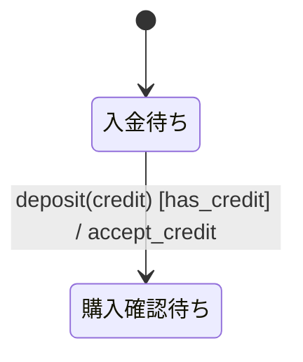
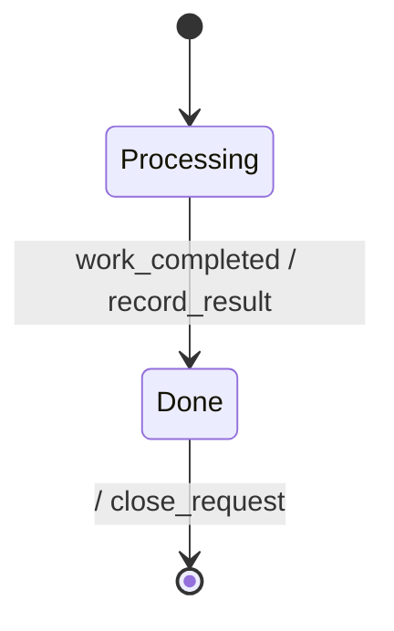
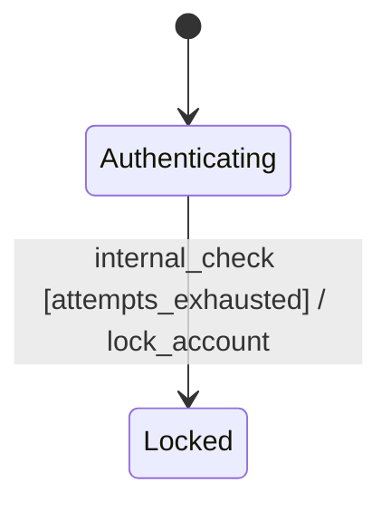
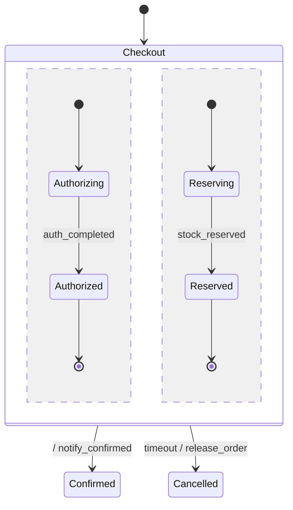
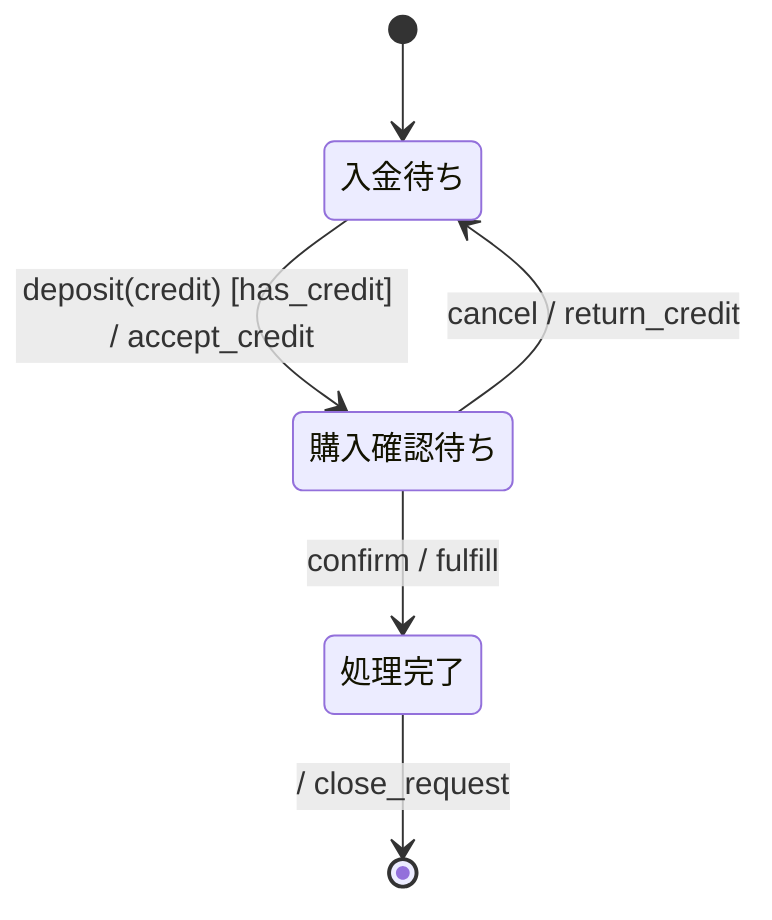

# specforgeで検証できる振る舞い仕様の書き方

specforgeの入力は、Mermaid `stateDiagram-v2`と補助表を含むMarkdown文書である。
この文書では、要求から状態機械を組み立て、指摘をすべて失敗として扱う静的検査と、TLCによるモデル検査へ渡すまでの手順を示す。

振る舞い仕様の概念は[振る舞い仕様とは何か](./behavior-specs.md)を先に参照する。
構文解析器が受理する文字単位の規則と変換規則は[入力仕様](./spec.md)を正準とする。

## 作成前に境界を決める

最初に、仕様が扱う対象と扱わない対象を一文ずつ書く。
この境界がないと、対象となる振る舞い、通信基盤、運用手順、画面遷移が一つの図へ混ざる。

次の四点を確定する。

- **対象となる主体**：状態を一つだけ持つ主体は何か。
- **開始と終了**：どのイベントから仕様を開始し、どの状態までを扱うか。
- **観測可能な結果**：利用者または他の主体から見えるアクションは何か。
- **非対象**：別仕様または実装文書へ置く規則は何か。

例えば自動販売機を対象にする場合、「入金待ちから商品払い出し完了まで」を扱い、硬貨識別器の回路や在庫データベースの構造は扱わない。

## 表か状態機械かを選ぶ

入力だけで出力が決まる規則は表にする。
履歴、動作モード、並行性によって反応が変わる規則は状態機械にする。

両方を含む場合は、状態遷移と、状態を持たない変換を分ける。
例えば`Selecting`状態での商品価格計算は表にし、「購入可能なら`Dispensing`へ進む」という制御を状態機械に置く。

## イベントから列挙する

正常系の処理順から状態を作り始めると、異常系と遅れて届くイベントを見落としやすい。
外部から届くイベントを先に列挙し、各イベントがどの状態で意味を持つかを確認する。

イベント一覧には次を含める。

- 利用者または運用者の操作
- 外部システムの成功通知と失敗通知
- タイムアウト
- 取消
- 再試行または回復の契機
- 内部条件の成立

イベント名は、発生した事実または受信した命令を対象領域の語で表す。
同じイベントを複数の図で共有する場合、綴りを完全に一致させる。

## 状態を抽出する

同じイベントに対する反応が変わる境界を状態にする。
処理を実行する関数やジョブの数に合わせて状態を作らない。

各状態について次の問いに答える。

- この状態へ入るイベントは何か。
- この状態から出るイベントは何か。
- タイムアウト、取消、失敗を受けたらどこへ進むか。
- 終了状態か、常に次の遷移が必要な状態か。
- この状態で未定義イベントを受けたらどうするか。

状態IDにはASCIIの英字、数字、`_`を使う。 日本語表示名は別名として付ける。



## 遷移を書く

通常の遷移ラベルは次の順にする。

```text
event [guard] / action
```

各要素の意味を次に示す。

| 要素                 | 意味                                 | 例                |
| -------------------- | ------------------------------------ | ----------------- |
| イベント（event）    | 遷移を試みる契機                     | `deposit(credit)` |
| ガード               | 事前状態とペイロードに対する許可条件 | `[has_credit]`    |
| アクション（action） | 遷移に伴う観測可能な作用             | `/ accept_credit` |

引数のないイベントでは`()`を省略できる。
引数はイベント契約で宣言したペイロードの項目名と一致させる。

完了遷移ではイベントを省略できる。



外部イベントを必要としない判定は`internal_`接頭辞を使う。



`internal_`は読み手のための命名規則であり、現在のspecforgeは通常のイベントと同様に変換する。

## ガードを定義する

Mermaidには短いガードIDを書き、条件式を`### ガード定義`表に置く。

```markdown
### ガード定義

| ガードID     | 条件         | 根拠                   |
| ------------ | ------------ | ---------------------- |
| `has_credit` | `credit > 0` | 入金後の残高が正である |
```

ガードが参照できるのは、次の値である。

- `### 共有状態`表で宣言した状態変数
- 対象イベントのペイロード項目
- 定数
- `TRUE` と `FALSE`

同じ状態とイベントから分岐するガードは、重なりと漏れを確認する。

```text
retry_count < max_retries
retry_count >= max_retries
```

この二条件は排他的であり、整数の全域を覆う。
意図的にどのガードにも合わない範囲を残す場合、そのイベントを無視するのかエラーにするのかを設計メモに書く。

## アクションを定義する

アクションIDと作用の意味を表で対応付ける。 再試行される可能性があるアクションには冪等性を書く。

```markdown
### アクション定義

| アクションID      | 意味                   | 冪等性             |
| ----------------- | ---------------------- | ------------------ |
| `accept_credit`   | 入金済み残高を確定する | 同じ取引IDでは冪等 |
| `return_credit`   | 確定済み残高を返金する | 同じ取引IDでは冪等 |
| `increment_retry` | 再試行回数を一つ増やす | 累積系             |
```

現在のspecforgeはアクション名を変換するが、アクションが状態変数をどう更新するかまでは解釈しない。
したがってアクション表は人間向けの契約であり、実際の副作用や変数更新は検査対象ではない。

## イベント契約を書く

ペイロードを使う場合と、複数の主体がイベントを共有する場合はイベント契約表を書く。 見出しには
`### イベント契約`、`### イベント一覧`、`### イベント定義` のいずれかを使う。

```markdown
### イベント契約

| イベント  | 発生元   | 受信先     | 通信方式 | ペイロード | 備考             |
| --------- | -------- | ---------- | -------- | ---------- | ---------------- |
| `deposit` | 入金装置 | 自動販売機 | 同期     | `{credit}` | 入金後の累積残高 |
| `confirm` | 購入者   | 自動販売機 | 同期     | `{}`       | 購入を確定する   |
```

specforgeは第一列をイベント名として読み、`payload`または`ペイロード`を含む列から
`{field1, field2}`を抽出する。
ペイロード項目と状態変数を同じ名前にすると、そのイベントで受け取った値が次の状態へ引き継がれる。

複数の主体を結ぶ契約では、同期または非同期に加え、必要なら最大一回、少なくとも一回、同時配送、点対点といった配送方法を書く。

## 状態変数を宣言する

`### 共有状態` または `### State variables` の直後に表を置く。 specforge
は第一列を変数名として読む。

```markdown
### 共有状態

| 変数     | 型         | 書き手   | 読み手             | 初期値 |
| -------- | ---------- | -------- | ------------------ | ------ |
| `credit` | int (>= 0) | 入金装置 | `has_credit`ガード | 0      |
```

型、書き手、読み手、初期値は人間向けの契約として残す。
現在の変換処理は各状態変数を共通の有限整数値域`0..bound`で検証する。

共有状態を複数の主体が更新する場合は、所有者と排他方針を設計メモに書く。

## 階層状態と直交領域を使う

複数の状態に共通する外向きの遷移がある場合は、階層状態にまとめる。
階層状態内の各領域には初期遷移が必要である。



直交領域は、複数の領域が同時に有効であることを表す。
順番にしか進まない処理を図の配置目的で直交領域にしない。

同じイベントを複数の領域へ同時に配送する場合は、各領域に同じイベント名を書く。
現在のspecforgeはこの記法を構文解析できるが、同名イベントの同期をまだ生成しない。
同時配送を必要とする性質は未検証として設計メモに残す。

## 設計メモを書く

図と表だけでは、省略した組合せの意味を確定できない。 仕様の末尾に `## 設計メモ`
を置き、次を記述する。

- **直積崩れの扱い**：禁止状態、遷移制限、モード依存をどこで使ったか
- **同時配送の対応**：対象イベントと領域。該当しない場合は「なし」
- **ガードの根拠**：条件の理由と参照値の範囲
- **アクションの冪等性**：累積系と冪等系、再試行時の結果
- **未定義イベントの扱い**：無視、error、到達不能のどれか
- **異常系の網羅**：取消、失敗、拒否、タイムアウト、回復
- **既知の未対応ケース**：意図的に省いた組合せ

複数の主体、共有状態、詳細仕様、実装文書がある場合は、それぞれの契約とリンクも加える。

## 進行性を宣言する

終了状態へ最終的に到達することなどをTLCで検査する場合、`### 進行性`表を加える。

```markdown
### 進行性

| プロパティ名  | 式             |
| ------------- | -------------- |
| `Termination` | `<>Terminated` |
```

性質が一件以上あると、specforgeは`WF_vars(Next)`を弱公平性の仮定として追加する。
現在は一律の仮定であり、遷移ごとに弱公平性または強公平性を指定できない。

## 一つの仕様にまとめる

最小の完全例を示す。

````markdown
# 購入処理 振る舞い仕様

## リアクティブ仕様



### イベント契約

| イベント  | 発生元   | 受信先   | 通信方式 | ペイロード | 備考       |
| --------- | -------- | -------- | -------- | ---------- | ---------- |
| `deposit` | 入金装置 | 購入処理 | 同期     | `{credit}` | 入金後残高 |
| `confirm` | 購入者   | 購入処理 | 同期     | `{}`       | 購入確定   |
| `cancel`  | 購入者   | 購入処理 | 同期     | `{}`       | 入金取消   |

### アクション定義

| アクションID    | 意味                   | 冪等性       |
| --------------- | ---------------------- | ------------ |
| `accept_credit` | 入金済み残高を確定する | 冪等         |
| `fulfill`       | 商品を払い出す         | 取引IDで冪等 |
| `return_credit` | 残高を返金する         | 取引IDで冪等 |
| `close_request` | 処理を終了する         | 一回限り     |

### ガード定義

| ガードID     | 条件         | 根拠                   |
| ------------ | ------------ | ---------------------- |
| `has_credit` | `credit > 0` | 正の残高だけを受理する |

### 共有状態

| 変数     | 型         | 書き手   | 読み手       | 初期値 |
| -------- | ---------- | -------- | ------------ | ------ |
| `credit` | int (>= 0) | 入金装置 | `has_credit` | 0      |

## 設計メモ

- 直積崩れの扱い：単一の線形な処理であり、並行状態はない。
- 同時配送の対応：なし。
- ガードの根拠：`credit`は`deposit`のペイロードと同名の状態変数である。
- アクションの冪等性：外部作用は取引IDで重複を除く。
- 未定義イベントの扱い：何もせず無視する。
- 異常系の網羅：購入確定前の`cancel`を扱う。
- 既知の未対応ケース：商品在庫切れと装置故障は別仕様で扱う。
````

この構成では、Mermaidが状態遷移を、各表が名前の意味とモデル変数を、設計メモが省略規則を受け持つ。

## 構文解析と静的検査を実行する

リポジトリ内では次のコマンドを実行する。

```bash
deno task cli --json --strict path/to/spec.md
```

インストール済みの実行ファイルを使う場合は次を実行する。

```bash
specforge --json --strict path/to/spec.md
```

`--json`は、構文解析済みの抽象構文木と抽出した補助情報を表示する。
`--strict`は、静的検査の指摘を警告で終わらせず、終了コード1の失敗として扱う。

指摘を抑制して失敗を消すのではなく、仕様の意図と検査規則のどちらが誤っているかを確認する。

厳格な静的検査は、構文と現在実装済みの静的規則を確認する。
アクションによる変数更新、ファイル間のイベント合成、仕様の詳細化、直交領域への同時イベント配送は別途レビューする。

## TLCでモデル検査する

Javaと`tla2tools.jar`を用意した環境では次を実行する。

```bash
deno task verify --strict --bound=3 path/to/spec.md
```

実行ファイルを使う場合は次を実行する。

```bash
specforge verify --strict --bound=3 path/to/spec.md
```

最初の`--bound`は、ガードの境界値を含む最小値にする。
例えば`retry_count >= 3`を検査するなら、3未満の上限では境界へ到達できない。

上限を広げると状態変数の組合せが増え、探索状態数も増える。
小さい値で通った結果だけで十分とせず、要求上必要な境界を列挙してから上限を決める。

## 完了条件

仕様作成は、次をすべて満たした時点で完了とする。

- 対象となる主体と非対象が書かれている。
- 変換系とリアクティブ系の境界が決まっている。
- 初期状態と必要な終了状態がある。
- 正常系と異常系のイベントが同じ抽象度で書かれている。
- ガードの重なりと漏れを確認した。
- 未定義イベントの扱いがある。
- アクションの冪等性と共有状態の所有者がある。
- `specforge --json --strict` 相当が成功する。
- 必要な性質を宣言し、対象となる上限で`verify`の結果を確認した。
