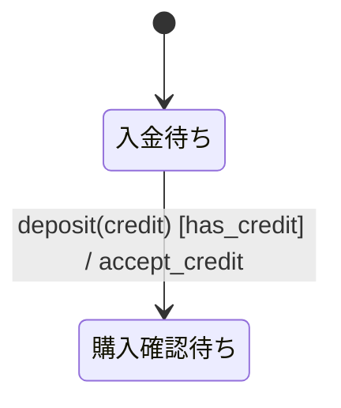
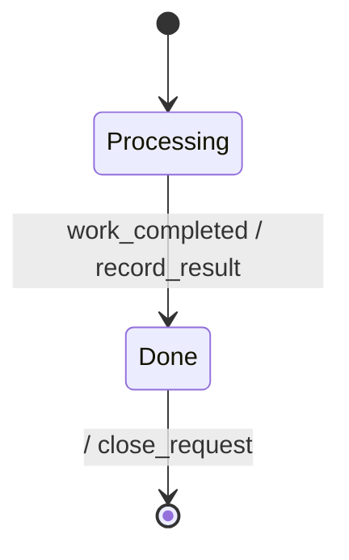
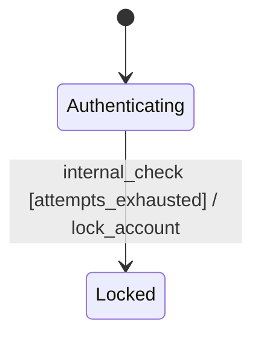
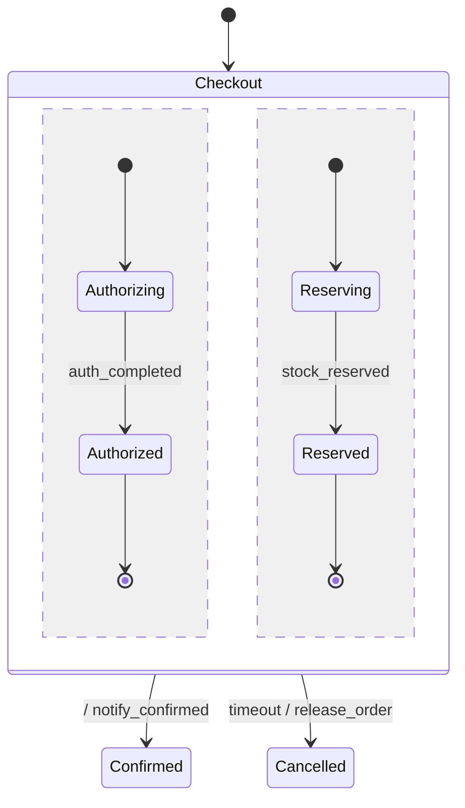
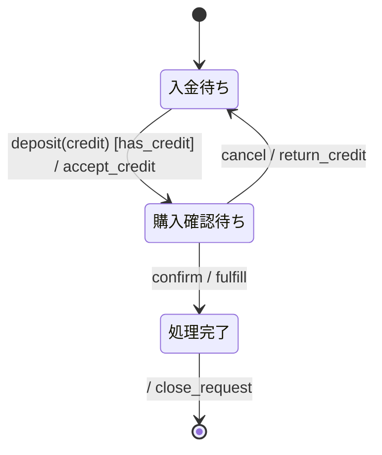

# specforge で検証できる振る舞い仕様の書き方

specforge の入力は、Mermaid `stateDiagram-v2` と補助表を含む Markdown 文書である。
この文書では、要求から状態機械を組み立て、strict validation と TLC 検証へ渡すまでの手順を示す。

振る舞い仕様の概念は [behavior-specs.md](./behavior-specs.md) を先に参照する。 parser
が受理する文字単位の規則や backend の変換 semantics は [spec.md](./spec.md) を正準とする。

## 作成前に境界を決める

最初に、仕様が扱う対象と扱わない対象を一文ずつ書く。 この境界がないと、domain behavior と
middleware、運用手順、画面遷移が一つの図へ混ざる。

次の四点を確定する。

- **対象 entity**：状態を一つだけ持つ主体は何か。
- **開始と終了**：どの event から仕様を開始し、どの状態までを扱うか。
- **観測可能な結果**：利用者または他 entity から見える action は何か。
- **非対象**：別仕様または実装文書へ置く規則は何か。

例えば自販機を対象にする場合、「入金待ちから商品払い出し完了まで」を扱い、硬貨識別器の回路や在庫
database の schema は扱わない。

## 表か状態機械かを選ぶ

入力だけで出力が決まる規則は表にする。 履歴、mode、並列性によって反応が変わる規則は状態機械にする。

両方を含む場合は、state transition と stateless conversion を分ける。 例えば `Selecting` state
での商品価格計算は表にし、「購入可能なら `Dispensing` へ進む」という制御を状態機械に置く。

## Event から列挙する

正常系の処理順から state を作り始めると、異常系と遅延 event を見落としやすい。 外部から届く event
を先に列挙し、各 event がどの state で意味を持つかを確認する。

event 一覧には次を含める。

- 利用者または operator の操作
- 外部 subsystem の成功通知と失敗通知
- timeout
- cancel
- retry または recovery の契機
- 内部条件の成立

event 名は発生した事実または受信した命令を domain の語で表す。 同じ event
を複数の図で共有する場合、綴りを完全に一致させる。

## State を抽出する

同じ event に対する反応が変わる境界を state にする。 処理を実行する function や job の数に合わせて
state を作らない。

各 state について次の問いに答える。

- この state へ入る event は何か。
- この state から出る event は何か。
- timeout、cancel、失敗を受けたらどこへ進むか。
- 終了 state か、常に次の遷移が必要な state か。
- この state で未定義 event を受けたらどうするか。

state ID には ASCII の英字、数字、`_` を使う。 日本語表示名は alias で付ける。



## Transition を書く

通常の transition label は次の順にする。

```text
event [guard] / action
```

各要素の意味を次に示す。

| Element | Meaning                             | Example           |
| ------- | ----------------------------------- | ----------------- |
| event   | 遷移を試みる契機                    | `deposit(credit)` |
| guard   | 事前状態と payload に対する許可条件 | `[has_credit]`    |
| action  | 遷移に伴う観測可能な作用            | `/ accept_credit` |

引数なし event の `()` は省略できる。 引数は event contract の payload field 名と一致させる。

完了遷移では event を省略できる。



外部 event を必要としない判定は `internal_` 接頭辞を使う。



`internal_` は読み手のための命名規則であり、現在の specforge は通常の event と同様に変換する。

## Guard を定義する

Mermaid には短い guard ID を書き、条件式を `### ガード定義` 表に置く。

```markdown
### ガード定義

| ガード ID    | 条件         | 根拠                   |
| ------------ | ------------ | ---------------------- |
| `has_credit` | `credit > 0` | 入金後の残高が正である |
```

guard が参照できるのは、次の値である。

- `### 共有状態` 表で宣言した state variable
- 対象 event の payload field
- 定数
- `TRUE` と `FALSE`

同じ state と event から分岐する guard は、重なりと漏れを確認する。

```text
retry_count < max_retries
retry_count >= max_retries
```

この二条件は排他的であり、整数の全域を覆う。 意図的にどの guard にも合わない範囲を残す場合、その
event を無視するのか error にするのかを設計メモに書く。

## Action を定義する

action ID と作用の意味を表で対応付ける。 retry される可能性がある action には冪等性を書く。

```markdown
### アクション定義

| アクション ID     | 意味                     | 冪等性               |
| ----------------- | ------------------------ | -------------------- |
| `accept_credit`   | 入金済み残高を確定する   | 同じ取引 ID では冪等 |
| `return_credit`   | 確定済み残高を返金する   | 同じ取引 ID では冪等 |
| `increment_retry` | retry count を一つ増やす | 累積系               |
```

現在の specforge は action 名を変換するが、action が state variable
をどう更新するかまでは解釈しない。 したがって action table は人間向けの契約であり、変数更新
semantics の機械検証には現在の実装上の制約がある。

## Event Contract を書く

payload を使う場合と、複数 entity が event を共有する場合は event contract table を書く。 見出しには
`### イベント契約`、`### イベント一覧`、`### イベント定義` のいずれかを使う。

```markdown
### イベント契約

| Event     | Producer      | Consumer        | Sync | Payload    | Notes            |
| --------- | ------------- | --------------- | ---- | ---------- | ---------------- |
| `deposit` | Payment input | Vending machine | sync | `{credit}` | 入金後の累積残高 |
| `confirm` | Customer      | Vending machine | sync | `{}`       | 購入を確定する   |
```

specforge は第一列を event 名として読み、`payload` または `ペイロード` を含む列から
`{field1, field2}` を抽出する。 payload field と state variable を同じ名前にすると、その event
で受け取った値が次の state へ引き継がれる。

複数 entity の contract では sync または async に加え、必要なら
`at-most-once`、`at-least-once`、`broadcast`、`point-to-point` を書く。

## State Variable を宣言する

`### 共有状態` または `### State variables` の直後に表を置く。 specforge
は第一列を変数名として読む。

```markdown
### 共有状態

| 変数     | 型         | 書き手        | 読み手             | 初期値 |
| -------- | ---------- | ------------- | ------------------ | ------ |
| `credit` | int (>= 0) | Payment input | `has_credit` guard | 0      |
```

型、書き手、読み手、初期値は人間向けの契約として残す。 現在の backend は各 state variable
を共通の有限整数 domain `0..bound` で検証する。

共有状態を複数 entity が更新する場合は、owner と排他方針を設計メモに書く。

## Hierarchy と直交領域を使う

複数 state に共通する外向きの遷移がある場合は composite state にまとめる。 composite 内の各 region
には初期遷移が必要である。



直交領域は複数 region が同時に active であることを表す。
順番にしか進まない処理を図の配置目的で直交領域にしない。

同じ event を複数 region へ broadcast する場合は、各 region に同じ event 名を書く。 現在の specforge
はこの記法を parse できるが、backend は同名 event の同期をまだ生成しない。 broadcast を必要とする
property は未検証として設計メモに残す。

## 設計メモを書く

図と表だけでは、省略した組合せの意味を確定できない。 仕様の末尾に `## 設計メモ`
を置き、次を記述する。

- **直積崩れの扱い**：禁止状態、遷移制限、モード依存をどこで使ったか
- **broadcast の対応**：対象 event と region。該当しない場合は「なし」
- **ガードの根拠**：条件の理由と参照値の scope
- **アクションの冪等性**：累積系と冪等系、retry 時の結果
- **未定義イベントの扱い**：無視、error、到達不能のどれか
- **異常系の coverage**：cancel、fail、reject、timeout、recovery
- **既知の未対応ケース**：意図的に省いた組合せ

複数 entity、共有状態、refinement、implementation doc がある場合は、それぞれの契約と link も加える。

## Liveness Property を宣言する

終了状態へ最終的に到達することなどを TLC で検証する場合、`### Liveness` 表を加える。

```markdown
### Liveness

| プロパティ名  | 式             |
| ------------- | -------------- |
| `Termination` | `<>Terminated` |
```

property が一件以上あると、specforge は `WF_vars(Next)` を fairness assumption として追加する。 この
fairness は現在一律であり、action ごとの WF または SF は指定できない。

## 一つの仕様にまとめる

最小の完全例を示す。

````markdown
# 購入処理 振る舞い仕様

## リアクティブ仕様



### イベント契約

| Event     | Producer      | Consumer         | Sync | Payload    | Notes      |
| --------- | ------------- | ---------------- | ---- | ---------- | ---------- |
| `deposit` | Payment input | Purchase process | sync | `{credit}` | 入金後残高 |
| `confirm` | Customer      | Purchase process | sync | `{}`       | 購入確定   |
| `cancel`  | Customer      | Purchase process | sync | `{}`       | 入金取消   |

### アクション定義

| アクション ID   | 意味                   | 冪等性         |
| --------------- | ---------------------- | -------------- |
| `accept_credit` | 入金済み残高を確定する | 冪等           |
| `fulfill`       | 商品を払い出す         | 取引 ID で冪等 |
| `return_credit` | 残高を返金する         | 取引 ID で冪等 |
| `close_request` | 処理を終了する         | 一回限り       |

### ガード定義

| ガード ID    | 条件         | 根拠                   |
| ------------ | ------------ | ---------------------- |
| `has_credit` | `credit > 0` | 正の残高だけを受理する |

### 共有状態

| 変数     | 型         | 書き手        | 読み手       | 初期値 |
| -------- | ---------- | ------------- | ------------ | ------ |
| `credit` | int (>= 0) | Payment input | `has_credit` | 0      |

## 設計メモ

- 直積崩れの扱い：単一の線形 workflow であり、並列 state はない。
- broadcast の対応：なし。
- ガードの根拠：`credit` は `deposit` payload と同名の state variable である。
- アクションの冪等性：外部作用は取引 ID で重複を除く。
- 未定義イベントの扱い：no-op として無視する。
- 異常系の coverage：購入確定前の `cancel` を扱う。
- 既知の未対応ケース：商品在庫切れと装置故障は別仕様で扱う。
````

この構成では Mermaid が state transition を、各表が名前の意味と model
変数を、設計メモが省略規則を受け持つ。

## Parser と validation を実行する

リポジトリ内では次の command を実行する。

```bash
deno task cli --json --strict path/to/spec.md
```

インストール済み binary を使う場合は次を実行する。

```bash
specforge --json --strict path/to/spec.md
```

`--json` は parse 済み AST と抽出済み metadata を表示する。 `--strict` は V001 以降の validation
issue を exit code 1 にする。

失敗を警告 suppression で消さず、仕様の意図と検査規則のどちらが誤っているかを確認する。

strict validation は構文と現在実装済みの静的規則を確認する。 action update、file 間の event
合成、refinement、broadcast synchronization は別途レビューする。

## TLC で検証する

Java と `tla2tools.jar` を用意した環境では次を実行する。

```bash
deno task verify --strict --bound=3 path/to/spec.md
```

binary を使う場合は次を実行する。

```bash
specforge verify --strict --bound=3 path/to/spec.md
```

最初の bound は、guard の境界値を含む最小値にする。 例えば `retry_count >= 3`
を検証するなら、`--bound=3` 未満では境界へ到達できない。

bound を広げると state variable の組合せが増え、探索状態数も増える。
小さい値で通った結果だけで十分とせず、要求上必要な境界を列挙してから bound を決める。

## 完了条件

仕様作成は、次をすべて満たした時点で完了とする。

- 対象 entity と非対象が書かれている。
- 変換系とリアクティブ系の境界が決まっている。
- 初期 state と必要な終了 state がある。
- 正常系と異常系の event が同じ抽象度で書かれている。
- guard の重なりと漏れを確認した。
- 未定義 event の扱いがある。
- action の冪等性と共有状態の ownership がある。
- `specforge --json --strict` 相当が成功する。
- 必要な property を宣言し、対象 bound で `verify` の結果を確認した。
