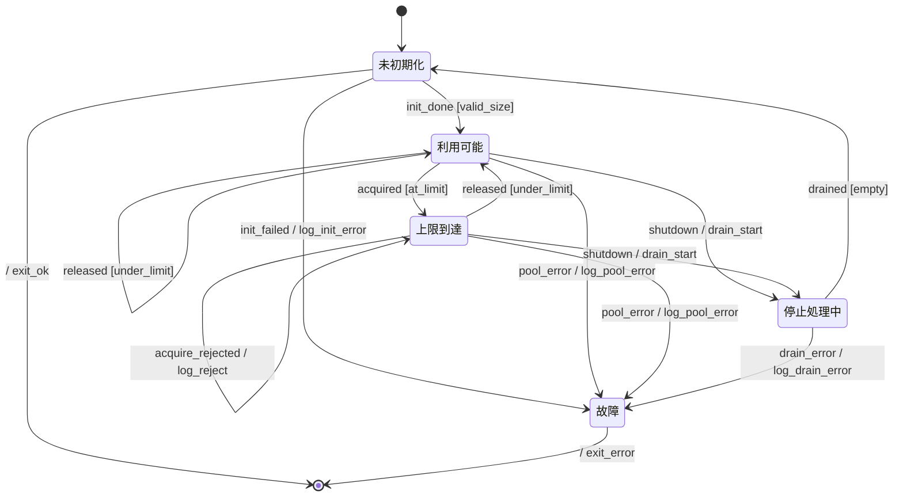

# DB コネクションプール 振る舞い仕様 (example)

specforge の中規模例。複数 state var (`in_use`, `pool_size`) + 複数 payload event + retry 分岐。
リソース管理と並行制御の典型パターン。

## リアクティブ仕様 (Mermaid 拡張状態機械)



### 状態一覧

| 状態 ID     | 人間向け名 | 説明                                           |
| ----------- | ---------- | ---------------------------------------------- |
| `Closed`    | 未初期化   | プール初期化前 or drain 完了後                 |
| `Available` | 利用可能   | 1 個以上の空きコネクションあり、acquire 受付可 |
| `Saturated` | 上限到達   | 全コネクション使用中、acquire は reject        |
| `Closing`   | 停止処理中 | drain 中、新規 acquire 拒否、release のみ受付  |
| `Failed`    | 故障       | 復旧不能エラー、operator 介入待ち              |

### イベント一覧

| イベント           | 発生元           | 通信特性  | payload (ガード/分岐に使うフィールド)                      |
| ------------------ | ---------------- | --------- | ---------------------------------------------------------- |
| `init_done`        | Pool initializer | sync 内部 | `{pool_size, in_use}` — 確定したプールサイズ、初期使用数=0 |
| `init_failed`      | Pool initializer | sync 内部 | (payload なし)                                             |
| `acquired`         | Client request   | sync 内部 | `{in_use}` — 取得後の使用中数                              |
| `released`         | Client release   | sync 内部 | `{in_use}` — 解放後の使用中数                              |
| `acquire_rejected` | Pool             | sync 内部 | (payload なし)                                             |
| `shutdown`         | Operator         | sync 内部 | (payload なし)                                             |
| `drained`          | Pool drainer     | sync 内部 | `{in_use}` — drain 完了時の使用中数 (期待値 0)             |
| `drain_error`      | Pool drainer     | sync 内部 | (payload なし)                                             |
| `pool_error`       | Pool             | sync 内部 | (payload なし)                                             |

### アクション定義

| アクション ID     | 意味                                               | 冪等性          |
| ----------------- | -------------------------------------------------- | --------------- |
| `log_init_error`  | 初期化失敗を log + metric 出力                     | 冪等            |
| `log_reject`      | 飽和時の拒否を log (DoS 検知用)                    | 冪等            |
| `log_pool_error`  | プール内部エラーを log                             | 冪等            |
| `log_drain_error` | drain 中エラーを log                               | 冪等            |
| `drain_start`     | 新規 acquire を block、active コネクションを drain | 冪等            |
| `exit_ok`         | プール終了 (リソース解放)                          | 自明な 1 回限り |
| `exit_error`      | プール終了 (エラー扱い、operator 通知)             | 自明な 1 回限り |

### ガード定義

| ガード ID     | 条件                  | 根拠                                                |
| ------------- | --------------------- | --------------------------------------------------- |
| `valid_size`  | `pool_size > 0`       | プールサイズ 0 は意味なし、init_failed 扱いとすべき |
| `under_limit` | `in_use < pool_size`  | 取得後でも上限未満なら Available のまま             |
| `at_limit`    | `in_use >= pool_size` | 取得で上限到達 → Saturated に遷移                   |
| `empty`       | `in_use == 0`         | drain 完了は使用中数が 0 になった時                 |

### 共有状態

| 変数        | 型        | 書き手           | 読み手                                   |
| ----------- | --------- | ---------------- | ---------------------------------------- |
| `pool_size` | int (>=1) | Pool initializer | 全 acquire/release 系遷移時のガード      |
| `in_use`    | int (>=0) | Client / Pool    | acquire / release / drain 遷移時のガード |

---

## 設計メモ

**必須**:

- **直積崩れの扱い**: 線形 + 並列なし (orthogonal region 不使用)。 状態空間は使用中数 ×
  プールサイズの組合せで決まり、guard で確実に絞り込む。
- **broadcast の対応**: なし。
- **ガードの根拠**: `under_limit` / `at_limit` で Available ↔ Saturated を切り替え。 `valid_size` は
  0 サイズ プール拒否、`empty` は drain 完了判定。
- **アクションの冪等性**: 全 action が log / 終了系で冪等もしくは 1 回限り。`drain_start` は active
  コネクション数が 0 になるまで poll する想定で実装層に委ねる。
- **未定義イベントの扱い**: **無視**。例: Closed 中の `acquired` は実装層が prevent する想定。
- **異常系のカバレッジ**: 初期化失敗 (`init_failed`)、プール内部エラー (`pool_error`)、drain 失敗
  (`drain_error`) を Failed に集約。Operator 介入で復旧する設計。
- **既知の未対応ケース**: コネクションごとの health check、idle timeout、コネクション再利用 cap (=
  max_uses) などは impl 詳細として別 doc に分離する想定。

**該当時**:

- **共有状態の排他制御**: `in_use` は Pool 側 の単一書き込み元 (CAS or lock で増減)。 Client 側は
  acquire/release イベントで通知するのみ、直接書き換えない。

---

## 検証手順

```bash
$ deno task verify --bound=3 examples/db-connection-pool.md
verified ok
... distinct states found ...
Model checking completed. No error has been found.
```

`--bound=3` で `in_use, pool_size` が `{0, 1, 2, 3}` の範囲で網羅探索。 数値関係
(`in_use <
pool_size` 等) の境界条件を全て試す。
