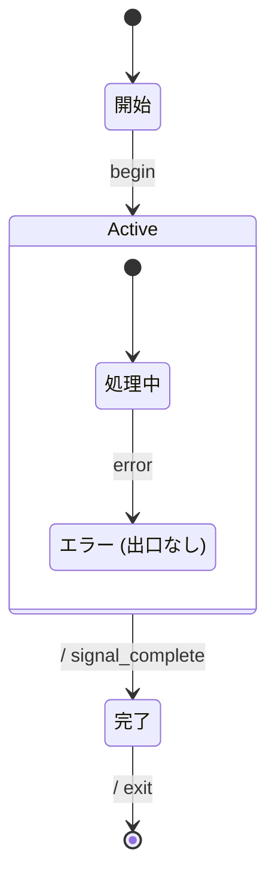

# Deadlock デモ 振る舞い仕様 (example)

**意図的に deadlock するように書かれた spec**。 TLC の deadlock 検出機能を実演するための
教育用サンプル。composite の region に「[*] への経路がない state」を入れると、完了遷移 (全 region
_done を precondition) が発火できず、 region 内で stuck する → deadlock。

## リアクティブ仕様 (Mermaid 拡張状態機械)



### 状態一覧

| 状態 ID      | 人間向け名        | 説明                                             |
| ------------ | ----------------- | ------------------------------------------------ |
| `Ready`      | 開始              | 起動待ち                                         |
| `Active`     | 進行中            | composite。 内部 region 1 つで処理を進行         |
| `Processing` | 処理中            | region 内、正常系                                |
| `Stuck`      | エラー (出口なし) | error 後に到達するが、`--> [*]` を書き忘れている |
| `Done`       | 完了              | 全 region 完了で到達 (本仕様では到達不可)        |

### イベント一覧

| イベント | 発生元 | 通信特性  | payload        |
| -------- | ------ | --------- | -------------- |
| `begin`  | UI     | sync 内部 | (payload なし) |
| `error`  | 内部   | sync 内部 | (payload なし) |

### アクション定義

| アクション ID     | 意味         | 冪等性          |
| ----------------- | ------------ | --------------- |
| `signal_complete` | 完了通知     | 冪等            |
| `exit`            | プロセス終了 | 自明な 1 回限り |

---

## 設計メモ

**必須**:

- **直積崩れの扱い**: composite 1 region (orthogonal 不使用)。 ただし region 内に出口無しの state
  (`Stuck`) を入れているため、 region が完了できない → 完了遷移発火不可。
- **broadcast の対応**: なし。
- **ガードの根拠**: なし (本サンプルではガード未使用)。
- **アクションの冪等性**: `signal_complete` 冪等、`exit` 1 回限り。
- **未定義イベントの扱い**: 無視。
- **異常系のカバレッジ**: **意図的に未カバー**。`Stuck` から脱出する経路 (`Stuck --> [*]` や
  `Stuck --> Done` 等の triggered exit) を書いていないので、TLC が deadlock を検出する。
- **既知の未対応ケース**: 本仕様は教育目的の "壊れた spec" デモなので、 修正版は別途用意する想定。

---

## 検証手順 (意図的に失敗する例)

```bash
$ deno task verify examples/deadlock.md
verification failed (code 11)

TLC2 Version 2.19 of 08 August 2024 (rev: 5a47802)
Computing initial states...
Finished computing initial states: 1 distinct state generated at ...
Error: Deadlock reached.
Error: The behavior up to this point is:
...states generated, ...distinct states found, 0 states left on queue.
```

TLC が `Error: Deadlock reached.` を返し、 specforge は `verification failed (code 11)` で exit
する。 これが TLC を組み込む価値の demonstration。

## 修正方法

`Stuck` から戻る経路を入れれば deadlock-free になる。 例:

```diff
  Processing --> Stuck : error
+ Stuck --> Processing : reset_attempt
```

または composite の triggered exit を入れる:

```diff
  Active --> Done : / signal_complete
+ Active --> Done : abort / cleanup
```

triggered exit (`abort` event 付き) は完了遷移と違い、region 状態に関わらず interrupt できる。
