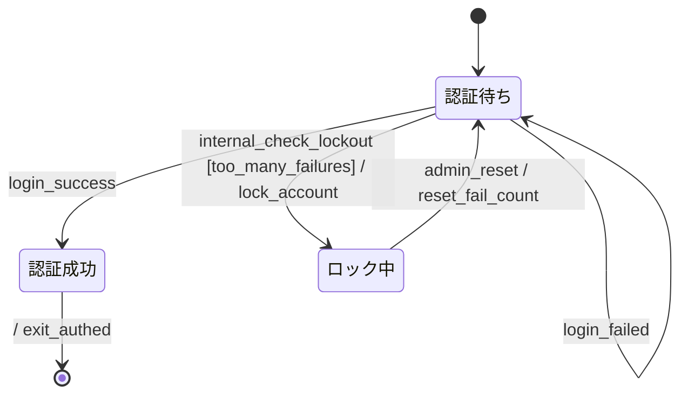

# 内部イベント (internal\_xxx) 振る舞い仕様 (example)

spec-behavior skill の `internal_xxx` 命名規約を使う例。 外部からのトリガーではなく、
内部状態の変化や時間経過等で自発的に発火する遷移を `internal_*` のプレフィックスで明示する。
ログイン認証のロックアウト機構をモデル化。

> **注**: 現状 specforge は `internal_` プレフィックスを **特別扱いしない** (通常の event と 同じく
> channel として宣言、CSPm では hiding せず、TLA+ ではただの action 名)。 規律としては
> 「読み手にとって外部 / 内部の区別がつくよう命名する」ことを優先。 将来 CSPm 側で `\ {internal_*}`
> 形式の hiding に対応する案あり (`docs/spec.md` §4.4 と CLAUDE.md Pending 参照)。

## リアクティブ仕様 (Mermaid 拡張状態機械)



### 状態一覧

| 状態 ID    | 人間向け名 | 説明                                 |
| ---------- | ---------- | ------------------------------------ |
| `Awaiting` | 認証待ち   | ログイン試行を受け付け中             |
| `Authed`   | 認証成功   | ログイン成功                         |
| `Locked`   | ロック中   | 失敗回数超過によりアカウント一時停止 |

### イベント一覧

| イベント                 | 発生元              | 通信特性  | payload                                   |
| ------------------------ | ------------------- | --------- | ----------------------------------------- |
| `login_success`          | Auth service        | sync 内部 | (payload なし)                            |
| `login_failed`           | Auth service        | sync 内部 | `{fail_count}` — 失敗試行後の累計失敗回数 |
| `internal_check_lockout` | **内部** (定期検査) | sync 内部 | `{fail_count}` — 検査時点の累計失敗回数   |
| `admin_reset`            | 管理者 (手動)       | sync 内部 | (payload なし)                            |

### アクション定義

| アクション ID      | 意味                                          | 冪等性          |
| ------------------ | --------------------------------------------- | --------------- |
| `lock_account`     | アカウントを lock 状態に (ログイン拒否)       | 冪等            |
| `reset_fail_count` | 失敗カウンタを 0 に戻す                       | 冪等            |
| `exit_authed`      | セッション確立 (本仕様では即終了として簡略化) | 自明な 1 回限り |

### ガード定義

| ガード ID           | 条件              | 根拠                                           |
| ------------------- | ----------------- | ---------------------------------------------- |
| `too_many_failures` | `fail_count >= 2` | 失敗 2 回超でロックアウト (例として境界が低め) |

### 共有状態

| 変数         | 型        | 書き手       | 読み手                            |
| ------------ | --------- | ------------ | --------------------------------- |
| `fail_count` | int (>=0) | Auth service | `internal_check_lockout` の guard |

---

## 設計メモ

**必須**:

- **直積崩れの扱い**: 線形 (composite 不使用)。
- **broadcast の対応**: なし。
- **ガードの根拠**: `too_many_failures` で fail_count の閾値超過を判定。 境界は 2 (`>=`) で、3
  回目の失敗以降にロックアウト発火可能。
- **アクションの冪等性**: 全て冪等。`lock_account` の重複呼び出しは状態変化なし。
- **未定義イベントの扱い**: 無視 (self-loop / no-op)。例: Locked 中の `login_success` は
  ロック解除前なので到達しない (auth service が prevent)。
- **異常系のカバレッジ**: ロックアウトは異常系の最小カバレッジ。 タイムアウトでの自動解除は
  本仕様では未モデル化 (`admin_reset` のみ)。 タイマー駆動の自動解除を入れるなら
  `internal_lockout_timeout` を追加し state vars `lockout_remaining` を導入する。
- **既知の未対応ケース**: 認証成功後のセッションタイムアウト、 再認証フロー、 multi-factor
  認証等は本仕様のスコープ外。

### 内部イベント (internal\_xxx) について

`internal_xxx` のプレフィックスは **spec-behavior skill の命名規約**で、 「外部からのトリガー
ではなく、内部状態の検査や時間経過で発火する遷移」を可視化するためのもの。

- 外部 event (`login_success` / `login_failed` / `admin_reset`): 明確な発生元 (ユーザ操作・管理者・
  外部サービス) を持つ
- 内部 event (`internal_check_lockout`): 状態機械自身が条件満たした時に発火する。 実装的には state
  チェックポイントや scheduled task で実現する場面が多い

specforge の現在の挙動: `internal_check_lockout` を他の event と同様に channel として宣言し、 TLA+
では action として emit する。 hiding (CSPm `\ {...}` で trace から隠す) は未対応。

---

## 検証手順

```bash
$ deno task verify --bound=3 examples/internal-events.md
verified ok
... Model checking completed. No error has been found.
... states generated, ... distinct states found, ...
```

`--bound=3` で `fail_count` が `{0..3}` を取れる範囲を網羅探索。 境界値 `2` 前後の挙動 (ロック
発火するか否か) が両方とも TLC によって試される。
