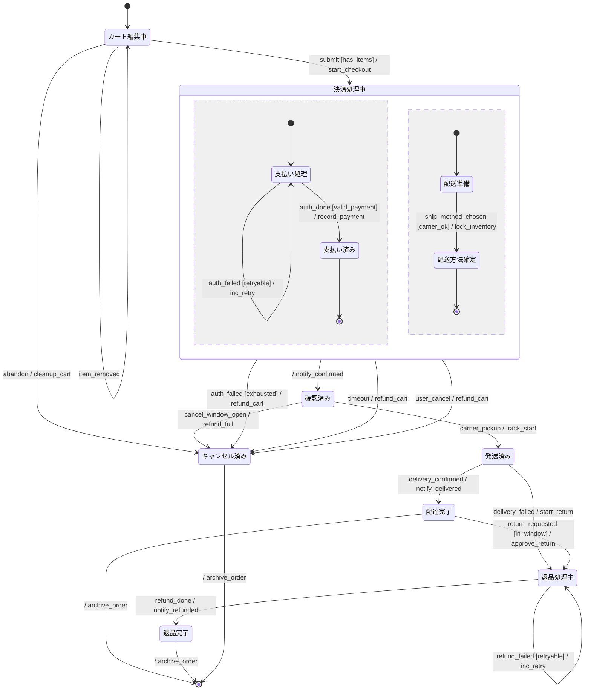

# 注文ワークフロー 振る舞い仕様 (example)

specforge の大規模例。EC サイトの注文〜配達〜返品までのライフサイクル。 composite + 直交領域
(Payment + Shipping を並行で進める)、retry 分岐、複数 state var、 複数 payload event
を全部入りで使ったリアルなサンプル。

## リアクティブ仕様 (Mermaid 拡張状態機械)



### 状態一覧

| 状態 ID         | 人間向け名     | 説明                                     |
| --------------- | -------------- | ---------------------------------------- |
| `Cart`          | カート編集中   | ユーザーが商品を出し入れ                 |
| `Checkout`      | 決済処理中     | 支払いと配送方法を並行で確定 (composite) |
| `Authorizing`   | 支払い処理     | Payment region 内                        |
| `Authorized`    | 支払い済み     | Payment region 完了                      |
| `PreparingShip` | 配送準備       | Shipping region 内                       |
| `ShipReady`     | 配送方法確定   | Shipping region 完了                     |
| `Confirmed`     | 確認済み       | 決済完了、出荷待ち                       |
| `Shipped`       | 発送済み       | 配送業者にピックアップされた             |
| `Delivered`     | 配達完了       | 受取人が受領                             |
| `Cancelled`     | キャンセル済み | 注文取消・返金完了 (terminal)            |
| `Returning`     | 返品処理中     | 返品リクエスト後、返金処理中             |
| `Returned`      | 返品完了       | 返金完了 (terminal)                      |

### イベント一覧

| イベント             | 発生元              | 通信特性              | payload (ガード/分岐に使うフィールド)                 |
| -------------------- | ------------------- | --------------------- | ----------------------------------------------------- |
| `item_added`         | UI                  | sync 内部             | `{item_count}` — 追加後の商品点数                     |
| `item_removed`       | UI                  | sync 内部             | `{item_count}` — 削除後の商品点数                     |
| `submit`             | UI                  | sync 内部             | (payload なし)                                        |
| `abandon`            | UI / セッション切れ | sync 内部             | (payload なし)                                        |
| `auth_done`          | Payment service     | async / at-most-once  | `{amount, payment_attempts}` — 認証成功時の金額と試行 |
| `auth_failed`        | Payment service     | async / at-most-once  | `{payment_attempts}` — 失敗時の試行回数               |
| `ship_method_chosen` | Shipping service    | async / at-least-once | `{amount}` — 送料込み合計                             |
| `timeout`            | Checkout timer      | sync 内部             | (payload なし)                                        |
| `user_cancel`        | UI                  | sync 内部             | (payload なし)                                        |
| `cancel_window_open` | UI                  | sync 内部             | (payload なし)                                        |
| `carrier_pickup`     | Shipping carrier    | async                 | (payload なし)                                        |
| `delivery_confirmed` | Shipping carrier    | async / at-least-once | (payload なし)                                        |
| `delivery_failed`    | Shipping carrier    | async / at-least-once | (payload なし)                                        |
| `return_requested`   | UI                  | sync 内部             | (payload なし)                                        |
| `refund_done`        | Payment service     | async / at-most-once  | (payload なし)                                        |
| `refund_failed`      | Payment service     | async / at-most-once  | `{payment_attempts}` — 返金試行回数                   |

### アクション定義

| アクション ID      | 意味                                       | 冪等性                            |
| ------------------ | ------------------------------------------ | --------------------------------- |
| `start_checkout`   | チェックアウト開始 (タイマー起動)          | 冪等                              |
| `record_payment`   | 支払い情報を DB に永続化                   | 冪等 (idempotency key で重複防止) |
| `inc_retry`        | retry 回数加算 (実体は payment_attempts++) | 累積系                            |
| `lock_inventory`   | 在庫を仮確保                               | 冪等                              |
| `notify_confirmed` | ユーザーに注文確定通知                     | 冪等                              |
| `refund_cart`      | 仮確保した決済と在庫を解放                 | 冪等                              |
| `refund_full`      | 確定済み決済を返金                         | 冪等 (idempotency key で重複防止) |
| `cleanup_cart`     | カートを空にする                           | 冪等                              |
| `track_start`      | 追跡情報を生成                             | 冪等                              |
| `notify_delivered` | 受取通知をユーザーに送信                   | 冪等                              |
| `start_return`     | 返品処理開始                               | 冪等                              |
| `approve_return`   | 返品リクエスト承認                         | 冪等                              |
| `notify_refunded`  | 返金完了通知をユーザーに送信               | 冪等                              |
| `archive_order`    | 注文を archive store に移動                | 自明な 1 回限り                   |

### ガード定義

| ガード ID       | 条件                    | 根拠                                                    |
| --------------- | ----------------------- | ------------------------------------------------------- |
| `has_items`     | `item_count > 0`        | カートが空なら submit 不可                              |
| `valid_payment` | `amount > 0`            | 金額 0 の支払いは認証通過させない (フリー商品は別経路)  |
| `retryable`     | `payment_attempts < 3`  | retry 3 回まで                                          |
| `exhausted`     | `payment_attempts >= 3` | retry 上限到達 → Cancelled                              |
| `carrier_ok`    | `amount > 0`            | 送料計算後、合計金額が非ゼロ (有料配送が成立)           |
| `in_window`     | `payment_attempts < 3`  | 返品猶予期間内 (簡略化: retry 上限と同じカウンタを流用) |

### 共有状態

| 変数               | 型        | 書き手          | 読み手                                         |
| ------------------ | --------- | --------------- | ---------------------------------------------- |
| `item_count`       | int (>=0) | UI              | Cart のガード (has_items)                      |
| `amount`           | int (>=0) | Payment service | Checkout の Payment/Shipping ガード            |
| `payment_attempts` | int (>=0) | Payment service | Checkout / Returning の retry/exhausted ガード |

---

## 設計メモ

**必須**:

- **直積崩れの扱い**: `Checkout` で **直交領域** を使用 (Payment region + Shipping region)。 両
  region が `[*]` 到達で `Confirmed` への完了遷移 (event=null)、いずれかの failure
  (`auth_failed [exhausted]` / `timeout` / `user_cancel`) で triggered exit → `Cancelled`。 これは
  UML 標準セマンティクスで、specforge は CSPm `((R1 ||| R2) ; ...) /\ (...)` / TLA+ 両 region 変数の
  `_done` precondition で表現する。
- **broadcast の対応**: なし。 各 region は独立イベントで進行する。
- **ガードの根拠**:
  - `has_items` でカート空での submit を防ぐ
  - `retryable` / `exhausted` で payment retry を 3 回までに制限
  - `valid_payment` / `carrier_ok` は金額境界条件 (0 円注文の検出)
  - `in_window` は返品猶予期間 (簡略化のため retry カウンタを流用)
- **アクションの冪等性**:
  - `record_payment` / `refund_full` / `refund_cart` は **冪等** (idempotency key で重複防止)。
    Payment service が at-most-once で配信する `auth_done` / `refund_done` と整合する。
  - `inc_retry` は **累積系** で、`payment_attempts` を増やす。リトライ毎に増加。
  - `archive_order` は注文当たり 1 回限り。 二重アーカイブはバグ。
- **未定義イベントの扱い**: **無視 (self-loop / no-op)**。例: Cart 中の `delivery_confirmed`
  は到達しない (carrier 未起動)。 実装層が前段 filter する想定。
- **異常系のカバレッジ**:
  - 認証失敗 → retry 3 回 → Cancelled
  - チェックアウト timeout / user_cancel → Cancelled
  - 配送失敗 → Returning に分岐 (Cancelled とは別経路)
  - 返金失敗 → retry あり (Returning 内ループ)
  - キャンセル猶予期間 (`cancel_window_open`) → Confirmed から Cancelled へ抜けられる
- **既知の未対応ケース**:
  - 在庫切れ → 別エラー経路 (本 spec は Payment + Shipping の完了同期のみ扱う)
  - 部分発送 / 部分返品 → 単一注文単位のため未対応
  - リフン処理中の再キャンセル → spec ではブロック扱い

**該当時**:

- **共有状態の排他制御**: `item_count` は UI 単一書き込み元、`amount` は Payment / Shipping
  両方が読むが Payment が確定値を書き込む単一書き込み元。`payment_attempts` は Payment service
  単一書き込み元 (retry 毎に CAS で +1)。

---

## 検証手順

```bash
$ deno task verify --bound=3 examples/order-workflow.md
verified ok
... distinct states found ...
Model checking completed. No error has been found.
```

`--bound=3` で各 state var が `{0..3}` を取れる範囲で TLC が網羅探索。 retry 関連 ガード
(`retryable` / `exhausted`、境界 = 3) の境界を含む値域なので、retry 上限到達経路もカバーされる。
`--bound=5` まで広げると探索空間は大幅に増えるが、 distinct states 数千〜万のオーダーで TLC
は秒オーダーで完走する。
