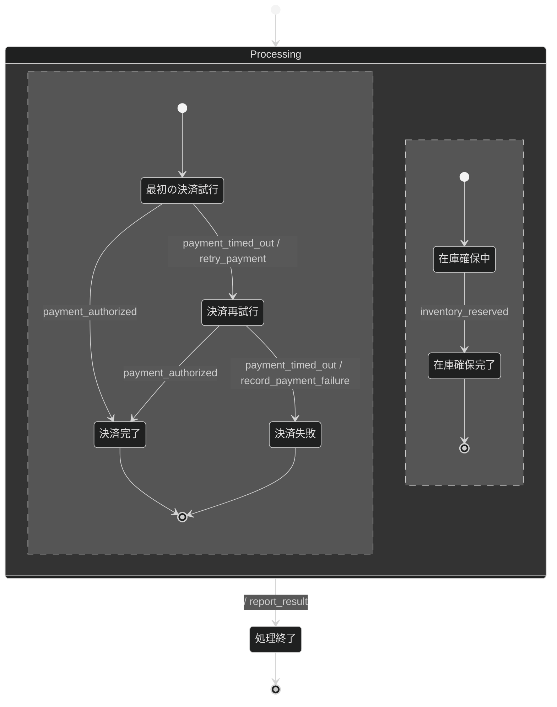

# 終了経路を定めた注文処理の振る舞い仕様

決済と在庫確保を並行して進める注文処理の修正版である。
決済の再試行を一回に制限し、二回目のタイムアウト後は決済失敗として終了する。

## リアクティブ仕様

### イベント一覧

| イベント             | 意味                   |
| -------------------- | ---------------------- |
| `payment_timed_out`  | 決済がタイムアウトした |
| `payment_authorized` | 決済が承認された       |
| `inventory_reserved` | 在庫を確保できた       |

### アクション定義

| アクション               | 意味                             | 冪等性 |
| ------------------------ | -------------------------------- | ------ |
| `retry_payment`          | 決済を一回だけ再試行する         | 冪等   |
| `record_payment_failure` | 決済失敗を記録する               | 冪等   |
| `report_result`          | 注文処理の終了を呼び出し元へ返す | 冪等   |

### 進行性

| 性質の名前    | TLA+式         |
| ------------- | -------------- |
| `Termination` | `<>Terminated` |

## 設計メモ

- **直積崩れの扱い**：決済と在庫確保を直交領域に分け、両方が終了したときだけ`Processing`を完了する。
- **broadcastの対応**：二つの領域へ同時に通知するイベントはない。
- **ガードの根拠**：ガードは使用しない。
- **アクションの冪等性**：再試行、失敗記録、終了通知は、同じ要求で繰り返しても結果が変わらないものとして扱う。
- **未定義イベントの扱い**：現在の状態で定義していないイベントは無視する。
- **異常系の範囲**：決済のタイムアウトを扱い、一回の再試行後もタイムアウトした場合は決済失敗として終了する。
- **既知の未対応ケース**：在庫確保の失敗と注文の取消は、この例の対象外とする。
