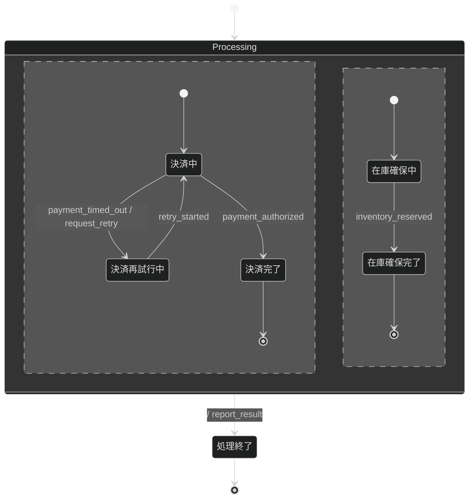

# 終了しない注文処理の振る舞い仕様

決済と在庫確保を並行して進める注文処理の、意図的に問題を残した例である。
決済のタイムアウト後に何度でも再試行できるため、処理が終了しない実行をTLCが検出する。

## リアクティブ仕様

### イベント一覧

| イベント             | 意味                   |
| -------------------- | ---------------------- |
| `payment_timed_out`  | 決済がタイムアウトした |
| `retry_started`      | 決済の再試行を開始した |
| `payment_authorized` | 決済が承認された       |
| `inventory_reserved` | 在庫を確保できた       |

### アクション定義

| アクション      | 意味                             | 冪等性 |
| --------------- | -------------------------------- | ------ |
| `request_retry` | 決済の再試行を要求する           | 冪等   |
| `report_result` | 注文処理の終了を呼び出し元へ返す | 冪等   |

### 進行性

| 性質の名前    | TLA+式         |
| ------------- | -------------- |
| `Termination` | `<>Terminated` |

## 設計メモ

- **直積崩れの扱い**：決済と在庫確保を直交領域に分け、両方が終了したときだけ`Processing`を完了する。
- **broadcastの対応**：二つの領域へ同時に通知するイベントはない。
- **ガードの根拠**：ガードは使用しない。
- **アクションの冪等性**：再試行要求と終了通知は、同じ要求で繰り返しても結果が変わらないものとして扱う。
- **未定義イベントの扱い**：現在の状態で定義していないイベントは無視する。
- **異常系の範囲**：決済のタイムアウトを扱う。ただし、再試行回数の上限を意図的に定めていない。
- **既知の問題**：`payment_timed_out`が続くと決済領域を終了できず、注文処理全体も終了しない。
