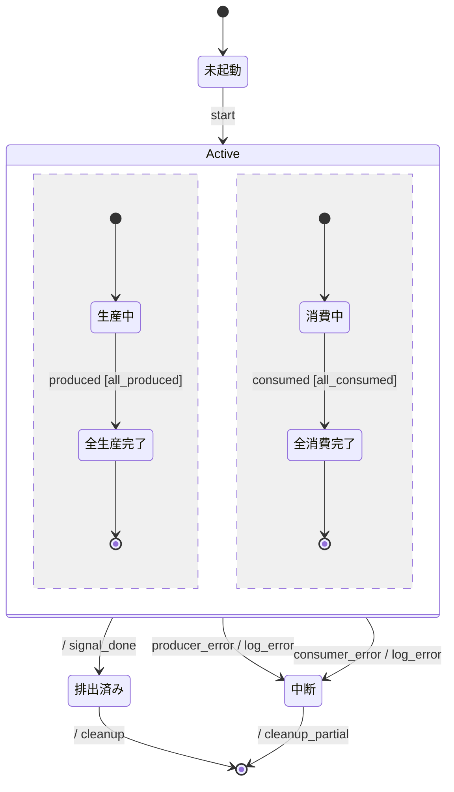

# Producer-Consumer Queue 振る舞い仕様 (example)

specforge の「小さいが難解」例。composite + 2 つの直交領域で producer と consumer の並行
動作を表現し、完了遷移 (両 region 終了) と triggered 中断 (エラー) を組合せる。

## リアクティブ仕様 (Mermaid 拡張状態機械)



### 状態一覧

| 状態 ID       | 人間向け名 | 説明                                          |
| ------------- | ---------- | --------------------------------------------- |
| `Init`        | 未起動     | producer/consumer 起動前                      |
| `Active`      | 並行実行中 | composite (Producer region + Consumer region) |
| `Producing`   | 生産中     | Producer region 内、buffer に書き込み中       |
| `ProducedAll` | 全生産完了 | Producer 側がターゲット件数に到達、`[*]` 待ち |
| `Consuming`   | 消費中     | Consumer region 内、buffer から読み出し中     |
| `ConsumedAll` | 全消費完了 | Consumer 側がターゲット件数に到達、`[*]` 待ち |
| `Drained`     | 排出済み   | 両 region 完了 → Active 退出後の安定状態      |
| `Aborted`     | 中断       | いずれかの region で error → 強制終了         |

### イベント一覧

| イベント         | 発生元        | 通信特性  | payload (ガード/分岐に使うフィールド)    |
| ---------------- | ------------- | --------- | ---------------------------------------- |
| `start`          | Scheduler     | sync 内部 | (payload なし)                           |
| `produced`       | Producer step | async     | `{produced_count}` — 生産済み件数 (累積) |
| `consumed`       | Consumer step | async     | `{consumed_count}` — 消費済み件数 (累積) |
| `producer_error` | Producer step | async     | (payload なし)                           |
| `consumer_error` | Consumer step | async     | (payload なし)                           |

### アクション定義

| アクション ID     | 意味                                 | 冪等性          |
| ----------------- | ------------------------------------ | --------------- |
| `signal_done`     | 両 region 完了を上位に通知           | 冪等            |
| `log_error`       | エラー詳細を stderr に log           | 冪等            |
| `cleanup`         | 正常終了 (バッファ解放)              | 自明な 1 回限り |
| `cleanup_partial` | 部分結果保存 + バッファ解放 (中断時) | 自明な 1 回限り |

### ガード定義

| ガード ID      | 条件                             | 根拠                            |
| -------------- | -------------------------------- | ------------------------------- |
| `all_produced` | `produced_count >= target_count` | producer がターゲット件数に到達 |
| `all_consumed` | `consumed_count >= target_count` | consumer がターゲット件数に到達 |

### 共有状態

| 変数             | 型        | 書き手        | 読み手                    |
| ---------------- | --------- | ------------- | ------------------------- |
| `produced_count` | int (>=0) | Producer step | Producer region のガード  |
| `consumed_count` | int (>=0) | Consumer step | Consumer region のガード  |
| `target_count`   | int (>=1) | Scheduler     | 両 region のガード (定数) |

---

## 設計メモ

**必須**:

- **直積崩れの扱い**: **直交領域** (orthogonal regions) を Active composite で使用。Producer と
  Consumer は独立に進行し、両方が `[*]` に到達した時点 (= 完了遷移) で Drained へ。 これは UML
  completion semantics で、specforge は CSPm `(R1 ||| R2) ; ...` / TLA+ region 変数の 両 `_done` を
  precondition、として変換する。
- **broadcast の対応**: なし。 producer と consumer は独立イベント (`produced` / `consumed`) で
  完了する。共有 buffer は本 spec のスコープ外 (実装層)。
- **ガードの根拠**: `produced_count` / `consumed_count` の累積で target に到達したか判定。
  `target_count` は scheduler が事前設定する定数 (本 spec では state var として宣言するだけ)。
- **アクションの冪等性**: `signal_done` / `log_error` は冪等、`cleanup` / `cleanup_partial` は 1
  回限り。 buffer 解放後の二重 cleanup はバグ扱い。
- **未定義イベントの扱い**: **無視**。例: Init 中の `produced` は到達しない (Producer 未起動)。
- **異常系のカバレッジ**: `producer_error` / `consumer_error` どちらでも Aborted。 これは triggered
  exit (event 付き composite 退出) で、specforge は `/\` interrupt 演算子 / TLA+ の不要 precondition
  無し action として表現する。
- **既知の未対応ケース**: buffer 満杯 / 空による backpressure、producer/consumer の動的追加・
  削除、target 動的変更などは本 spec のスコープ外。

**該当時**:

- **共有状態の排他制御**: `produced_count` は Producer の単一書き込み元、`consumed_count` は
  Consumer の単一書き込み元。 競合なし。 `target_count` は scheduler が start 時に set、以降
  read-only。

---

## 検証手順

```bash
$ deno task verify --bound=2 examples/producer-consumer.md
verified ok
... distinct states found ...
Model checking completed. No error has been found.
```

`--bound=2` でも target_count = {0,1,2} の範囲で十分。 大きくすると 4 変数 × 状態数で
状態空間が大きくなる点に注意 (Producer region × Consumer region × state vars)。
