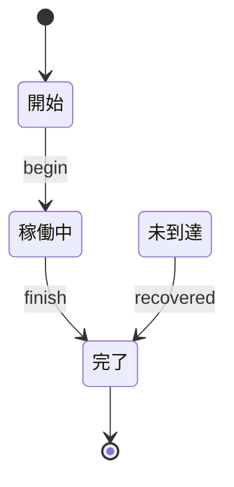

# 未到達 state デモ 振る舞い仕様 (example)

**意図的に未到達 state を含む spec**。 specforge の validation pass (V004) が状態の
到達可能性をチェックして warning を出すことを示す教育用サンプル。 TLC は (到達不能な state は
そもそも探索されないので) 通常通り deadlock-free を確認する。 これらは別の検出機構。

## リアクティブ仕様 (Mermaid 拡張状態機械)



### 状態一覧

| 状態 ID   | 人間向け名 | 説明                                |
| --------- | ---------- | ----------------------------------- |
| `Started` | 開始       | 初期状態                            |
| `Running` | 稼働中     | 通常進行                            |
| `Orphan`  | 未到達     | 宣言だけ存在、 誰からも到達されない |
| `Done`    | 完了       | 終端                                |

### イベント一覧

| イベント    | 発生元 | 通信特性  | payload                                                     |
| ----------- | ------ | --------- | ----------------------------------------------------------- |
| `begin`     | UI     | sync 内部 | (payload なし)                                              |
| `finish`    | 内部   | sync 内部 | (payload なし)                                              |
| `recovered` | 内部   | sync 内部 | (payload なし、Orphan から発火する想定だが Orphan 到達不能) |

---

## 設計メモ

**必須**:

- **直積崩れの扱い**: 線形 (composite 不使用)。
- **broadcast の対応**: なし。
- **ガードの根拠**: なし (本サンプルではガード未使用)。
- **アクションの冪等性**: なし (アクション未使用)。
- **未定義イベントの扱い**: 無視。
- **異常系のカバレッジ**: 本サンプルは異常系ではなく、 **宣言ミスのデモ**。 `Orphan` を
  リネームミスや transition 書き忘れで放置している状況を再現。
- **既知の未対応ケース**: `recovered` イベントの発火元 (Orphan) に到達できないので、 実質的には dead
  code。 specforge の V004 がこれを検出する。

---

## 検証手順

```bash
$ deno task cli examples/unreachable-state.md
warn V004: state 'Orphan' is declared but unreachable (no transition has it as 'to')
  hint: Add a transition '<from> --> Orphan' from a reachable state, or remove the declaration if intentional.

[CSPm 出力が stdout に]
```

`--strict` を付けると warning が failure に昇格:

```bash
$ deno task cli --strict examples/unreachable-state.md
exit=1
(同じ warning) + "validation found 1 issue(s) (--strict)"
```

`verify` で TLC に流すと、 到達不能な `Orphan` は TLC の状態空間探索では見えないため、 deadlock
検出も走らずに完走する:

```bash
$ deno task verify examples/unreachable-state.md
verified ok
... Model checking completed. No error has been found.
```

つまり TLC は「到達できる範囲では deadlock-free」を確認するが、 「全 declared state が
到達可能か」は別の問題。 specforge の validation pass がこの構造的 check を補う。

## 修正方法

`Orphan` を到達可能にするか、削除する:

```diff
  Running --> Done : finish
+ Running --> Orphan : suspend
  Orphan --> Done : recovered
```

または不要なら削除:

```diff
- state "未到達" as Orphan
  ...
- Orphan --> Done : recovered
```
