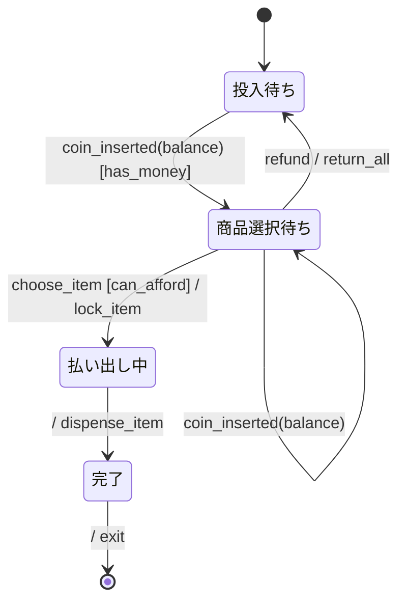

# 自販機 振る舞い仕様 (example)

specforge の入門例。1 state var (`balance`) + 1 payload event の単純な linear pipeline で、 guard
substitution と payload binding の動作を見るためのデモ。

## リアクティブ仕様 (Mermaid 拡張状態機械)



### 状態一覧

| 状態 ID      | 人間向け名   | 説明                                   |
| ------------ | ------------ | -------------------------------------- |
| `Idle`       | 投入待ち     | 残高ゼロ、コイン待ち                   |
| `Selecting`  | 商品選択待ち | 残高あり、商品選択かさらにコイン投入可 |
| `Dispensing` | 払い出し中   | 商品を物理的に出している               |
| `Done`       | 完了         | サイクル完了                           |

### イベント一覧

| イベント        | 発生元         | 通信特性  | payload (ガード/分岐に使うフィールド) |
| --------------- | -------------- | --------- | ------------------------------------- |
| `coin_inserted` | コインスロット | sync 内部 | `{balance}` — コイン投入後の累積残高  |
| `choose_item`   | 押しボタン     | sync 内部 | (payload なし)                        |
| `refund`        | 返金ボタン     | sync 内部 | (payload なし)                        |

### アクション定義

| アクション ID   | 意味                                         | 冪等性                |
| --------------- | -------------------------------------------- | --------------------- |
| `lock_item`     | 在庫から 1 つ確保 (商品コードを表示器に出力) | 冪等 (同 ID で no-op) |
| `dispense_item` | 商品を物理的に放出                           | 冪等 (二重放出はバグ) |
| `return_all`    | 残高分を全て返金口に出す                     | 冪等                  |
| `exit`          | サイクル終了 (内部リセット)                  | 自明な 1 回限り       |

### ガード定義

| ガード ID    | 条件           | 根拠                               |
| ------------ | -------------- | ---------------------------------- |
| `has_money`  | `balance > 0`  | コイン投入で初めて選択画面に移れる |
| `can_afford` | `balance >= 1` | 商品 1 個 = 1 単位 (簡略化)        |

### 共有状態

| 変数      | 型        | 書き手           | 読み手                        |
| --------- | --------- | ---------------- | ----------------------------- |
| `balance` | int (>=0) | コインスロット側 | Idle/Selecting 遷移時のガード |

---

## 設計メモ

**必須**:

- **直積崩れの扱い**: 線形パイプライン。`Dispensing` 中に新 `coin_inserted` が来ても無視する
  (実装層が機械的に inhibit する想定)。 並列領域なし。
- **broadcast の対応**: なし。
- **ガードの根拠**: `balance` はコインの累積。`has_money` (> 0) は Idle 脱出条件、`can_afford`
  (>= 1) は商品単価相当 (簡略化のため 1)。
- **アクションの冪等性**: `lock_item` / `dispense_item` / `return_all` / `exit` は全て冪等もしくは 1
  回限り。リトライ機構は本 spec のスコープ外 (再投入は新サイクル扱い)。
- **未定義イベントの扱い**: **無視 (self-loop / no-op)**。例: Idle 中の `choose_item` は到達しない
  想定 (UI が押せないよう抑制)。
- **異常系のカバレッジ**: `refund` は Selecting 中のみ受付。コインスロット故障や商品在庫切れ等の
  ハード障害は本 spec のスコープ外 (上位の operator が介入)。
- **既知の未対応ケース**: 釣銭管理、複数商品単価、定員制限。 教育目的の最小例。

---

## 検証手順

```bash
$ deno task verify --bound=3 examples/vending-machine.md
verified ok
... distinct states found ...
Model checking completed. No error has been found.
```

`--bound=3` で balance が `{0, 1, 2, 3}` を取れる範囲で TLC が網羅探索する。
